# migukstory.com — Architecture

End-to-end pipeline from RSS ingestion through Cloudflare deploy and search-engine indexing. All boxes are real files/services in this repo; arrows show data flow.

> **Note:** GitHub renders these Mermaid diagrams inline. If you're viewing this file as raw text, paste the code blocks into <https://mermaid.live> to see them rendered.

---

## 1. Full system (flow + components)

```mermaid
flowchart TB
    classDef cron fill:#dcfce7,stroke:#16a34a,stroke-width:2px,color:#14532d
    classDef ai fill:#fef3c7,stroke:#d97706,stroke-width:2px,color:#78350f
    classDef human fill:#dbeafe,stroke:#2563eb,stroke-width:2px,color:#1e3a8a
    classDef storage fill:#f1f5f9,stroke:#475569,stroke-width:1px,color:#0f172a
    classDef external fill:#f5f5f5,stroke:#737373,stroke-width:1px,color:#525252,stroke-dasharray:5 3
    classDef live fill:#fce7f3,stroke:#db2777,stroke-width:2px,color:#831843

    %% ── Layer 1: Sources ─────────────────────────────────────────
    subgraph SOURCES["External RSS sources (scripts/config/rss_sources.yml)"]
        direction LR
        S1[USCIS Newsroom]
        S2[State Dept Travel]
        S3[CDC Newsroom]
        S4[U.S. Treasury]
        S5[Federal Reserve]
        S6[NPR Business]
        S7[…disabled: BoK, IRS, KTimes]
    end
    class S1,S2,S3,S4,S5,S6,S7 external

    %% ── Layer 2: Ingest (cron) ───────────────────────────────────
    CRON1["⏰ daily-draft.yml<br/>cron: 0 */4 * * *  (6×/day)"]:::cron
    SOURCES --> CRON1
    CRON1 --> DRAFT["🤖 draft_from_rss.py<br/>Claude API (Sonnet 4.6)<br/>1 source → 1 Korean draft"]:::ai
    SEEN[(scripts/state/<br/>seen_urls.json)]:::storage
    DRAFT <-->|dedupe| SEEN
    DRAFTS[(drafts/<br/>YYYY-MM-DD-slug.md)]:::storage
    DRAFT --> DRAFTS

    %% ── Layer 3: Editor agent ───────────────────────────────────
    DRAFTS --> EDITOR["🤖 editor_grade.py<br/>5-axis rubric (0-100)<br/>factuality · sources · KA-angle · originality · structure"]:::ai
    REPORT[(scripts/state/<br/>editor_report.json)]:::storage
    EDITOR --> REPORT
    EDITOR -->|score ≥ 80| PROMOTE{{"git mv<br/>drafts → queue"}}
    QUEUE[(queue/<br/>topic-year.md)]:::storage
    PROMOTE --> QUEUE
    EDITOR -.->|score 50-79: stay in drafts/| DRAFTS
    EDITOR -.->|score < 50: discard flag| DRAFTS

    %% ── Layer 4: Auto-PR ────────────────────────────────────────
    DRAFTS --> PR["📋 Auto-PR (peter-evans)<br/>bot/daily-draft branch<br/>title includes promote/review/discard counts"]
    QUEUE --> PR
    REPORT --> PR
    SEEN --> PR

    %% ── Layer 5: Human review (Steve clicks merge) ──────────────
    PR --> HUMAN["👤 Steve reviews + merges<br/>one click — nothing auto-publishes"]:::human

    %% ── Layer 6: Publish (manual trigger) ───────────────────────
    HUMAN -.->|manual trigger| CRON2["⚙️ daily-post.yml<br/>workflow_dispatch only<br/>(no cron — by design)"]:::cron
    CRON2 --> PUBLISH["📤 publish_from_queue.py<br/>set pubDate=today<br/>git mv queue → src/content/blog"]
    QUEUE --> PUBLISH
    BLOG[(src/content/blog/<br/>topic-year.md)]:::storage
    PUBLISH --> BLOG
    PUBLISH -->|commit + push main| GH[(GitHub main)]:::storage

    %% Direct human commits also land here
    HUMAN -.->|merge PR with publish in queue/blog/| GH

    %% ── Layer 7: Auto-deploy ────────────────────────────────────
    GH --> CRON3["⚙️ cloudflare-deploy.yml<br/>on: push to main<br/>(paths filter: src/, public/, scripts/notify_indexes.py)"]:::cron
    CRON3 --> BUILD["🛠 npm run build<br/>Astro static (49 pages)<br/>+ Pagefind search index"]
    BUILD --> DIST[(dist/)]:::storage
    DIST --> CF["☁️ wrangler pages deploy<br/>--project-name=migukstory<br/>--branch=main"]
    CF --> LIVE(["🌐 migukstory.com<br/>Cloudflare Pages edge"]):::live

    %% ── Layer 8: Notify indexes ─────────────────────────────────
    CF --> NOTIFY["🤖 notify_indexes.py --auto<br/>diff HEAD~1..HEAD for new blog/*.md"]:::ai
    NOTIFY -->|always, free| INDEXNOW["📡 IndexNow API<br/>(Bing · Yandex · Yep · Seznam)"]:::external
    NOTIFY -.->|if GOOGLE_SERVICE_ACCOUNT_JSON set| GAPI["📡 Google Indexing API<br/>(NewsArticle)"]:::external

    %% ── Layer 9: External AI ───────────────────────────────────
    ANTHROPIC[("🧠 Anthropic API<br/>Sonnet 4.6 drafts<br/>Sonnet 4.6 grades")]:::external
    DRAFT <-.->|ANTHROPIC_API_KEY secret| ANTHROPIC
    EDITOR <-.->|same key| ANTHROPIC
```



---

## 2. A typical day, as time-ordered events

```mermaid
sequenceDiagram
    autonumber
    participant Cron as ⏰ GH Actions Cron
    participant Draft as 🤖 draft_from_rss.py
    participant Anthropic as 🧠 Anthropic API
    participant Editor as 🤖 editor_grade.py
    participant PR as 📋 GH Pull Request
    participant Steve as 👤 Steve
    participant Pub as ⚙️ publish_from_queue.py
    participant Deploy as ☁️ Cloudflare Pages
    participant Index as 📡 IndexNow + Google

    Note over Cron: every 4 hours (6×/day)<br/>04:00, 08:00, 12:00, 16:00, 20:00, 00:00 UTC
    Cron->>Draft: trigger
    Draft->>Draft: fetch RSS, dedupe via seen_urls.json
    Draft->>Anthropic: prompt (Sonnet 4.6)
    Anthropic-->>Draft: Korean draft (≤ 5 per run)
    Draft->>Editor: drafts/*.md written
    Editor->>Anthropic: rubric prompt per draft
    Anthropic-->>Editor: scores + reasoning JSON
    Editor->>Editor: promote ≥80 → queue/, write editor_report.json
    Editor->>PR: open or update bot/daily-draft
    PR-->>Steve: GH notification w/ score breakdown

    Note over Steve: reviews when convenient
    Steve->>PR: merge (1 click)
    PR->>Steve: PR merged → drafts in queue/

    Note over Steve: when ready to publish (manual)
    Steve->>Pub: Actions UI → Run workflow (count=N)
    Pub->>Pub: pick N alphabetically-first<br/>set pubDate=today<br/>git mv queue → src/content/blog
    Pub-->>Steve: commit + push to main

    Note over Deploy: triggered by push to main
    Steve->>Deploy: push lands
    Deploy->>Deploy: npm ci · npm run build · wrangler deploy
    Deploy->>Index: notify_indexes.py --auto
    Index->>Index: diff HEAD~1..HEAD for new blog URLs
    Index-->>Deploy: IndexNow HTTP 200; Google API (if creds)
    Deploy-->>Steve: live at migukstory.com ~ 50s after push
```

---

## 3. Data store / file conventions

| Path | Owner | Purpose | Allowed writers |
|------|-------|---------|-----------------|
| `drafts/<date>-<slug>.md` | `draft_from_rss.py` | AI drafts pending review | `draft_from_rss.py` only |
| `queue/<topic>-<year>.md` | `editor_grade.py` + human | Approved-or-promoted, ready to publish | `editor_grade.py` (promote), human (merge), `publish_from_queue.py` (consume) |
| `src/content/blog/<topic>-<year>.md` | `publish_from_queue.py` + human | Published posts | `publish_from_queue.py`, human (direct edits) |
| `scripts/state/seen_urls.json` | `draft_from_rss.py` | Dedupe ledger | `draft_from_rss.py` only |
| `scripts/state/editor_report.json` | `editor_grade.py` | Last grading run report | `editor_grade.py` only |
| `public/<indexnow-key>.txt` | manual one-time | IndexNow domain verification | manual |

---

## 4. Secrets / external dependencies

| Secret | Used by | Required? | Effect if missing |
|--------|---------|-----------|-------------------|
| `CLOUDFLARE_API_TOKEN` + `CLOUDFLARE_ACCOUNT_ID` | `cloudflare-deploy.yml` | ✅ required | Workflow's "Check Cloudflare secrets" step short-circuits with a console message; no deploy attempted. |
| `ANTHROPIC_API_KEY` | `draft_from_rss.py`, `editor_grade.py` | ✅ required for cron | Both scripts exit with error; `daily-draft.yml` fails 6× per day. |
| `GOOGLE_SERVICE_ACCOUNT_JSON` | `notify_indexes.py` | optional | Google Indexing path skipped silently; IndexNow still runs. |

---

## 5. Workflows

| Workflow | Trigger | Job |
|----------|---------|-----|
| `daily-draft.yml` | cron `0 */4 * * *` + manual | ingest → draft → grade → auto-PR |
| `daily-post.yml` | **manual only** (workflow_dispatch) | move N queue items → blog, commit, push |
| `cloudflare-deploy.yml` | push to main (paths filter) + manual | build Astro → wrangler deploy → notify indexes |

---

## 6. Where AI fits (and where it doesn't)

- ✅ **Drafting** (`draft_from_rss.py`) — Claude Sonnet 4.6 writes Korean draft from English source
- ✅ **Grading** (`editor_grade.py`) — Claude Sonnet 4.6 scores draft on 5-axis rubric
- ❌ **Promotion to publish** — never automatic; always requires human PR merge
- ❌ **Original reporting** — out of scope; LLMs synthesize, humans report (per architectural research)

> Disclosure: AI-assisted posts emit a Korean disclosure block via the `aiAssisted: true` frontmatter flag, naming the human editor. Required by Google's 2024–2026 spam/helpful-content policies to remain indexable.

---

*Generated 2026-05-19. Update this file whenever workflows / scripts / state files change. Mermaid renders inline on GitHub; for static export use [mermaid.live](https://mermaid.live) or the [Mermaid CLI](https://github.com/mermaid-js/mermaid-cli).*
