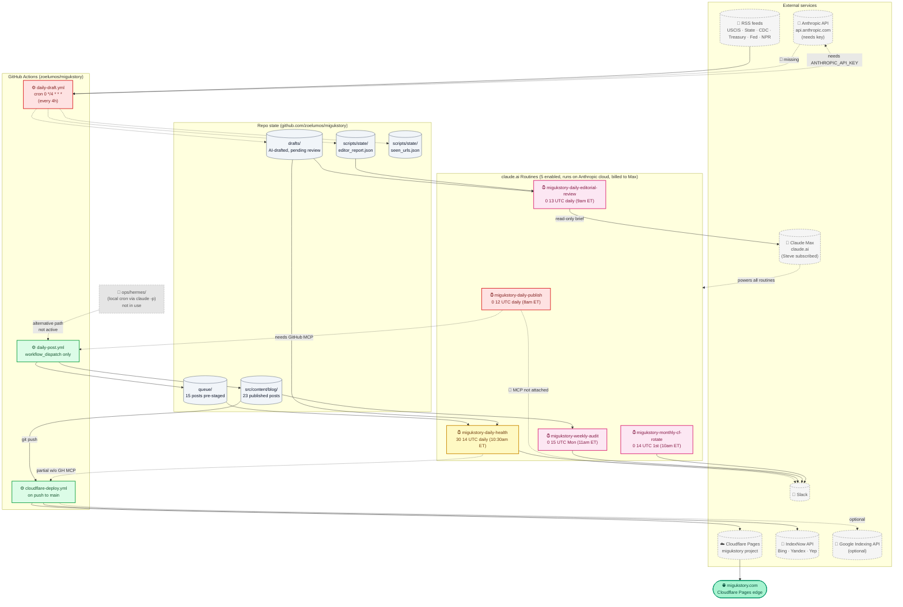
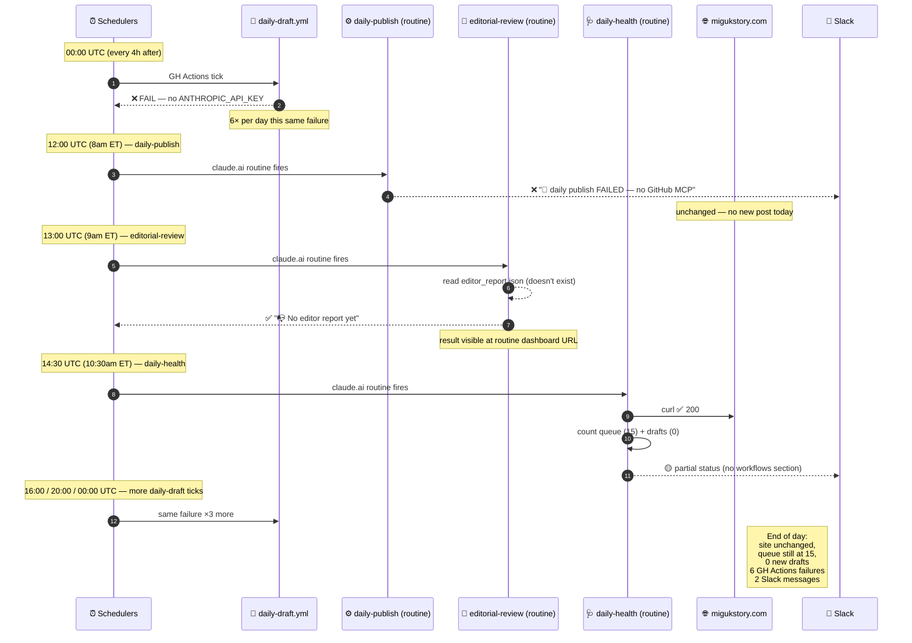
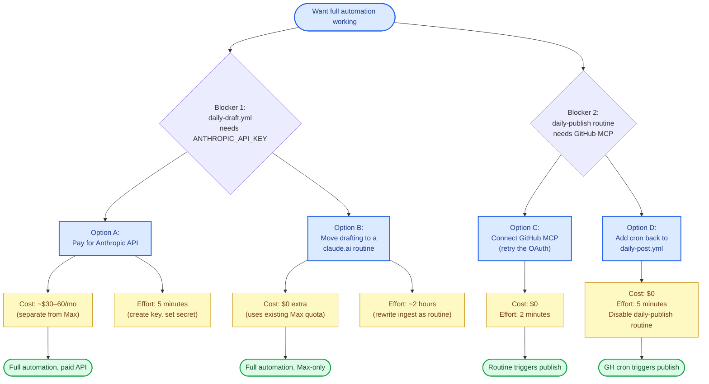

# migukstory.com — Architecture (2026-05-19)

**Status:** Site is live at https://migukstory.com. Deploy pipeline is fully automated. AI ingest pipeline has 2 known blockers (documented below).

> GitHub renders Mermaid diagrams inline in `.md` files. If you're viewing raw text, paste any of the code blocks into <https://mermaid.live>.

---

## TL;DR — what's working and what isn't

| Layer | Component | Status | Notes |
|---|---|---|---|
| **Site deploy** | `cloudflare-deploy.yml` | 🟢 working | push to main → CF Pages auto-deploys, ~50s |
| **Indexing** | `notify_indexes.py` (IndexNow + Google) | 🟢 working | runs post-deploy, IndexNow free |
| **AI ingest** | `daily-draft.yml` (RSS → Claude) | 🔴 blocked | needs `ANTHROPIC_API_KEY` (separate from Max) |
| **Editor grading** | `editor_grade.py` | 🔴 blocked | depends on ingest producing drafts |
| **Manual publish** | `daily-post.yml` | 🟢 working | triggered by routine or manually |
| **Routine: daily-publish** | claude.ai cron | 🔴 blocked | needs GitHub MCP attached |
| **Routine: editorial-review** | claude.ai cron | 🟢 working | will show "no data" until ingest fixed |
| **Routine: daily-health** | claude.ai cron | 🟡 partial | site/queue checks work; workflow listing blocked w/o GH MCP |
| **Routine: weekly-audit** | claude.ai cron | 🟢 working | runs every Monday |
| **Routine: monthly-cf-rotate** | claude.ai cron | 🟢 working | sends Slack reminder 1st of each month |
| **Local cron via Hermes** | `ops/hermes/` folder | ⚫ legacy | merged but unused; routines replace this |

---

## 1. Full system — what runs where

---

## 2. A day in the life — what fires when (with current state)

---

## 3. Decision tree — fixing the 2 blockers

---

## 4. Routines registered on claude.ai

All run in Anthropic's cloud, billed against Steve's Max subscription. Dashboard URLs are bookmarkable.

| Name | ID | Schedule (UTC) | Local approx (ET EDT) | Status | Dashboard |
|---|---|---|---|---|---|
| migukstory-daily-publish | `trig_01VDBqt2KmYvmH3wercFV5os` | `0 12 * * *` | 8:00 AM | 🔴 needs GH MCP | [link](https://claude.ai/code/routines/trig_01VDBqt2KmYvmH3wercFV5os) |
| migukstory-daily-editorial-review | `trig_01TwQNEERU2vYW6yxBPack2F` | `0 13 * * *` | 9:00 AM | 🟢 enabled | [link](https://claude.ai/code/routines/trig_01TwQNEERU2vYW6yxBPack2F) |
| migukstory-daily-health | `trig_01L1Ebbgjf939HNHw5Wze4zf` | `30 14 * * *` | 10:30 AM | 🟡 partial | [link](https://claude.ai/code/routines/trig_01L1Ebbgjf939HNHw5Wze4zf) |
| migukstory-weekly-audit | `trig_01PsRgvyDSmkhzvAbRtyhK3i` | `0 15 * * 1` | Mon 11:00 | 🟢 enabled | [link](https://claude.ai/code/routines/trig_01PsRgvyDSmkhzvAbRtyhK3i) |
| migukstory-monthly-cf-rotate | `trig_01Te7SdsHkTivdYSY2aBLN2q` | `0 14 1 * *` | 1st 10:00 | 🟢 enabled | [link](https://claude.ai/code/routines/trig_01Te7SdsHkTivdYSY2aBLN2q) |

MCPs auto-attached: Adobe-for-creativity, Vercel, Slack. **GitHub MCP NOT attached** (root cause of daily-publish blocker).

---

## 5. GitHub Actions workflows

| File | Trigger | Status | Purpose |
|---|---|---|---|
| `cloudflare-deploy.yml` | push to main (paths filter) | 🟢 working | Build Astro → wrangler deploy → IndexNow ping |
| `daily-draft.yml` | cron `0 */4 * * *` (6×/day) | 🔴 failing | RSS → Claude → drafts → editor grade → auto-PR |
| `daily-post.yml` | workflow_dispatch only | 🟢 working | Move N posts queue → blog → commit → push |

GitHub repo secrets currently set:
- `CLOUDFLARE_API_TOKEN` ✅ (deploy works)
- `CLOUDFLARE_ACCOUNT_ID` ✅
- `ANTHROPIC_API_KEY` ❌ (blocks daily-draft.yml)
- `GOOGLE_SERVICE_ACCOUNT_JSON` ❌ optional (IndexNow alone works)

---

## 6. Cost summary

| Service | Plan | Status | Used for |
|---|---|---|---|
| Claude Max | $200/mo subscription | ✅ active | All 5 claude.ai routines (15 runs/day budget) |
| Anthropic API | pay-as-you-go | ❌ not subscribed | Would unblock daily-draft.yml |
| Cloudflare Pages | Free tier | ✅ active | Hosting + auto-deploy |
| GitHub Actions | Free tier (public repo) | ✅ active | All workflows |
| IndexNow | Free | ✅ active | Bing/Yandex/Yep indexing |
| Google Indexing API | Free | ❌ not set up | Optional faster Google pickup |

**Current marginal monthly cost:** $0 on top of Max (~5 routine runs/day, well under 15/day cap).

---

## 7. Where Hermes / `ops/hermes/` sits

The `ops/hermes/` folder in the repo was created as an alternative path that uses Steve's Mac mini + `claude -p` (local invocation of Claude Code using the Max subscription, no API key). Defined 5 cron jobs in YAML.

**Currently unused.** The claude.ai routines do the same thing remotely, no Mac dependency. The folder remains in the repo as documentation of an alternative path if Steve wants to switch later. Can be safely deleted with one PR.

---

## 8. Repo file conventions

| Path | Purpose | Allowed writers |
|---|---|---|
| `drafts/<date>-<slug>.md` | AI drafts pending review | `draft_from_rss.py` |
| `queue/<topic>-<year>.md` | Approved-or-promoted, ready to publish | `editor_grade.py`, human, `publish_from_queue.py` |
| `src/content/blog/<topic>-<year>.md` | Published posts | `publish_from_queue.py`, human |
| `scripts/state/seen_urls.json` | Dedupe ledger | `draft_from_rss.py` |
| `scripts/state/editor_report.json` | Last grading report | `editor_grade.py` |
| `public/<indexnow-key>.txt` | IndexNow verification | manual |
| `ops/hermes/jobs/*.yml` | Hermes cron defs (unused) | manual |
| `ops/hermes/prompts/*.md` | Hermes prompts (unused) | manual |

---

## 9. Tomorrow morning, what to expect (current state)

🔴 Site unchanged (no new content gets published until 1 of 2 fixes)
🔴 6 failed `daily-draft.yml` runs visible at https://github.com/zoelumos/migukstory/actions
🟢 3 routine dashboards updated with results (editorial-review, daily-health, daily-publish)
🟡 Some Slack messages (depending on if Slack MCP triggers correctly from routines)

**To make tomorrow actually productive:** address Blocker 1 (Option B is recommended — keep everything Max-only). Blocker 2 has a 5-minute fix (Option D — cron in daily-post.yml).

---

*Generated 2026-05-19. Update this file whenever workflows, routines, scripts, or state files change. Mermaid renders inline on GitHub; for static export use [mermaid.live](https://mermaid.live) or the [Mermaid CLI](https://github.com/mermaid-js/mermaid-cli).*
