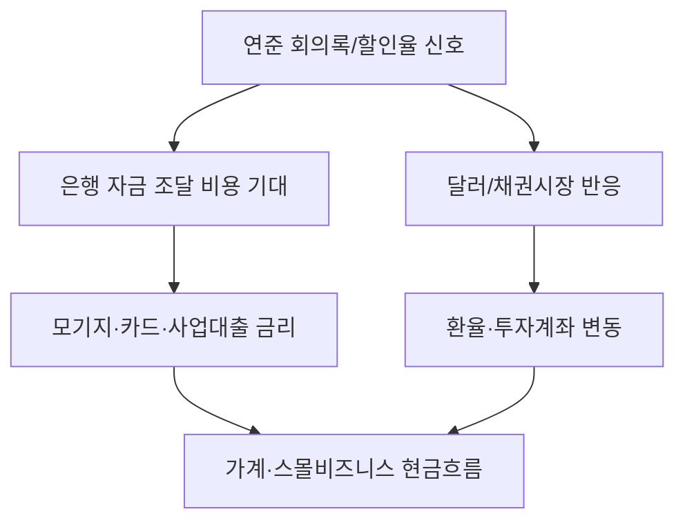

# 연준, 4월 할인율 회의록 공개… 금리 향방 단서

미국 연방준비제도(Federal Reserve) 이사회가 2026년 4월 20일과 29일에 열린 할인율(discount rate) 회의의 회의록을 5월 26일 공개했습니다. 할인율은 연준이 시중 은행에 직접 빌려줄 때 적용하는 금리로, 일반 대출 금리와 예금 금리 흐름을 가늠하는 중요한 신호 가운데 하나입니다.

이번 자료는 두 차례 회의의 논의 내용을 담은 공식 회의록(minutes) 형태로 공개되었습니다. 회의록은 통상 본회의가 끝난 뒤 일정 기간이 지나 발표되며, 이사회 위원들이 어떤 방향을 두고 의견을 나눴는지를 사후에 점검할 수 있는 1차 자료입니다. 발표 주체가 연준 이사회 본부라는 점에서 시장은 이 문서를 통화정책 흐름의 보조 지표로 받아들입니다.

연준이 정기적으로 회의록을 공개하는 것은 통화정책 결정 과정의 투명성을 높이기 위한 절차입니다. 연준은 이번에도 보도자료 형식으로 회의록 공개 사실을 알렸고, 상세 내용은 연방준비제도 공식 사이트의 통화정책 섹션을 통해 확인할 수 있습니다.

미주 한인 독자에게 이 발표가 왜 중요한지 짚어보겠습니다. 한인 자영업자에게 할인율은 사업자금 대출, 운영 자금 한도, 카드 가맹점 수수료 협상과 간접적으로 연결됩니다. 모기지를 끼고 집을 산 한인 가정과 학자금 대출이 남은 유학생·취업비자 근로자라면, 연준의 금리 신호가 변동금리 상품과 재융자 시점에 영향을 줄 수 있습니다. 은퇴를 앞둔 한인 부모 세대에게는 예금·CD 금리, 채권형 은퇴계좌 수익률에 파급되는 사안입니다. 다만 회의록 자체는 향후 인상·인하를 직접 명시하지 않으므로, 개별 대출·투자 결정은 본인의 재무 상황과 함께 판단해야 하며 필요한 경우 전문가 상담을 권장합니다.

당장 큰 변화가 임박했다고 단정하기보다는, 회의록에서 드러난 위원들의 시각이 향후 연방공개시장위원회(FOMC) 결정과 어떻게 맞물리는지 함께 살피는 것이 합리적입니다. 한인 가정의 가계부 점검, 사업체의 6~12개월 자금 계획, 자녀 학자금·렌트 인상 대비 등 실생활 결정에 참고용 자료로 활용하시기 바랍니다.

## 핵심 요약

- 연준 이사회가 2026년 4월 20일과 29일 할인율 회의의 회의록을 5월 26일 공개했습니다.
- 할인율은 은행 대출·예금 금리에 영향을 주는 연준의 핵심 금리 도구 중 하나입니다.
- 한인 자영업자, 모기지 보유 가정, 은퇴자 등은 향후 금리 방향성을 가늠하는 참고 자료로 활용할 수 있습니다.

## 한눈에 보는 시각화: 금리 결정이 가계로 전달되는 경로

| 연준/할인율 신호 | 금융시장 반응 | 한인 가정·사업체 영향 |
|---|---|---|
| 할인율 논의 공개 | 은행의 단기 자금 비용 기대가 바뀜 | 신용카드·사업자 대출 금리 부담을 점검해야 합니다. |
| 인플레이션/고용 판단 | 채권금리와 달러 흐름 변동 | 모기지 재융자, 환전, 송금 타이밍에 영향이 생깁니다. |
| 금리 인하 지연 가능성 | 대출 비용 고착 | 주택 구매와 사업 확장 계획을 보수적으로 잡아야 합니다. |
| 향후 회의 신호 | 시장 기대 재조정 | 현금흐름표와 이자비용 시나리오를 업데이트합니다. |

## 출처 (Sources)

- [Federal Reserve — Monetary Policy](https://federalreserve.gov/newsevents/pressreleases/monetary20260526a.htm)
