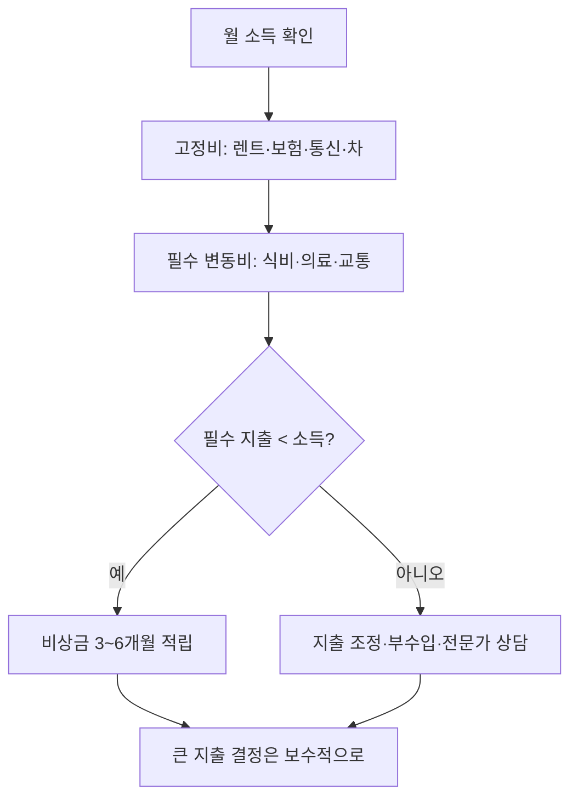

# 미국 가정 절반, 기본 생활비도 못 번다… 브루킹스 보고서 경고

미국 가정의 재정 상태가 생각보다 훨씬 벼랑 끝에 가깝다는 보고서가 공개됐습니다. NPR이 전한 브루킹스(Brookings) 분석에 따르면, 2024년 기준 미국 전체 가구 중 거의 절반이 기본적인 필수 생활비를 감당할 만큼의 소득을 벌지 못한 것으로 나타났습니다. 단순한 "허리띠 졸라매기" 수준이 아니라, 매달 들어오는 돈으로 의식주·교통·의료 같은 필수 지출조차 채우지 못한다는 의미입니다.

여기서 "필수 생활비"는 사치품이 아니라 살아가는 데 꼭 필요한 비용을 가리킵니다. 임금 인상이 있었음에도 인플레이션과 주거·식품·교통비 상승 속도를 따라잡지 못해, 통계상으로는 "일하고 있어도 가난한" 가구가 광범위하게 존재한다는 신호로 읽힙니다. 보고서는 이를 두고 미국 가계가 "재정적 벼랑(financial edge)"에 얼마나 가까이 서 있는지를 보여주는 자료라고 표현했습니다.

이는 한국에서 흔히 떠올리는 "미국 = 잘사는 나라" 이미지와는 큰 격차가 있습니다. 평균 소득 수치만 보면 미국 가구 소득은 여전히 높지만, 그 평균 뒤에는 고소득층이 끌어올린 평균 효과가 숨어 있고, 실제 중간 이하 가구는 매달 필수 지출을 맞추는 것조차 빠듯하다는 현실이 드러난 것입니다.

미주 한인 가정에도 남의 이야기가 아닙니다. 특히 ▲세탁소·식당·네일·편의점 등 소상공인 자영업 가정, ▲학자금과 렌트를 동시에 감당하는 유학생·신혼 가정, ▲취업비자(H-1B)·영주권 진행 중이라 이직이 어렵고 월급에 묶여 있는 직장인, ▲고정 연금으로 생활하는 은퇴 부모 세대처럼 소득이 비탄력적인 그룹은 인플레이션 충격을 그대로 흡수합니다. 렌트·그로서리·자동차 보험·건강보험 자기부담금이 동시에 오르면, 통계상 "절반"에 들어갈 위험은 한인 가정에도 충분히 현실적입니다.

대응 방향은 두 가지로 정리할 수 있습니다. 첫째, 가계 차원에서는 매달 고정비(렌트·보험·통신·자동차)와 변동비(식비·외식·배달)를 분리해 점검하고, 비상금 3~6개월치를 우선순위에 두는 것이 합리적입니다. 둘째, 자영업 가정은 매출이 줄어들 가능성에 대비해 메뉴·서비스 가격, 인건비, 임대 재계약 조건을 미리 시뮬레이션해 두는 편이 안전합니다. 구체적인 세금·대출·파산 관련 결정은 개인 상황에 따라 영향이 크므로, **전문가 상담을 권장합니다.**

새 학기, 비자 갱신, 부모 초청 등 큰 지출이 예정된 가정이라면 이 보고서를 "지금 미국 평균 가구의 절반이 이미 빠듯한 상태"라는 기준선으로 받아들이고, 무리한 지출 결정을 한 박자 늦추는 것이 안전합니다.

## 핵심 요약

- 2024년 미국 가구 중 거의 절반이 기본 필수 생활비를 충당할 소득을 벌지 못한 것으로 보고됐습니다.
- 평균 소득 수치 뒤에 가려진 중간 이하 가구의 현실이 드러난 자료로 해석됩니다.
- 한인 자영업·유학생·취업비자·은퇴자 가정도 동일한 인플레이션 압력에 노출되어 있어 비상금과 고정비 점검이 필요합니다.

## 한눈에 보는 변화

| 구분 | 통상적 인식 | 보고서가 보여주는 현실 |
| --- | --- | --- |
| 미국 가구 소득 | "평균적으로 여유 있다" | 거의 절반이 필수 지출도 못 맞춤 |
| 필수 생활비 | 사치 제외하면 감당 가능 | 의·식·주·교통·의료 기본조차 빠듯 |
| 임금 인상 효과 | 인플레이션을 상쇄한다고 가정 | 실제로는 가격 상승 속도에 미달 |
| 체감 위험 | 저소득층 일부의 문제 | 중간층까지 확장된 광범위한 문제 |

한인 가정 점검 흐름:

## 출처 (Sources)

- [NPR Business](https://npr.org/2026/05/28/nx-s1-5836525/affordability-report-brookings-inflation-wages)
