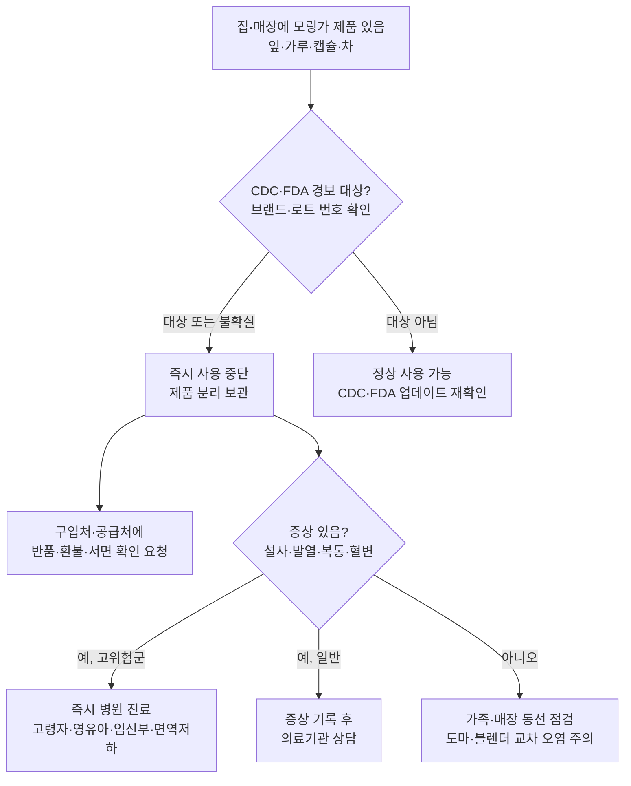

# 모링가 잎 제품 살모넬라 감염 확산: CDC 경보 업데이트와 한인 가정 대응 가이드

미국 질병통제예방센터(CDC)가 모링가(moringa) 잎 제품과 연관된 살모넬라(Salmonella) 감염 및 집단 발병이 늘고 있다며 경보를 갱신했습니다. CDC는 이번 사안을 단발성 사건이 아니라 "growing number"의 사례로 규정하고, 모링가 잎이 포함된 제품 전반을 다시 점검할 필요가 있다고 알렸습니다.

모링가는 잎, 가루, 캡슐, 차 형태로 미국 내 건강식품·자연요법 시장에서 꾸준히 팔리는 식물성 제품입니다. CDC가 이번 업데이트에서 강조한 핵심은 두 가지입니다. 첫째, 모링가 잎 제품을 매개로 한 살모넬라 감염 환자와 집단 발병 건수가 동시에 증가하고 있다는 점. 둘째, 이를 단순 식품 회수 안내가 아니라 "consumer alert" 수준으로 다루고 있다는 점입니다. 살모넬라는 일반적으로 설사, 발열, 복통을 유발하며, 미국에서만 매년 약 135만 건의 감염과 2만 6,500건의 입원, 약 420명의 사망과 관련된 것으로 추정되는 대표적 식중독균입니다(CDC, *Salmonella Homepage*). 영유아·고령자·면역 저하자에서 중증으로 진행될 수 있어, 이번처럼 "건강에 좋다"고 알려진 식물성 제품에서 발견될 때 위험이 과소평가되기 쉽습니다.

## 미주 한인 가정에 왜 중요한가

미주 한인 가정에서도 모링가는 낯설지 않은 품목입니다. 건강기능식품·차·분말 형태로 한인 마트, 한방·자연식 매장, 한인 온라인 쇼핑몰에서 어렵지 않게 구할 수 있고, 부모 세대의 혈당·면역 관리 보조제로 권유되는 경우가 많습니다. 이번 CDC 경보는 특히 다음 그룹에 직접 영향을 줍니다.

- **부모·조부모 세대**: 매일 모링가 차나 분말을 "혈당·혈압·면역에 좋다"는 권유로 장기 복용 중인 경우가 많습니다. 고령일수록 살모넬라가 중증 패혈증으로 진행될 위험이 높아 가장 먼저 확인해야 합니다.
- **유학생·젊은 직장인**: "natural detox", "그린 슈퍼푸드" 마케팅의 캡슐·파우더를 아마존·인스타그램 광고로 구매한 경우. 라벨에 "moringa leaf" 또는 "moringa oleifera"가 포함돼 있다면 점검 대상입니다.
- **임신부·면역 저하 가족**: CDC가 분류하는 고위험군에 해당합니다. 의심 제품은 즉시 중단하고 주치의와 상의해야 합니다.
- **한인 카페·베이커리·반찬 가게·푸드트럭 자영업자**: 모링가 분말을 라떼, 스무디, 마차 대용, 디저트, 반찬 가니쉬 등에 사용하는 곳이 늘었습니다. 영업장 식품 안전은 매출보다 무겁고, 단 한 건의 살모넬라 환자가 카운티 보건국 조사로 이어질 수 있습니다.

자영업자 입장에서는 책임 범위가 가정 소비자보다 훨씬 넓습니다. 매장에서 모링가가 들어간 음료·디저트·반찬을 판매 중이라면, 공급처(distributor)에 CDC 경보 대상 브랜드·로트(lot)에 포함되는지 서면으로 문의하고, 해당 로트의 사용을 중단해 별도 보관해야 합니다. 같은 도마·블렌더·계량스푼을 공유한 다른 메뉴까지 교차 오염 위험을 점검하는 것이 안전합니다. 가정 소비자도 라벨, 브랜드, 로트 번호를 확인하지 않은 상태라면 지금 한 번 점검하시기 바랍니다. 살모넬라 의심 증상(고열, 혈변, 6시간 이상 지속되는 구토, 심한 탈수)이 나타나면 자가 처치보다 의료기관 진료가 우선이며, 본 기사는 의학적 조언이 아니므로 반드시 전문 의료인의 상담을 받으시기 바랍니다.

## 편집자 분석: "천연=안전"이라는 통념의 한계

이번 CDC 업데이트가 한인 커뮤니티에 시사하는 바는 단순한 제품 회수 안내 이상의 의미를 가집니다. 첫째, 살모넬라는 익히 알려진 닭고기·달걀·생채소뿐 아니라 **건조 허브·분말·향신료**처럼 수분이 적은 식물성 원료에서도 반복적으로 검출돼 왔습니다. FDA는 그동안 후추, 카레 파우더, 모링가 등 건조 식물 원료에서 살모넬라가 검출돼 리콜이 진행된 사례를 여러 차례 공개한 바 있습니다(FDA, *Recalls, Market Withdrawals, & Safety Alerts*). "건조했으니 균이 없을 것"이라는 통념은 사실이 아니며, 가열 없이 차·스무디·캡슐로 그대로 섭취하는 모링가 제품은 오히려 위험이 직접 전달되는 경로입니다.

둘째, 모링가는 미국에서 의약품이 아니라 **dietary supplement(건강기능식품)** 로 분류돼 의약품 수준의 사전 검증을 받지 않습니다. FDA는 시장 출시 후 문제가 발견되면 회수·경고를 하는 사후 규제 체계를 운영하고 있어, 소비자가 CDC·FDA 발표를 주기적으로 확인하는 것이 사실상 1차 방어선이 됩니다. 한인 커뮤니티에서 "천연이라 안전하다", "한국·아시아에서 오래 먹어 왔으니 괜찮다"는 인식이 강할수록, 이번처럼 공식 경보가 갱신되는 시점에 가족 단위로 라벨을 한 번 점검하는 습관이 중요합니다.

## 핵심 요약

- CDC가 모링가 잎 제품과 연관된 살모넬라 감염·집단 발병이 늘고 있다며 경보를 업데이트했습니다.
- 모링가 잎, 가루, 캡슐, 차 등 모링가 잎이 포함된 제품 전반이 점검 대상입니다.
- 한인 가정·자영업자는 보유 중인 모링가 제품의 브랜드·로트 번호를 확인하고, 의심되면 즉시 사용을 중단하세요.
- 고령자·영유아·임신부·면역 저하자는 고위험군이므로 의심 제품 섭취 후 증상이 있다면 자가 처치 대신 병원 진료를 받으시기 바랍니다.
- 모링가를 메뉴·반찬에 사용하는 자영업자는 공급처에 서면 확인을 요청하고, 교차 오염 가능 동선을 점검해야 합니다.

## 한눈에 보는 변화

### 그룹별 우선 점검 항목

| 대상 | 우선 점검 항목 | 권장 조치 |
| --- | --- | --- |
| 한인 가정 소비자 | 모링가 차·분말·캡슐 보유 여부, 라벨 표기 | 브랜드·로트 확인, 의심 시 사용 중단·폐기 |
| 부모·고령자 | 매일 복용 중인 모링가 보조제 | 복용 일시 중단 후 가족·주치의와 상의 |
| 임신부·면역 저하자 | 차·스무디·캡슐 형태로 섭취 중인 모링가 | 즉시 중단, 증상 발생 시 바로 진료 |
| 카페·반찬·푸드트럭 자영업자 | 메뉴·식재료 내 모링가 사용처, 공급처 | 서면 문의, 해당 로트 사용 중단·격리, 교차 오염 점검 |
| 증상 발생자 | 고열·혈변·6시간↑ 구토·심한 탈수 | 자가 처치 대신 의료기관 진료 |

### 점검 순서 타임라인

1. **오늘**: 집·매장 안의 모링가 제품을 모두 꺼내 브랜드·로트 번호를 사진으로 기록.
2. **24시간 안**: CDC Newsroom과 FDA Recalls 페이지에서 해당 브랜드·로트가 경보 대상에 포함되는지 확인.
3. **48시간 안**: 대상이거나 불확실하면 사용 중단·분리 보관, 구입처에 반품·환불 문의.
4. **1주일 안**: 가족 중 의심 증상자가 없는지 확인, 고위험군은 주치의 상담.
5. **지속**: CDC가 업데이트를 추가할 수 있으므로 며칠 간격으로 재확인.

## 다음 단계 체크리스트

- [ ] 집 안 모링가 제품 라벨·로트 번호 사진 촬영
- [ ] CDC Newsroom 최신 발표 재확인
- [ ] FDA Recalls 페이지에서 브랜드·로트 검색
- [ ] 의심 제품 사용 중단·분리 보관, 구입처에 환불 문의
- [ ] 고위험 가족(고령자·영유아·임신부·면역 저하자) 증상 모니터링
- [ ] 자영업자는 공급처에 서면 확인 요청, 교차 오염 동선 점검

> 본 기사는 일반적인 정보 제공을 위한 것이며, 의학적·법률적 조언이 아닙니다. 증상이 있거나 고위험군에 해당한다면 반드시 의료 전문가의 상담을 받으시기 바랍니다.

## 출처 (Sources)

- [CDC Newsroom — Growing Number of Salmonella Illnesses and Outbreaks Linked to Moringa Leaf Products](https://tools.cdc.gov/api/embed/downloader/download.asp?c=765644&m=132608)
- [CDC — Salmonella Homepage](https://www.cdc.gov/salmonella/index.html)
- [FDA — Recalls, Market Withdrawals, & Safety Alerts](https://www.fda.gov/safety/recalls-market-withdrawals-safety-alerts)
- [FDA — Dietary Supplements](https://www.fda.gov/food/dietary-supplements)
