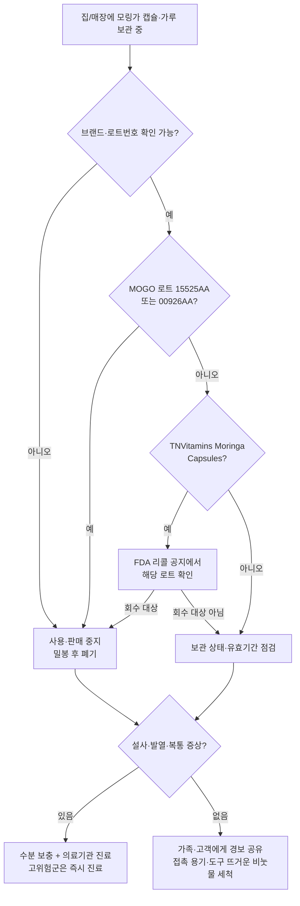

# 모링가 캡슐發 살모넬라 36개 주로 확산: MOGO·TNVitamins 리콜, 한인 가정·한인마트 점검 포인트

미국 질병통제예방센터(CDC)가 모링가(moringa) 잎 제품과 연관된 살모넬라(Salmonella) 감염이 계속 늘고 있다는 5월 27일자 업데이트 경보를 발표했습니다. CDC에 따르면 조사 시작 이후 누적 환자는 **36개 주 119명**이며, 정보가 확인된 109명 중 **32명이 입원**했습니다. 사망 사례는 보고되지 않았습니다. 이번 업데이트에서는 새로운 4개 주에서 환자 22명이 추가됐고, MOGO Moringa LLC가 5월 25일 자사 캡슐 제품 일부 로트를 리콜한 사실이 함께 공지됐습니다.

미주 한인 가정과 한인마트·건강식품점이 무심코 지나칠 수 없는 이유는, 모링가 가루·캡슐·차가 이미 한인 커뮤니티에서 "면역력·혈당·콜레스테롤" 마케팅 문구와 함께 폭넓게 유통되고 있기 때문입니다. CDC가 환자 수와 주(州) 범위를 명시했다는 것은 단발성 식중독이 아니라, 같은 보충제 카테고리에서 반복적으로 발병이 확인됐다는 뜻입니다. 미주 한인 독자 입장에서는 "한인마트에서 산 가루는 괜찮겠지"가 아니라, **브랜드명과 로트번호 단위로 확인**해야 안전한 상황입니다.

## 핵심 요약

- CDC 5월 27일 업데이트 기준 모링가 잎 제품發 살모넬라 누적 환자 **36개 주 119명**, 입원 **32명**, 사망 0명.
- **MOGO Pure Moringa Oleifera 캡슐**(흰색 플라스틱 통·녹색 라벨, 온라인 판매)이 5월 25일 **로트 15525AA(유효기간 2027/6)**, **로트 00926AA(유효기간 2028/1)**로 리콜됐습니다.
- **TNVitamins Moringa Capsules** 일부 로트도 리콜됐으며, CDC는 "이미 회수됐지만 가정에 남아 있을 수 있다"고 경고했습니다.
- 영유아·임산부·65세 이상·면역저하자는 고위험군이며, 증상이 있으면 자가 판단보다 진료가 우선입니다.

## 확인된 리콜 제품과 한인 가정 점검 포인트

지금까지 공식적으로 이름이 공개된 제품은 다음 두 가지입니다. 한인 가정에서 모링가 캡슐을 복용 중이라면 라벨과 로트번호를 직접 확인해 주세요.

| 제품 | 브랜드/제조 | 형태·외관 | 리콜 로트·유효기간 | 유통 채널 |
| --- | --- | --- | --- | --- |
| Pure Moringa Oleifera Capsules | MOGO Moringa LLC | 흰색 플라스틱 통, 녹색 라벨 | 로트 15525AA(EXP 2027/6), 로트 00926AA(EXP 2028/1) | 온라인 전용 판매 |
| Moringa Capsules | TNVitamins | 캡슐(세부 라벨은 FDA 공지 참조) | "일부 로트" 리콜 | CDC: 이미 회수됐으나 가정 잔여 가능 |

CDC와 FDA 공지에 이름이 없는 다른 모링가 가루·차 제품까지 자동으로 "안전"이라고 판단해서는 안 됩니다. 같은 공급망·동일 원료를 쓰는 후속 리콜이 나올 가능성이 있고, 5월 27일 업데이트 자체가 "환자가 늘고 있다"는 사실을 강조하는 흐름이기 때문입니다.

## 한눈에 보는 변화

## 미주 한인 독자별 의사결정 가이드

| 대상 그룹 | 가장 먼저 확인할 것 | 자주 놓치는 포인트 |
| --- | --- | --- |
| 영유아·임산부·65세 이상·면역저하자가 있는 가정 | 모링가 캡슐·가루 즉시 사용 중지, 진료 임계 증상 숙지 | "조금만 남았으니 다 먹고 버리자"는 가장 위험한 선택 |
| 한인마트·건강식품점·한방 매장 운영자 | 진열·재고 중 MOGO·TNVitamins 로트번호 대조, 공급사에 회수 의향서 요청 | 매입 인보이스·폐기 기록을 사진과 함께 문서화 |
| 유학생·1인 가구·온라인 구매자 | 아마존·인스타·틱톡 광고로 산 캡슐의 판매자·로트 재확인 | MOGO는 온라인 전용 판매라 SNS 구매 비중이 높을 가능성 |
| 부모 세대·실버타운 거주 한인 | 본인이 복용 중인 "면역력 보조제"가 모링가 캡슐인지 라벨 확인 | "한국에서 사 온 거라 괜찮다"는 가정 점검 필요 |

## 살모넬라 증상과 진료 기준

CDC는 살모넬라 노출 후 보통 **6시간~6일 사이**에 설사·발열·복통이 나타나고, 증상이 **4~7일** 이어진다고 설명합니다. 다음 중 하나라도 해당하면 의료기관 진료가 권장됩니다.

- 38.9℃(102°F)를 넘는 발열을 동반한 설사
- 호전 없이 2일 넘게 지속되는 설사
- 혈변
- 심한 구토로 수분 섭취가 어려운 경우
- 소변량 감소·입마름·어지럼증 등 탈수 징후

영유아, 임산부, 고령자, 면역저하 환자는 위 기준 이전이라도 조기에 진료를 받는 편이 안전하며, 진단·치료는 반드시 의료 전문가 상담을 거쳐야 합니다. 이 글은 의학 자문이 아니며, 개별 사례 판단은 주치의 또는 보건당국 안내를 따르시기 바랍니다.

## 편집자 분석: "건강식품이라 안심"이 가장 큰 함정

이번 업데이트에서 주목할 지점은 두 가지입니다. 첫째, 환자 수가 짧은 기간에 22명 늘고 새로운 4개 주가 추가됐다는 사실은, 회수 공지 이후에도 **가정·매장에 남은 재고가 계속 노출원이 되고 있다**는 신호입니다. 둘째, 살모넬라가 검출된 제품군이 신선식품이 아니라 가공된 캡슐·가루라는 점은 "건조식품이라 균이 없을 것"이라는 일반적인 통념을 정면으로 뒤집습니다. 즉, 한인 가정과 한인마트가 평소 위험하다고 분류하지 않던 카테고리에서 발병이 누적되고 있다는 뜻입니다.

미주 한인 독자에게 이번 경보가 더 무거운 이유는, 모링가가 영어권보다 한인 1세대·부모 세대·이민 가정 사이에서 "혈당·콜레스테롤·면역" 보조제로 강하게 마케팅돼 왔기 때문입니다. 부모님 댁 약 서랍, 한인 카톡방 공동구매, 한인마트 진열대 모두 한 번씩 훑어보는 것이 합리적입니다. 한인마트·건강식품점 운영자는 회수 대상 제품을 그대로 판매할 경우 보건당국 조사와 손해배상 위험이 따를 수 있어, **공급사에 서면 회수 확인을 요청하고 매입·폐기 기록을 보관**하는 절차가 필요합니다. 구체적인 법적 책임 범위는 변호사 등 전문가 상담을 권장합니다.

## 출처 (Sources)

- [CDC Newsroom — Alert Update: Growing number of Salmonella illnesses and outbreaks linked to moringa leaf products (2026-05-27)](https://www.cdc.gov/media/releases/2026/2026-alert-update-growing-number-of-salmonella-illnesses-and-outbreaks-linked-to-moringa-leaf-products.html)
- [CDC Newsroom (원문 다운로드 링크)](https://tools.cdc.gov/api/embed/downloader/download.asp?c=765643&m=132608)
- [CDC — Salmonella Outbreak Linked to Moringa Capsules (MOGO 리콜 상세)](https://www.cdc.gov/salmonella/outbreaks/moringa-05-26/index.html)
