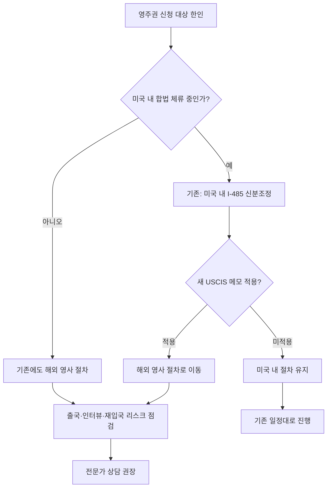

# USCIS 새 메모, 영주권 신청자 대부분 해외에서 신청해야 할 수도

미국이민협회(American Immigration Council, AIC)가 새로 공개된 USCIS 내부 메모를 분석한 결과, 영주권 신청자 상당수가 앞으로는 미국 내에서 신분조정(adjustment of status, I-485)을 받는 대신 본국 또는 제3국에 있는 미국 영사관을 통해 영주권을 신청해야 할 가능성이 제기됐습니다. AIC는 이번 변화가 "혼란과 혼선(chaos and confusion)"을 불러올 것이라고 경고했습니다.

핵심은 **"신청 장소"가 달라진다**는 점입니다. 그동안 많은 한인 신청자는 미국 내에 합법 체류 신분을 유지한 채 I-485를 제출해 인터뷰와 결정을 미국에서 받아왔습니다. 그러나 새 메모가 적용되면 같은 사람이 같은 카테고리로 신청해도 미국 내 절차가 막히고, 해외 미국 영사관에서 인터뷰를 받아야 영주권이 발급되는 경로(Consular Processing)로 밀려날 수 있다는 것이 AIC의 우려입니다.

## 미주 한인 독자에게 왜 중요한가

미주 한인 커뮤니티에 미치는 충격은 단순한 절차 변경 그 이상입니다. 영향권에 들어가는 그룹은 크게 네 부류입니다.

- **H-1B 취업비자로 일하며 영주권을 진행 중인 직장인**: 신분조정 단계에서 EAD(노동허가)와 AP(여행허가)를 받아 자유롭게 일하던 흐름이 끊길 수 있습니다. 해외에서 영사 인터뷰를 받는다면 인터뷰 일정에 맞춰 출국·체류해야 하며, 그 사이 미국 내 고용 유지와 급여 흐름을 어떻게 관리할지가 핵심 과제로 떠오릅니다.
- **OPT/STEM OPT를 거쳐 신분조정을 준비하던 유학생·신입 직장인**: F-1 신분에서 곧장 I-485로 옮겨가는 경로가 좁아진다면, 학업·취업 일정 전체를 다시 짜야 할 수 있습니다.
- **시민권자·영주권자 가족이 초청한 부모·배우자**: 이미 미국에 입국해 신분조정으로 영주권을 마무리하려던 가족 초청 케이스가 본국 영사 절차로 되돌려질 가능성이 거론됩니다. 부모 세대의 경우 장거리 비행, 의료 상태, 한국 내 임시 체류비가 새로운 부담으로 작동합니다.
- **자영업·소상공인 한인**: 신청자 본인이 장기간 해외에 머물러야 하는 시나리오 자체가 사업 운영의 핵심 리스크입니다. 직원 비자를 진행 중인 가게라면 인력 공백이 매출과 직결됩니다.

또한 영사 절차로 빠질 경우 과거 미국 체류 기록, 비자 만료, 무단 체류(unlawful presence) 일수에 대한 재심사 가능성이 커집니다. 본인의 체류 이력을 명확히 정리하지 않은 채 출국하는 것은 재입국 거부 위험까지 동반할 수 있으므로 매우 위험합니다.

## 한눈에 보는 변화

### 기존 신분조정 vs 새 메모 적용 시 영사 절차

| 항목 | 기존 (미국 내 신분조정, I-485) | 새 메모 적용 시 (해외 영사 절차) |
| --- | --- | --- |
| 인터뷰 장소 | 미국 내 USCIS 필드오피스 | 본국/제3국 미국 영사관 |
| 출국 필요성 | 일반적으로 불필요 (AP 활용 가능) | 출국 필요 가능성 |
| EAD/AP | 진행 중 발급 가능 | 해당 없음, 출국 시 미국 내 취업·재입국 제약 |
| 직장·사업 영향 | 상대적으로 적음 | 휴직·인력 공백·운영 공백 위험 |
| 체류 이력 재심사 | 미국 내 단계에서 검토 | 영사 단계에서 재검토 가능성, 무단 체류 일수 문제화 |
| 가족 동반 절차 | 동반 가족도 미국 내에서 동시 처리 | 본국에서 함께 인터뷰 필요할 수 있음 |
| 혼선 위험 | 낮음 | AIC가 "혼란과 혼선" 경고 |

### 케이스별 점검 단계

1. **현재 비자/체류 상태 확인** — H-1B, F-1/OPT, L-1, 가족초청 대기, 무비자 입국 후 신분조정 등 정확한 분류.
2. **I-140·우선일자(priority date) 진행 단계 확인** — 어디까지 승인됐는지가 영사 절차 전환 시 영향이 큽니다.
3. **과거 미국 체류 이력 점검** — 무단 체류 일수, 비자 만료, 출국 기록을 변호사와 함께 정리.
4. **가족 일정 검토** — 자녀 학교, 배우자 직장, 부모 의료 일정과 출국 가능 기간을 맞춰봅니다.
5. **사업·고용 영향 점검** — 자영업자는 부재 시 운영 위임, 직장인은 장기 휴가/원격 근무 가능 여부 확인.

## 편집자 분석

이번 메모의 본질은 "자격 요건"이 아니라 "처리 경로"의 이동에 있다는 점에서, 같은 영주권 카테고리·같은 우선일자라도 결과 체감 차이가 매우 커진다는 데에 주의해야 합니다. 미국 내 신분조정은 신청자가 미국에 머물면서 일하고 학교에 다니며 결정을 기다릴 수 있는 구조인 반면, 영사 절차는 신청자의 일정·생활 거점을 본국에 두어야 하는 구조이기 때문입니다. AIC가 "혼란과 혼선"이라는 강한 표현을 쓴 이유도 이 차이가 단순한 행정 이동이 아니라, **신청자의 직장·가족·재정 계획 전체를 다시 짜야 하는 변동**이기 때문으로 읽힙니다.

또한 메모 단계에서는 ① 이미 접수된 I-485 케이스가 소급 적용을 받는지, ② 어떤 비자 카테고리·어떤 사유가 영사 절차로 분류되는지, ③ 시행 시점이 언제인지 등 구체 사항이 명확히 공개되지 않은 상태입니다. 따라서 지금 시점에서 가장 합리적인 대응은 새로운 결정을 서두르는 것이 아니라, **본인 케이스의 단계·체류 이력·서류 무결성을 정리해 두고, 공식 시행 지침이 나올 때 즉시 움직일 수 있게 준비해 두는 것**입니다. 특히 무단 체류 일수, 비자 변경 이력, 과거 거절 이력이 있는 신청자라면 출국이 곧 재입국 거부 리스크가 될 수 있어, 변호사 검토 없이 단독으로 결정해서는 안 됩니다.

## 핵심 요약

- AIC는 새 USCIS 메모로 영주권 신청자 상당수가 미국 내 신분조정 대신 해외 영사 절차로 밀릴 수 있다고 분석했습니다.
- 변화의 핵심은 자격이 아니라 "신청 장소"입니다. 같은 케이스여도 미국 내에서 끝낼 수 없게 될 가능성이 거론됩니다.
- 한인 직장인·유학생·가족초청 신청자·자영업자 모두 출국 위험, 일정, 무단 체류 일수 재심사에 대비해야 합니다.
- 메모 단계라 시행·소급 여부가 불명확하므로, 지금은 본인 케이스 정리와 전문가 상담이 가장 시급합니다.

> 이 글은 정보 제공 목적의 편집 분석이며, 개별 케이스에 대한 법률 자문이 아닙니다. 영주권 경로 결정 전에는 반드시 **이민 전문 변호사 상담**을 권장합니다.

## 출처 (Sources)

- [Google News — USCIS / Green Card Watch](https://news.google.com/rss/articles/CBMigAFBVV95cUxPMjFwZHIyTFh0M01CZF9uLW5maUwzWjFpemxjR0VGd2J1YlllZXFCcE40N1hXZ3p6Ym9NVi1ydElrX0dWRjhhaWRCaGVPQks0RXJFU29oLUlIMmVSV0RBUXRtQ1dyZHEzQ0thZUFBR292M09BYWVFdU5jSmctakp1UQ?oc=5)
- [USCIS Policy Manual — Adjustment of Status (공식)](https://www.uscis.gov/policy-manual/volume-7)
- [U.S. Department of State — Immigrant Visa Process / Consular Processing (공식)](https://travel.state.gov/content/travel/en/us-visas/immigrate/the-immigrant-visa-process.html)
- [American Immigration Council — Publications & Analysis](https://www.americanimmigrationcouncil.org/research)
