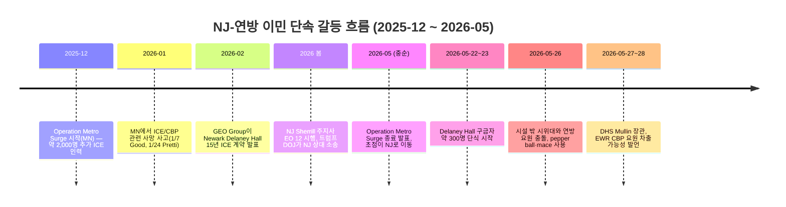

# EWR 비상: Newark 공항 지연에 ICE·트럼프 압박까지 겹쳤다

뉴저지와 뉴욕 한인들이 가장 많이 쓰는 공항 중 하나인 **Newark Liberty International Airport(EWR)** 가 다시 여행객 불안의 중심에 섰습니다. 최근 며칠 사이 United 탑승객의 장시간 활주로 대기 보도, 날씨·관제·항공사 운영 이슈가 겹친 지연 사례, 그리고 실시간 운항 변동이 이어지면서 “지금 공항 가도 되나?”라는 질문이 커지고 있습니다.

여기에 **ICE·뉴저지·트럼프 행정부 갈등**이라는 정치·이민 변수까지 붙었습니다. ABC News는 DHS 장관 Markwayne Mullin이 Newark의 **Delaney Hall ICE detention center** 시위 통제를 이유로 EWR에서 국제 여객을 처리하는 CBP 요원을 차출할 수 있다고 위협했다고 보도했고, NJ 1015·Save Jersey는 Sherrill 뉴저지 주지사가 트럼프 측의 EWR ICE 인력 배치 계획을 강하게 비판했다고 전했습니다. 아직 EWR 국제선 처리가 실제로 중단된 것은 아니지만, 한인 여행자에게는 단순 항공 지연을 넘어 **이민·입국·신분 확인** 이슈까지 같이 봐야 하는 상황입니다.

다만 중요한 점이 있습니다. **공식 FAA NAS Status는 2026년 5월 28일 20:59 GMT 확인 시점에 EWR을 별도 Ground Delay Program 목록에 올려두지는 않았습니다.** 즉 “공항 전체가 공식적으로 멈췄다”고 단정하면 안 됩니다. 대신 EWR은 United 허브이고 뉴욕권 날씨·관제 흐름의 영향을 크게 받기 때문에, 개별 항공편 단위로 지연·게이트 변경·탑승 후 대기가 갑자기 생길 수 있는 공항입니다.

한인 독자에게 핵심은 공포가 아니라 **출발 전 확인 순서**입니다. EWR은 뉴저지 팰팍·포트리·에디슨·맨해튼 서쪽에서 접근성이 좋아 많이 쓰지만, 한 번 꼬이면 픽업·환승·회사 일정·한국행 국제선 연결까지 같이 무너질 수 있습니다.

## 핵심 요약

- FAA 공식 NAS 상태에서 EWR 전체 Ground Delay가 표시되지 않아도, 개별 항공편은 지연·결항될 수 있습니다.
- 별도 보도에 따르면 DHS/트럼프 행정부 쪽에서 Newark 국제선 처리 중단 또는 공항 인력 철수 가능성까지 언급해, EWR 이슈가 항공 지연을 넘어 ICE·이민 정책 갈등으로 커졌습니다.
- EWR은 United 허브라 United 앱의 게이트·탑승·기체 지연 알림을 가장 먼저 봐야 합니다.
- 국제선 연결, 한국행 환승, 노약자 동반 여행은 “공항 도착 후 해결”보다 출발 전 재예약 옵션 확인이 안전합니다.
- 영주권·비자·체류 신분이 민감한 여행자는 여권, 비자, I-94, 영주권카드, 승인서 사본을 따로 준비하고 불필요한 설명은 피하는 것이 좋습니다.
- 가족 픽업은 착륙 예정시간만 보지 말고 **실제 이륙 여부 + 도착 게이트 + 수하물 지연**까지 확인해야 합니다.
- 공항 상황 기사만 보고 움직이지 말고 FAA, 항공사 앱, FlightAware 같은 실시간 도구를 함께 확인하세요.

## 한눈에 보는 EWR 확인 순서

| 단계 | 확인할 곳 | 봐야 할 것 | 한인 여행자 팁 |
|---|---|---|---|
| 1 | 항공사 앱 | 항공편 status, gate, aircraft delay | United면 앱 알림을 켜고 문자보다 앱을 우선 확인 |
| 2 | FAA NAS Status | Ground Delay, Ground Stop, airport status | EWR이 공식 지연 목록에 있는지 확인 |
| 3 | FlightAware EWR | 같은 공항의 도착·출발 흐름 | 내 비행기만이 아니라 같은 노선·항공사 흐름도 보기 |
| 4 | 공항 이동 전 | 교통, 주차, 터미널 | 픽업 차량은 cell phone lot 대기 고려 |
| 5 | 장거리/국제선 | 환승 가능 시간 | 한국행 연결편은 최소 연결시간보다 여유 있게 재확인 |

## 왜 EWR은 한 번 꼬이면 체감이 큰가

EWR은 뉴욕권 3대 공항 중 하나이지만, 실제로는 뉴저지 한인 생활권과 매우 밀접합니다. 팰리세이즈파크·포트리·리틀페리·에디슨·저지시티에서 차로 이동하기 쉬워 한국 방문, 출장, 가족 픽업에 자주 쓰입니다.

문제는 EWR이 **United 중심 허브 공항**이라는 점입니다. 허브 공항은 연결편이 많아 한 항공편 지연이 다음 항공편, 승무원 배치, 게이트 운영까지 영향을 줄 수 있습니다. 날씨가 맑아 보여도 다른 도시에서 들어오는 기체가 늦으면 내 항공편도 밀릴 수 있습니다.

또 뉴욕권 공항은 공역이 복잡합니다. Newark, LaGuardia, JFK가 같은 대도시권 하늘을 나눠 쓰기 때문에, 어느 한쪽의 날씨·관제·활주로 운영 문제가 주변 공항 흐름에도 영향을 줄 수 있습니다.

## ICE·트럼프 행정부 변수: 왜 EWR 뉴스가 이민 뉴스가 됐나

이번 Newark 공항 이슈가 더 민감한 이유는 공항 지연만의 문제가 아니기 때문입니다. Newark에는 **Delaney Hall**이라는 1,000-bed ICE detention center가 있고, GEO Group이 ICE와 약 15년·10억 달러 규모 계약(2025년 2월 발표)으로 운영하고 있습니다. CNN·TIME·CBS News 보도에 따르면 5월 22~23일경부터 약 300명의 구금자가 음식 위생(상한 음식, 일부 “구더기” 신고 포함)과 의료 미흡을 이유로 단식·노동 거부에 들어갔고, 5월 26일 전후로는 시설 밖에서 시위대와 연방 요원이 충돌해 pepper ball·mace가 사용됐다고 전했습니다.

### EWR 국제선 인력 차출 위협, 어디까지 사실인가

확인된 부분과 아직 확정되지 않은 부분을 분리해 보면 다음과 같습니다.

- 확인됨 (보도 기반): ABC News는 DHS 장관 **Markwayne Mullin이 Delaney Hall 시위 통제를 이유로 EWR에서 국제 여객을 처리하는 CBP 요원을 빼올 수 있다고 위협**했다고 전했습니다. NJ 1015·Save Jersey 보도에 따르면 Sherrill 주지사는 EWR 공항에 ICE 인력을 배치하려는 트럼프 측 계획을 강하게 비판했고, 트럼프 DOJ는 sanctuary 성격의 NJ Executive Order 12를 상대로 소송을 제기한 상태입니다. CBS New York·NBC New York은 정부 셧다운 기간 ICE 요원이 EWR과 JFK에 TSA 보조 명목으로 배치돼 일부 터미널 B·C에서 입국자 대상 서류 확인 사례가 보고됐다고 전했습니다(Border Czar Tom Homan은 “스크리닝이 아닌 출입구 관리·crowd control”이라고 설명).
- 아직 아님: 5월 28일 현재 “EWR 국제선이 실제로 중단됐다”거나 “ICE가 EWR 입국장에서 대규모 단속을 시작했다”는 보도는 없습니다. **이 글을 보고 EWR 입국이 막혔다고 단정하지 마세요.**

따라서 “EWR 폐쇄”나 “모든 입국심사가 ICE로 전환됐다” 같은 표현은 사실을 넘는 과장입니다. 다만 공항 운영, ICE 시설 시위, sanctuary 정책 논쟁, 국제선 처리 권한이 한꺼번에 엮이면서 한인 여행자에게는 **국제선 처리 시간·신분 확인·연방-주정부 충돌**이 새로운 변수로 들어왔습니다.

### Steve 질문: “미네소타 때처럼” 비교는 맞나

Steve가 언급한 미네소타 비교는 **참고할 선례지만 그대로 적용해서는 안 되는 사례**입니다. Britannica·CBS News 정리에 따르면, 트럼프 2기 행정부는 2025년 12월 미니애폴리스–세인트폴 일대에 약 2,000명의 추가 이민단속 요원을 투입(“Operation Metro Surge”)했고, 2026년 1월에는 ICE/CBP 요원에 의한 사망 사고(1월 7일 Renee Nicole Good, 1월 24일 미 시민권자 ICU 간호사 Alex Pretti)가 발생해 항의가 격화됐습니다. Walz 주지사와 Frey 미니애폴리스 시장이 철수를 요구했고, 이후 Tom Homan은 Operation Metro Surge 종료를 발표했습니다.

뉴저지는 미네소타와 **두 가지 패턴이 비슷**합니다. 첫째, 민주당 주지사가 sanctuary 성격 정책(Sherrill 주지사 EO 12—연방 이민 요원의 비공개 주정부 시설 사용 제한)을 운영합니다. 둘째, 트럼프 DOJ가 이를 막기 위해 NJ를 상대로 소송을 걸었습니다. 단, **NJ에는 아직 미네소타 수준의 대규모 추가 인력 투입이나 ICE 사망 사례가 보고되지 않았고**, Newark 갈등의 중심은 “공항 단속”이 아니라 “Delaney Hall 구금시설”입니다.

결론: **“미네소타처럼 물리적으로 동일하게 번지고 있다”고 단정할 근거는 없지만, 정치·법적 충돌 패턴이 비슷하게 진행 중**이라는 의미로 보는 것이 정확합니다.

### 사건 흐름 한눈에 보기

### 한인 여행자·이민자 체크포인트

| 대상 | 지금 확인할 것 | 이유 |
|---|---|---|
| 영주권자 | 영주권카드, 여권, 장기 해외체류 기록 | 입국 심사에서 체류기간·거주 의사 질문 가능 |
| 비자 소지자 | 비자 유효기간, I-94, 고용/재학 증빙 | 항공 지연보다 신분 서류 미비가 더 큰 문제 |
| 시민권 신청 중 | 해외여행 기간, 주소 변경, pending case 알림 | 장기 부재는 케이스 설명이 필요할 수 있음 |
| 서류 미비 가족 동반 | 변호사 연락처, 가족 비상 연락망 | 공항·이동 중 불필요한 노출을 줄여야 함 |
| 픽업 가족 | 항공편 상태 + 입국장 대기시간 | 도착 후 심사 지연이 픽업 지연으로 이어질 수 있음 |

### 공항에서 기억할 원칙

1. 합법 신분자는 **서류를 정확히 준비**하되, 묻지 않은 내용을 길게 설명하지 마세요.
2. 비자·영주권·pending case가 복잡하면 출국 전 변호사에게 여행 가능 여부를 확인하세요.
3. 기사 제목만 보고 공항으로 바로 가지 말고, 항공사 앱과 FAA 상태를 먼저 확인하세요.
4. ICE 관련 시위나 대규모 경찰 활동이 보이면 현장 접근을 피하고 우회하세요.
5. 가족에게 항공편 번호, 터미널, 비상 연락처, 체류 신분 관련 중요 서류 위치를 공유해두세요.

## 지금 EWR 이용자 체크리스트

### 출발하는 사람

1. 집에서 나오기 전 항공사 앱에서 “On time”만 보지 말고 **기체 도착 여부**를 확인하세요.
2. 수하물을 부칠 예정이면 카운터 마감시간을 기준으로 움직이세요. 지연이 있어도 체크인 마감은 그대로일 수 있습니다.
3. 회의·결혼식·장례식·한국행 연결편처럼 놓치면 큰 일정은 같은 날 늦은 대체편을 미리 확인하세요.
4. “탑승 시작” 알림 뒤에도 활주로 대기가 생길 수 있으므로 물·약·아이 간식은 보안검색 후 준비하세요.

### 도착자를 픽업하는 사람

1. 착륙 예정시간보다 **실제 출발 여부**를 먼저 보세요. 출발지에서 아직 이륙하지 않았으면 픽업 시간을 늦춰야 합니다.
2. 도착 후에도 게이트 이동, 수하물 대기, 세관 대기 시간이 붙을 수 있습니다.
3. 국제선 가족 픽업이면 최소 45~90분 여유를 두고 움직이는 편이 안전합니다.
4. 공항 앞 순환도로에서 오래 돌지 말고 cell phone lot 또는 근처 대기 장소를 활용하세요.

## 상황별 빠른 판단표

| 상황 | 바로 할 일 | 이유 |
|---|---|---|
| 항공사 앱은 지연, FAA는 정상 | 항공사 앱 기준으로 움직이기 | FAA는 공항/공역 단위, 앱은 내 항공편 단위 |
| FAA에 Ground Delay 표시 | 출발 전 재예약 옵션 확인 | 공항 전체 흐름이 밀릴 가능성 |
| 탑승했는데 출발 안 함 | 연결편 고객센터 채팅/앱 열기 | 기내 대기 중에도 다음편 재예약 경쟁 시작 |
| 한국행 국제선 연결 | 최소 연결시간 재계산 | 입국심사·수하물·터미널 이동이 변수 |
| 노약자/아이 동반 | 공항 도착 전 wheel chair/assistance 확인 | 현장 요청은 지연 때 더 오래 걸림 |

## “공식 지연 없음”인데 왜 난리처럼 느껴질까

공항 이슈는 두 층으로 나뉩니다.

첫째는 FAA가 표시하는 **공항·공역 단위 상태**입니다. Ground Stop이나 Ground Delay Program처럼 공항 전체 흐름을 조절하는 조치가 여기에 해당합니다.

둘째는 승객이 실제로 겪는 **항공편 단위 문제**입니다. 기체 도착 지연, 승무원 연결 문제, 게이트 부족, 날씨 우회, 수하물 처리 지연은 FAA의 큰 경보가 없어도 발생할 수 있습니다. 그래서 EWR을 이용할 때는 “뉴스에서 난리냐 아니냐”보다 **내 항공편이 실제로 움직이고 있느냐**가 더 중요합니다.

## 미주 한인에게 특히 중요한 포인트

한인 가정은 EWR을 단순 국내선 공항으로만 쓰지 않습니다. 한국 방문, 부모님 마중, 유학생 귀국, 출장 환승이 엮이는 경우가 많습니다. 이때 2~3시간 지연은 단순 불편이 아니라 다음 일정 전체를 바꾸는 문제가 됩니다.

특히 한국에서 오는 부모님이나 영어가 익숙하지 않은 가족을 픽업할 때는 항공편 번호를 가족 단톡방에 공유해두고, 픽업 담당자가 직접 앱이나 FlightAware로 확인하는 편이 안전합니다. “도착했다”는 문자만 기다리면 수하물·세관·게이트 변경 때문에 공항 앞에서 오래 대기할 수 있습니다.

## 출처 (Sources)

- FAA National Airspace System Status — https://nasstatus.faa.gov/
- FAA Airport Status Information API — https://nasstatus.faa.gov/api/airport-status-information
- FlightAware EWR airport live page — https://www.flightaware.com/live/airport/KEWR
- TIME, “What to Know About the Hunger Strike and Protests at a New Jersey ICE Facility” — https://time.com/article/2026/05/26/delaney-hall-ice-protests-new-jersey-dhs-geo-group-hunger-strike/
- CNN, “Delaney Hall: ICE facility hunger strike leads to protests in New Jersey” — https://www.cnn.com/2026/05/25/us/new-jersey-ice-facility-protests
- CBS New York, “Delaney Hall ICE facility protests continue in Newark, N.J. as members of Congress visit” — https://www.cbsnews.com/newyork/news/delaney-hall-protests-continue-newark-nj/
- ABC News, “DHS Secretary Mullin threatens to pull agents from Newark airport over ICE detention center protests” — https://abcnews.com/Politics/dhs-secretary-mullin-threatens-pull-agents-newark-airport/story?id=133387510
- NJ 1015, “Sherrill blasts Trump move to put ICE agents in Newark airport” — https://nj1015.com/newark-airport-ice-deployment/
- CBS New York, “ICE agents begin patrols at JFK Airport in New York, Newark Airport in New Jersey” — https://www.cbsnews.com/newyork/news/ice-agents-airport-tsa-jfk-nyc-newark-nj/
- Save Jersey, “Sherrill tries to dismiss Trump lawsuit challenging N.J.'s anti-ICE policies” — https://savejersey.com/2026/05/trump-doj-battles-new-jersey-over-sherrill-order-shielding-illegal-immigrants-from-ice/
- Britannica, “2025–26 Minnesota ICE Deployment (Operation Metro Surge)” — https://www.britannica.com/event/2025-26-Minnesota-ICE-Deployment
- CBS News, “Minneapolis becomes ground zero in Trump's immigration crackdown” — https://www.cbsnews.com/news/minneapolis-trump-immigration-ice-border-patrol-arrests-protests-shootings/
