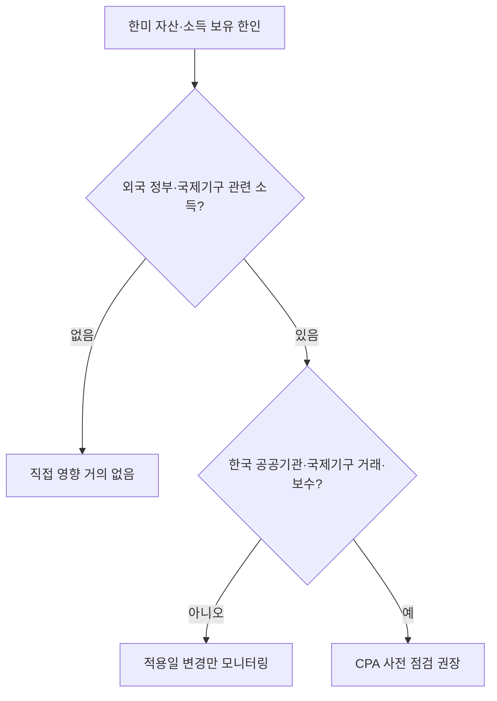

# 외국 정부·국제기구 미국 투자소득 과세, IRS 적용일 규정 일부 철회

미국 연방관보(Federal Register)에 외국 정부와 국제기구가 미국 내 투자로 얻는 소득의 과세를 다루는 제안 규정이 새로 게시됐습니다. 해당 제안은 미 재무부(Treasury)와 국세청(IRS)이 함께 발의한 것으로, 일반적으로 미국 세법 코드 §892(외국 정부·국제기구의 특정 미국원천소득에 대한 과세 면제) 영역을 다루는 규정군에 속합니다. 이번 문서의 핵심은 규정 내용 자체를 새로 만드는 것이 아니라, **그 규정이 언제부터 적용되는지(applicability dates)**에 대한 부분을 다시 정비한다는 점입니다.

이번 조치에는 이전 규정의 일부 철회가 포함됩니다. 2025년 12월 15일자로 공개됐던 제안 규정 중 적용일과 관련된 부분이 이번 문서에 의해 철회되고, 같은 주제에 대한 새 적용일 제안이 그 자리를 대체합니다. 즉, 약 반년 전 게시됐던 적용일 조항을 그대로 인용해 시점을 판단해두신 분이라면, 최신 연방관보 문서를 기준으로 다시 확인해야 합니다.

## 미주 한인에게 왜 중요한가

이 규정은 표면상 외국 정부와 국제기구의 미국 투자소득을 다루지만, 한미 양국에 걸친 자산을 관리하는 한인 가정과 자영업자에게도 간접적인 영향을 줄 수 있습니다.

- **한인 은퇴자(401(k)·IRA·뮤추얼펀드 보유자)**: 한국 국민연금공단, 한국투자공사(KIC) 같은 한국 공공·준공공 기관이 미국 채권·주식·부동산에 투자한 부분의 과세 시점이 바뀌면, 글로벌 자금 흐름과 미국 채권·주식의 수익률·환율에 부수적인 영향을 줄 수 있습니다. 단기적으로 본인 계좌에 직접적인 세금 변화가 생기는 사안은 아니지만, 자산 배분 점검 시 참고할 만한 거시 변수입니다.
- **한미 송금·환전이 잦은 유학생·주재원 가정**: 외국 공공자금의 미국 투자 과세 시점 변화가 외환·채권시장에 미세하게 반영되면 송금 시점 결정에 간접 변수가 됩니다.
- **한국계 금융기관·공공기관과 거래하는 한인 자영업자·중소기업**: 한국 정부기관·공기업·국제기구와의 계약, 합작투자, 미국 지사 자금 운용이 있는 경우 본인 회사가 받는 보수·이자·배당 항목이 §892 적용 대상에 닿을 수 있는지 미리 CPA와 점검해두는 것이 안전합니다.
- **국제기구(UN, 세계은행, IMF 등) 종사 한인**: 본인 보수·연금이 §892 또는 관련 면세 규정의 영향을 받을 수 있는지 여부는 개인별로 다르므로 세무 전문가 확인이 필요합니다.

본인의 세금 신고나 투자 의사결정과 직접 연결된다고 느끼신다면 공인회계사(CPA)나 국제조세 전문 세무사와 상담하시기 바랍니다. **이 글은 일반 정보 제공용이며 세무·법률 자문이 아닙니다.**

## 편집자 분석: "내용"이 아니라 "시점"의 정비

이번 문서가 "제안 규정(proposed regulations)"이라는 점도 중요합니다. 즉, 아직 최종 확정된 규칙이 아니며, 일반적으로 공개 의견 수렴과 행정 절차(notice-and-comment)를 거친 뒤에 확정·시행됩니다. 따라서 지금 단계에서는 한인 독자가 즉시 신고 방식이나 보유 자산을 바꿔야 하는 단계는 아닙니다.

다만 편집자 관점에서 주목할 부분은, 이번 게시가 **"규정 본문 변경"이 아니라 "언제부터 적용되는지"의 정비**라는 점입니다. 일반적으로 IRS가 적용일 조항만 따로 정리하는 절차를 다시 밟는 경우는, 기존 적용일이 시장·납세자에게 실무적 혼선을 일으켰거나, 다른 절차(예: 같은 주제의 본문 규정 확정 일정)와 시점을 맞춰야 할 필요가 생겼을 때입니다. 한미 자산을 양쪽에 걸친 한인 납세자 입장에서는 본문 규정과 적용일 규정이 어느 시점에 함께 확정되는지를 따라가는 것이 실질 영향 파악의 핵심입니다.

또한 §892 영역은 한국의 국민연금·한국투자공사 같은 국부펀드·공공기관 자금이 미국에 들어올 때의 과세 면제 범위를 가르는 규정이기 때문에, 적용 시점 정비는 향후 한미 간 국부펀드·공공자금의 미국 투자 흐름에도 신호를 줄 수 있습니다. 한인 자영업자·은퇴자가 보유한 미국 자산의 가격에 즉각적으로 반영되는 사안은 아니지만, **"한국발 공공자금이 미국 자산시장에 들어오는 비용 구조"**가 점진적으로 변할 수 있다는 점은 장기 자산 배분 시 염두에 둘 만합니다.

## 실무 체크포인트

실무적으로는 두 가지를 기억해두시면 좋습니다.

1. 이번 게시는 "내용 변경"보다 "언제부터 적용되는지"의 정비라는 점.
2. 이전 2025년 12월 15일자 제안 중 일부가 철회됐으므로, 그 시점 자료만 보고 적용일을 판단해 두셨다면 최신 연방관보 문서를 다시 확인해야 한다는 점.

본인이나 회사가 외국 정부·국제기구와 연결된 소득 구조(예: 외국 공공기관 거래, 한미 합작 투자, 국제기구 관련 보수)를 가지고 있다면, 세무 전문가에게 이번 제안의 영향 가능성을 미리 점검받아 두시는 것을 권합니다.

## 핵심 요약

- 외국 정부·국제기구의 미국 투자소득 과세(미 세법 §892 영역) 제안 규정의 적용일(applicability dates) 관련 새 제안 규정이 연방관보에 게시됐습니다.
- 2025년 12월 15일에 공개됐던 제안 규정 중 적용일 관련 일부가 이번 문서로 철회됩니다.
- 아직 최종 규칙이 아닌 "제안" 단계이며, 공개 의견 수렴 절차가 남아 있습니다.
- 한미 자산을 보유한 한인 가정·자영업자, 국제기구 종사 한인은 향후 적용 시점 정리를 모니터링할 필요가 있습니다.

## 한눈에 보는 변화

| 구분 | 2025년 12월 15일자 제안 | 2026년 6월 1일자 새 제안 |
| --- | --- | --- |
| 문서 성격 | 제안 규정(proposed regulations) | 제안 규정(proposed regulations) |
| 다루는 범위 | 외국 정부의 미국 투자소득 과세 관련 규정 + 적용일 | 동일 주제의 적용일(applicability dates) 재정비 |
| 적용일 조항 | 일부 조항이 이번 문서로 철회됨 | 새 적용일 제안으로 대체 |
| 한인 독자 영향 | 적용 시점 기준이 변동될 수 있음 | 최신 문서 기준으로 시점 재확인 필요 |
| 단계 | 의견 수렴 대상 | 의견 수렴 대상(최종 미확정) |

## 내가 영향받는 그룹인가 — 빠른 판별

위 도식은 일반 안내용 단순화입니다. 본인 상황의 §892 적용 여부는 반드시 국제조세 전문 CPA/세무사를 통해 개별 확인하시기 바랍니다.

## 한인 독자 실무 체크리스트

1. 본인·가족의 미국 세금 신고에 외국 정부·국제기구 관련 소득(보수, 이자, 배당, 면세 항목 등)이 포함되는지 점검합니다.
2. 한국 공공기관·국제기구와 계약·합작·자금 거래가 있는 자영업자·중소기업은 §892 적용 가능성에 대해 CPA에게 사전 확인을 요청합니다.
3. 2025년 12월 15일자 제안 규정만 보고 적용 시점을 판단해뒀다면, 최신 연방관보 문서(2026-06-01자)로 다시 확인합니다.
4. 향후 본문 규정과 적용일 규정이 함께 확정되는 시점을 모니터링하고, 확정 시점에 맞춰 신고·원천징수 절차를 점검합니다.
5. 일반 한인 은퇴자·유학생 가정은 지금 단계에서 보유 자산을 즉시 조정할 필요는 없으며, 거시 변수로만 참고합니다.

## 출처 (Sources)

- [Federal Register — Income of Foreign Governments and of International Organizations (2026-10841)](https://federalregister.gov/documents/2026/06/01/2026-10841/income-of-foreign-governments-and-of-international-organizations)
- [IRC §892 — Income of foreign governments and of international organizations (Cornell LII)](https://www.law.cornell.edu/uscode/text/26/892)
- [IRS — International Taxpayers (공식 안내 페이지)](https://www.irs.gov/individuals/international-taxpayers)
