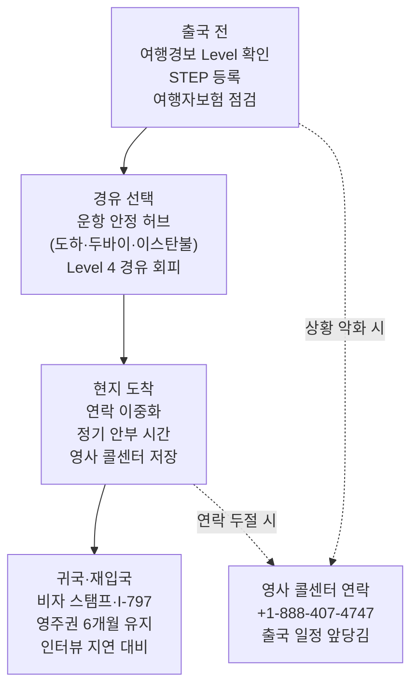

# 이란 전쟁 완화 국면(6월 말): 중동 경유 항공편 재개·가족 연락·재입국, 미주 한인 실무 점검표

6월 17일, 미국과 이란이 전쟁을 끝내기 위한 양해각서(MOU)에 서명하면서 2026년 이란 전쟁은 **완화/종전 프레임워크 국면**으로 들어섰습니다. 6월 초중순까지만 해도 "여행을 재고하라"는 경보가 핵심이었다면, 지금의 질문은 달라졌습니다. **"무엇이 다시 열렸고, 무엇이 아직 주의인가."**

이 글은 거시경제 분석이 아니라 미주 한인 개인과 가족이 실제로 점검할 일들을 다룹니다. (1) 두바이·도하·이스탄불 등 경유 항공편의 재개·재예약·환불, (2) 중동이나 주변국에 가족·유학생·사업이 있는 경우 연락·송금·대피 정보, (3) 국무부 STEP 등록과 여행경보 단계 확인, (4) H-1B·영주권자의 재입국 주의점입니다. 한 가지 분명히 합니다. **한국 자체는 여행경보 Level 1로 안전합니다.** 이 글의 위험 초점은 "한국"이 아니라 "중동·경유지·현지 가족"입니다.

> **면책 공지:** 이 글은 2026년 6월 27일 기준 공개 정보를 정리한 일반 안내입니다. 휴전은 60일 프레임워크 단계로 상황이 빠르게 바뀔 수 있습니다. 항공편은 항공사·공항 공식 정보로, 신분·재입국 문제는 이민 변호사로, 안전 정보는 travel.state.gov로 출발 직전 반드시 재확인하세요.

## 핵심 요약

- 6월 12일 60일 휴전 조건 합의, **6월 17일 미·이란 양해각서 서명**으로 종전 프레임워크 국면 진입. 단, 휴전은 깨질 수 있는 단계입니다.
- **카타르항공**은 6월 16일 여름 스케줄로 위기 이전 약 85% 복원(도하 일일 140편+), **에미레이트**는 80% 안팎까지 회복. 일부 노선·시간대는 여전히 변경·지연 가능.
- 분쟁 기간 취소·변경 예약에 대해 주요 걸프 항공사가 **유연 재예약/환불** 적용(카타르항공: 10월 31일까지 무료 날짜 변경 등).
- 여행경보: **이란·이라크·레바논·시리아·예멘·가자 = Level 4(여행금지)**, **UAE·카타르·바레인·쿠웨이트·오만·사우디·요르단·이스라엘 = Level 3(여행 재고)**. **한국 = Level 1.**
- 중동에 가족이 있으면 **STEP(STEP.state.gov) 등록 + 24시간 영사 콜센터 저장**이 1순위.

## 1. 지금 항공편은 어디까지 열렸나 (경유·재예약·환불)

분쟁 정점에서는 두바이 국제공항이 드론 피격으로 일시 전면 중단됐고, 이후 제한적으로만 재개됐습니다. 6월 말 현재는 **상당 부분 회복**됐지만, "완전 정상"은 아닙니다.

| 허브 | 6월 말 재개 상황 | 한인 실무 포인트 |
|------|----------------|----------------|
| 도하(카타르항공) | 6월 16일 여름 스케줄로 위기 전 약 85% 복원, 일일 140편+ | 미국–한국 환승 안정적. 단 시간대 통합 있을 수 있음 |
| 두바이(에미레이트) | 위기 전 80% 안팎 회복 | 피격 이력 있는 허브, 운항정보 출발 직전 재확인 |
| 이스탄불(터키항공) | 두바이·역내 주요 노선 운항 재개 | 유럽 경유 대안 동선으로 활용 가능 |
| 이란 영공 | 당국이 "정상 조건" 복귀 발표 | 그래도 이란 경유는 피하고 우회 노선 선택 |

**재예약·환불 핵심:**

- 주요 걸프 항공사는 분쟁 기간 확정 예약에 **유연 정책**을 적용했습니다. 카타르항공은 해당 예약에 대해 **10월 31일까지 무료 날짜 변경**을 제공했습니다.
- 적용 기간·대상은 항공사마다 다릅니다. **예약한 항공사 정책 페이지를 직접 확인**하세요.
- 표를 산 경로대로 문의하세요. 항공사 직접 구매는 항공사에, 여행사·OTA 구매는 판매처에.
- **여행자보험:** 출발 전 가입한 보험이면 항공편 취소·지연·여정 변경 보장 여부를 약관에서 확인하세요. 이미 시작된 분쟁(알려진 사건)은 신규 가입 시 보장 제외될 수 있으니, 가입 시점과 보장 시작일을 따져야 합니다.

> **팁:** 출발 24~48시간 전에 항공사 앱 + 출발/도착 공항의 실시간 운항정보를 함께 확인하세요. 프레임워크 단계라 단기 변동 가능성이 남아 있습니다.

## 2. 중동·주변국에 가족·유학생·사업이 있다면

가장 먼저 할 일은 "내가 정보를 받는 채널"을 만드는 것입니다.

- **STEP 등록 (1순위):** 가족 본인(미국 시민·영주권 동반가족)이 [STEP.state.gov](https://step.state.gov/)에 등록하면 현지 미 대사관·영사관의 안전 경보를 직접 받고, 비상시 영사가 연락하기 쉬워집니다.
- **연락 이중화:** 현지 통신망이 불안정할 수 있으니 현지 SIM + 인터넷 메신저(와이파이 기반) 두 가지를 준비하게 하세요. 정기 안부 시간(예: 매일 같은 시각)을 정해두면 "연락 두절"과 "단순 지연"을 구분할 수 있습니다.
- **송금:** 현지 은행·환전 시스템이 일시 마비될 수 있습니다. 평소 쓰던 송금 앱 외에 대안 경로(가족 계좌, 신뢰할 수 있는 송금 서비스)를 미리 점검하고, 비상 현금을 분산 보관하도록 안내하세요. 제재 대상국(이란 등) 송금은 법적 제약이 크므로 무리하지 마세요.
- **대피·영사 지원:** 미국 시민은 24시간 영사 콜센터로 지원을 요청할 수 있습니다. **미국·캐나다 내 +1-888-407-4747, 해외에서 +1-202-501-4444.** 적십자(ICRC) 이산가족 찾기 등 비정부 채널도 보조 수단이 됩니다.

## 3. STEP 등록과 여행경보 단계 확인하는 법

[travel.state.gov](https://travel.state.gov/en/international-travel/travel-advisories.html)의 여행경보는 4단계입니다. 6월 4일자 "중동 주의 강화" 보안 경보 이후의 단계 구분은 다음과 같습니다.

| 단계 | 의미 | 6월 말 해당 국가(예) | 권장 대응 |
|------|------|------------------|----------|
| Level 1 | 정상 주의 | **한국**, 일본 등 | 일반 여행 가능, 기본 주의 |
| Level 2 | 주의 강화 | 일부 역내 외곽국 | 현지 상황 모니터링 |
| Level 3 | 여행 재고 | **UAE·카타르·바레인·쿠웨이트·오만·사우디·요르단·이스라엘** | 꼭 필요한 여행만, STEP 등록 |
| Level 4 | 여행 금지 | **이란·이라크·레바논·시리아·예멘·가자** | 가지 말 것, 체류자는 즉시 출국 검토 |

확인 순서: ① travel.state.gov에서 해당 국가 페이지 열기 → ② 현재 Level과 최신 Security Alert 날짜 확인 → ③ STEP 등록 → ④ 영사 콜센터 번호 저장. **휴전 단계라 단계는 다시 조정될 수 있으니 출발 직전 재확인**이 핵심입니다.

## 4. H-1B·영주권자 재입국 주의점

신분이 걸려 있으면 항공편 가격보다 **동선과 서류**가 먼저입니다.

- **Level 4 국가는 경유라도 피하기.** 운항이 안정된 허브(도하·두바이·이스탄불 중)로 동선을 잡으세요.
- **비자 인터뷰·갱신 지연 가능성.** 역내 영사 업무가 밀릴 수 있으니 재입국·갱신 일정에 여유를 두세요.
- **영주권자:** 출국 6개월 이내 유지(장기 체류는 재입국 허가서 검토), 영주권 카드 지참.
- **H-1B:** 유효 비자 스탬프 + 최신 I-797 승인서 + 고용 증빙을 반드시 지참. 스탬프 갱신이 필요하면 분쟁 영향이 적은 제3국 영사관 옵션을 변호사와 상의하세요.
- 신분 관련 모든 일정은 **이민 변호사 확인**을 권장합니다. 한 번의 입국 거부가 수개월을 되돌립니다.

## 출국 전 → 경유 → 현지 → 귀국 대응 흐름도



## 실행 체크리스트

```
[ ] travel.state.gov에서 목적지·경유지 현재 Level과 최신 Security Alert 날짜 확인
[ ] STEP.state.gov 등록 (본인 + 중동 거주 가족)
[ ] 24시간 영사 콜센터 저장: 미국/캐나다 +1-888-407-4747, 해외 +1-202-501-4444
[ ] 항공사 앱으로 출발 24~48시간 전 운항 재확인
[ ] 취소·변경 예약: 항공사 유연 재예약/환불 정책 확인 (구매 경로대로 문의)
[ ] 여행자보험 약관에서 분쟁 관련 보장·면책 조항 확인
[ ] 중동 가족: 연락 이중화(SIM+메신저) + 정기 안부 시간 합의
[ ] 송금 대안 경로 점검, 비상 현금 분산 (제재국 송금은 법적 제약 확인)
[ ] H-1B: 유효 비자 스탬프 + I-797 + 고용 증빙 지참
[ ] 영주권자: 출국 6개월 이내 유지, 장기 체류는 재입국 허가 검토
[ ] 신분 관련 재입국 일정은 이민 변호사 확인
```

전쟁이 완화 국면에 들어섰다고 해서 "다 끝났다"는 뜻은 아닙니다. 60일 프레임워크는 깨질 수 있고, 항공편·영사 업무·비자 일정은 여전히 영향을 받습니다. **지금이 바로 "정상화될 때를 대비해 동선과 서류를 정리해 두는" 가장 좋은 시점**입니다. 가족이 현지에 있다면 STEP 등록과 영사 콜센터 저장만이라도 오늘 끝내 두세요.

## 출처 (Sources)

- [Travel.State.gov — Travel Advisories (여행경보 단계)](https://travel.state.gov/en/international-travel/travel-advisories.html)
- [Travel.State.gov — Iran Travel Advisory (Level 4)](https://travel.state.gov/en/international-travel/travel-advisories/iran.html)
- [Travel.State.gov — Consular Information for Americans in the Middle East](https://travel.state.gov/en/international-travel/travel-advisories/global-events/middle-east.html)
- [STEP — Smart Traveler Enrollment Program 등록](https://step.state.gov/)
- [U.S. Embassy — Security Alert: Exercise Increased Caution in the Middle East (June 4, 2026)](https://il.usembassy.gov/security-alert-exercise-increased-caution-in-the-middle-east/)
- [Wikipedia — 2026 Iran war ceasefire (휴전 합의·MOU 서명 경과)](https://en.wikipedia.org/wiki/2026_Iran_war_ceasefire)
- [Al Jazeera — Iran and Israel halt attacks but sabre-rattling continues](https://www.aljazeera.com/news/2026/6/8/israel-and-iran-exchange-attacks-as-ceasefire-falters)
- [Qatar Airways Newsroom — Resumes Daily Services (운항 재개)](https://www.qatarairways.com/press-releases/en-WW/264759-qatar-airways-resumes-daily-services-to-the-united-arab-emirates-and-syria/)
- [Wego — Qatar Airways Flight Status 2026 (재개 일정)](https://blog.wego.com/qatar-airways-flight-status-2026/)
- [Newsweek — Middle East Flights Reopen: Why Travelers Still Face Delays](https://www.newsweek.com/middle-east-flights-reopen-as-new-confusion-hits-travelers-12099350)
