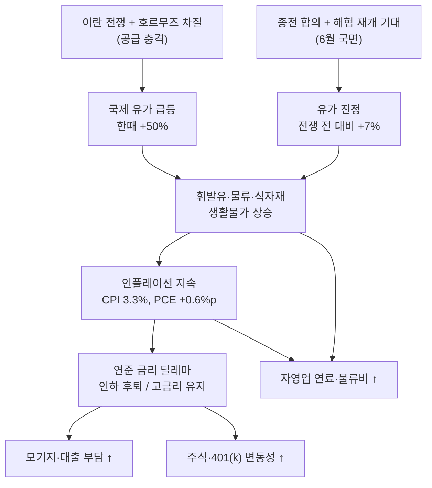

# 이란 전쟁 종전 국면, 유가 하락이 한인 가계에 주는 영향: 무엇이 진정되고 무엇이 여전히 위험한가

2026년 2월 28일 미국과 이스라엘의 이란 공격으로 시작된 전쟁이, 6월 들어 **종전·완화 국면**으로 전환되고 있습니다. 미국과 이란은 적어도 60일간 휴전을 연장하고 호르무즈 해협 재개를 포함한 양해각서(MOU)에 서명했으며, 카타르·파키스탄 등 중재국은 60일 안에 최종 합의를 목표로 한 로드맵에 합의했다고 밝혔습니다. 전쟁 중 한때 50% 가까이 치솟았던 국제 유가는 이 기대를 반영해 빠르게 내려왔습니다.

미주 한인 가계 입장에서 이 변화는 직접적입니다. **휘발유·항공권·식자재 같은 생활물가, 401(k)와 미국주식, 모기지 금리, 그리고 식당·세탁소·물류 같은 자영업의 연료·물류비**가 모두 유가와 연결돼 있기 때문입니다. 다만 "전쟁이 끝나가니 다 괜찮아진다"는 단순한 결론은 위험합니다. 종전 국면에서 **무엇이 실제로 진정됐고, 무엇이 여전히 위험한지**를 분리해서 봐야 합니다.

> **면책 공지:** 이 글은 일반 경제 정보 안내이며 투자 자문이 아닙니다(YMYL). 개별 투자·자산 배분·대출 결정은 공인 재무사(CFP), CPA, 또는 투자 전문가와 상담하세요. 유가·시장 전망은 합의 이행 여부에 따라 크게 달라질 수 있습니다.

## 핵심 요약

- 국제 유가는 6월 말 종전 프레임워크 합의와 호르무즈 재개 기대로 **전쟁 전(2월 28일) 대비 약 7% 높은 수준**까지 진정됐습니다. 6월 22일 기준 브렌트유는 배럴당 약 $77.90, WTI는 약 $74.82로 마감했는데, 이는 전쟁 중 한때 50% 넘게 올랐던 데서 큰 폭으로 내린 수준입니다.
- EIA는 2026년 평균 **도매 휘발유 가격을 갤런당 약 $2.98**로 전망(2027년 $2.61). 즉 **단기 급등은 진정**됐지만 **연간 기준 물가는 여전히 높은 상태**입니다.
- 댈러스 연준 분석: 전쟁발 유가 충격이 2026년 **헤드라인 PCE 인플레이션을 약 +0.6%p, 근원 PCE를 약 +0.2%p** 끌어올림. 장기 기대인플레이션은 대체로 안정.
- 위험 요인: 호르무즈 통항은 아직 전쟁 전(하루 120~130척)의 **일부 수준**, 합의가 깨질 가능성, 그리고 **관세·고용 둔화와 겹친 1970년대식 스태그플레이션** 우려.
- 한인 가계 행동 포인트: 생활물가 안정은 **이행 확인 후 단계적**으로 기대, 401(k)는 장기 원칙 유지, 모기지·금리는 인플레 경로에 연동, 자영업은 연료·물류 단가를 분기 점검.

## 1. 진정된 것: 유가의 단기 급등이 꺾였다

가장 분명하게 좋아진 부분은 **유가의 단기 급등이 멈췄다**는 점입니다. 전쟁 초기 호르무즈 해협 통항이 사실상 막히면서 국제에너지기구(IEA)가 "세계 석유시장 역사상 최대 규모 공급 차질"이라고 표현할 정도였고, 미국 휘발유 가격은 전쟁 이후 한때 갤런당 1달러 이상 뛰었습니다.

그러나 6월 들어 종전 프레임워크 합의와 호르무즈 재개 기대가 형성되면서 가격이 빠르게 되돌아왔습니다.

### 유가·물가 변화 비교표

| 구분 | 전쟁 전 (2026-02) | 전쟁 정점 (4~5월) | 6월 말 종전 국면 |
|------|------------------|-------------------|------------------|
| 브렌트유 (배럴) | 약 $71 (2월 평균) | 한때 $100 이상 | 약 $77.90 (6/22) |
| WTI (배럴) | — | — | 약 $74.82 (6/22) |
| 전쟁 전 대비 | 기준점 | 한때 +50% 안팎 | **약 +7%** |
| 정점 대비 | — | 기준점 | **정점에서 큰 폭 하락(약 -27%)** |
| 미국 휘발유 (연 도매 전망) | — | — | 2026년 약 $2.98/갤런 (EIA) |

> 수치 해석: 6월 말 유가는 "전쟁 전보다 약간 높은 정도"로 진정됐지만, 연간 평균 휘발유 전망(약 $2.98/갤런)은 여전히 작년보다 높습니다. 즉 **공포 프리미엄은 빠졌지만, 물가가 전쟁 전 바닥으로 완전히 돌아온 것은 아닙니다.**

## 2. 여전히 위험한 것: 인플레·금리·스태그플레이션

유가가 내렸다고 해서 가계가 체감하는 물가가 바로 내려가지는 않습니다. 한번 오른 물가는 천천히 식고, 전쟁 충격이 다른 악재와 겹쳐 있기 때문입니다.

- **인플레이션 지속:** 4월 에너지 가격은 전월 대비 3.8%(전년 대비 +17.9%), 휘발유는 전월 대비 5.4%(전년 대비 +28.4%) 올랐습니다. 소비자물가지수(CPI)는 연 3.3%로 2024년 5월 이후 최고치를 기록했습니다.
- **연준 분석:** 댈러스 연준은 전쟁발 유가 충격이 2026년 헤드라인 PCE 인플레이션을 약 +0.6%p, 근원 PCE를 약 +0.2%p 끌어올린다고 추정했습니다. 다행히 장기 기대인플레이션(5~10년)은 거의 움직이지 않아 "고착화"까지는 아니라는 평가입니다.
- **스태그플레이션 우려:** 전쟁 공급 충격이 **관세·고용 둔화**와 겹치면서, 1970년대식 스태그플레이션(저성장 + 고물가) 위험이 제기됐습니다. 유럽중앙은행(ECB)은 전쟁 장기화 시 독일·이탈리아가 기술적 경기침체에 빠질 수 있다고 경고했습니다.
- **금리 딜레마:** 물가를 잡으려면 연준은 금리를 높게 유지해야 하는데, 그러면 성장과 고용이 눌립니다. 2026년 초까지 시장이 기대하던 금리 인하가 오히려 후퇴하는 흐름이 나타났습니다.

### 전쟁 → 유가 → 인플레 → 연준 → 가계 전이 흐름도



## 3. 한인 가계 4대 영역별 영향

### (1) 생활물가 — 휘발유·항공권·식자재

휘발유는 유가 하락을 가장 먼저 반영하는 품목이지만, **연간 기준으로는 여전히 높은 수준**입니다. EIA 전망(2026년 약 $2.98/갤런)을 감안하면, 단기 급등 공포는 줄었어도 작년 수준의 저렴함을 기대하긴 이릅니다. 식자재·가공식품은 물류비가 가격에 늦게 반영되므로, 유가가 먼저 내려도 마트 체감 물가는 시차를 두고 천천히 안정됩니다.

### (2) 401(k)·미국주식·에너지주

종전 국면에서 시장은 "안도 랠리"와 "차익 실현"이 엇갈리며 변동성이 큽니다. 실제로 6월에는 평화 협상 진전·결렬 소식에 따라 유가와 주가가 하루 단위로 출렁였습니다. 에너지주는 유가 방향에 민감하고, 항공·운송주는 연료비 하락의 수혜를 받을 수 있습니다. 다만 **장기 은퇴 자금(401(k)·IRA)이라면 단기 뉴스 매매보다 분산·자산 배분 원칙을 지키는 것이 일반적 권고**입니다. (투자 자문 아님)

### (3) 모기지·금리

유가 → 인플레 → 연준 경로가 핵심입니다. 유가가 진정되면 인플레 압력이 줄어 **금리 인하 여지**가 생기지만, 관세·고용 등 다른 인플레 요인이 남아 있으면 연준은 신중해집니다. 즉 종전만으로 모기지 금리가 곧바로 크게 내린다고 보긴 어렵고, **인플레 지표가 실제로 둔화되는지**가 관건입니다. 변동금리 대출·리파이낸싱을 고민 중이라면 단발성 뉴스보다 PCE·CPI 추세를 보고 판단하세요.

### (4) 자영업 — 식당·세탁소·물류

자영업은 연료·물류비 직격탄을 받는 영역입니다. 디젤·배송비는 원유보다 **늦게 반응**하므로, 유가가 먼저 내려도 배송비·식자재 단가에 반영되기까지 시차가 있습니다. 종전 합의가 안정적으로 이행돼 호르무즈 통항이 정상화되면 하반기로 갈수록 비용 부담이 줄 여지가 있지만, **합의 불이행·재충돌 시 다시 튈 수 있습니다.** 단가 계약·메뉴 가격·재고를 분기 단위로 점검하는 것이 안전합니다.

## 4. 아직 끝나지 않은 불확실성

종전 "프레임워크" 합의는 최종 합의가 아니라 **60일 협상 로드맵**입니다. 실제로 6월에는 제네바 평화회담이 갑자기 연기되고, 이란이 호르무즈 해협을 다시 닫았다고 발표하는 등 합의가 흔들리는 장면이 반복됐습니다. 호르무즈 통항량도 전쟁 전(하루 120~130척)의 일부 수준에 머물러 있습니다. 따라서 유가의 추가 하락과 물가 안정은 **합의가 실제로 이행되는지**에 달려 있다는 점을 전제로 가계 계획을 세워야 합니다.

## 가계 점검 체크리스트

```
☐ 휘발유: 단기 급등은 진정 — 연간 기준 가격은 여전히 높음 인지
☐ 식자재·물류: 유가보다 늦게 반영 — 마트 물가 안정은 시차 두고 기대
☐ 401(k)·IRA: 종전 뉴스에 단기 매매 자제 — 분산·자산 배분 원칙 유지
☐ 에너지주/항공주 비중: 유가 방향에 민감 — 본인 위험 감내도 재점검
☐ 모기지·리파이낸싱: 단발성 뉴스보다 CPI·PCE 추세 확인 후 판단
☐ 변동금리 대출: 연준 금리 경로(인하 후퇴 가능성) 감안
☐ 자영업 연료·물류비: 단가 계약·메뉴 가격·재고 분기 점검
☐ 비상금: 합의 불이행·재충돌 시 재급등 대비 현금흐름 여유 확보
☐ 모든 투자 결정: CFP/CPA/전문가 상담 (이 글은 투자 자문 아님)
```

## 마무리

6월 말 현재 이란 전쟁은 종전·완화 국면에 들어섰고, 유가의 단기 급등 공포는 분명히 꺾였습니다. 그러나 **유가가 전쟁 전 바닥으로 완전히 돌아온 것도 아니고, 인플레·금리·스태그플레이션 위험이 사라진 것도 아닙니다.** 한인 가계는 "진정된 부분(유가 급등)"과 "여전히 위험한 부분(누적 물가·금리·합의 불확실성)"을 분리해서 보고, 종전 뉴스 하나에 과도하게 반응하기보다 인플레·금리 지표의 추세를 확인하며 단계적으로 계획을 조정하는 것이 안전합니다.

## 출처 (Sources)

- [Al Jazeera — Oil prices back to pre-war levels on rising Middle East supply (2026-06-25)](https://www.aljazeera.com/news/2026/6/25/oil-prices-back-to-pre-war-levels-on-rising-middle-east-supply)
- [Al Jazeera — Oil prices continue slide amid hopes for peace, opening of Strait of Hormuz (2026-06-17)](https://www.aljazeera.com/economy/2026/6/17/oil-prices-continue-slide-amid-hopes-for-peace-opening-of-strait-of-hormuz)
- [CNBC — Oil prices fluctuate: Trump threatens fresh strikes on Iran (2026-06-22)](https://www.cnbc.com/2026/06/22/oil-prices-wti-brent-crude-trump-iran-threat-strait-hormuz-closure.html)
- [CNBC — Brent rises after U.S.-Iran peace talks in Geneva are abruptly postponed (2026-06-19)](https://www.cnbc.com/2026/06/19/oil-prices-wti-brent-crude-us-iran-deal-strait-hormuz-shipping-recovery.html)
- [EIA — June 2026 Short-Term Energy Outlook](https://www.eia.gov/outlooks/steo/report/global_oil.php)
- [EIA Press Release (2026-06-09) — Drop in global oil demand will limit price increases from Hormuz disruptions](https://www.eia.gov/pressroom/releases/press589.php)
- [Dallas Fed — The Impact of the 2026 Iran War on U.S. Inflation: A Scenario Analysis (Working Paper 2609)](https://www.dallasfed.org/research/papers/2026/wp2609)
- [Wikipedia — Economic impact of the 2026 Iran war](https://en.wikipedia.org/wiki/Economic_impact_of_the_2026_Iran_war)
- [Wikipedia — 2026 Iran war fuel crisis](https://en.wikipedia.org/wiki/2026_Iran_war_fuel_crisis)
