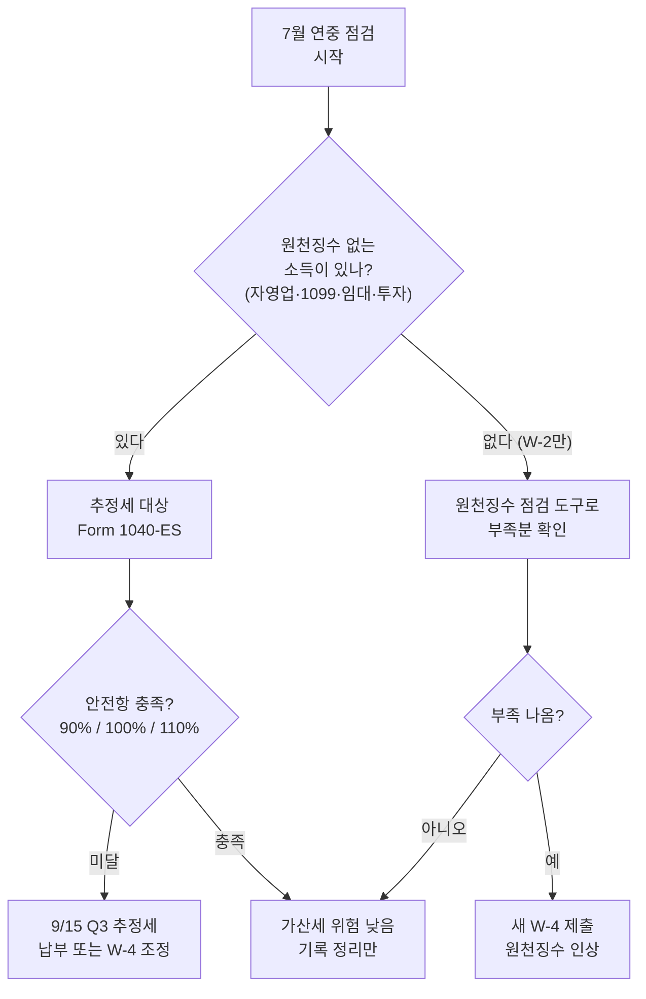

# 2026 하반기 세무 점검표: 한인 자영업자가 7월 시작 전 확인할 추정세·원천징수

7월이 코앞입니다. 한 해의 정확히 절반이 지났다는 뜻이고, 세금 관점에서는 **연중 점검(mid-year tax check-up)을 하기에 가장 좋은 시점**입니다. 많은 한인이 세금을 4월에만 생각하지만, 원천징수가 없는 자영업·1099 소득자에게 세금은 1년에 네 번 분기마다 직접 챙겨야 하는 일입니다.

특히 식당·세탁소·네일숍·우버/리프트·온라인 셀러처럼 **한인 비중이 높은 업종은 회사가 세금을 떼어주지 않습니다.** 본인이 분기 추정세(estimated tax)를 내지 않으면, 내년 4월에 큰 세금 청구서와 과소납부 가산세를 동시에 맞게 됩니다. 지금 점검하면 충분히 막을 수 있는 일입니다.

> **면책 공지:** 이 글은 일반적인 정보 안내이며 세무 자문이 아닙니다. 추정세 금액 계산, 원천징수 조정, FBAR/해외계좌 신고 등 개별 상황은 공인회계사(CPA) 또는 등록세무사(EA)와 상담하세요.

## 핵심 요약

- **2분기(Q2) 마감은 6월 15일로 이미 지났습니다.** 지금부터는 **3분기 9월 15일(화)**, 그리고 **4분기 2027년 1월 15일(금)**을 준비할 때입니다.
- 원천징수가 없는 소득(자영업·1099·임대·주식/암호화폐 매도)이 있다면 분기마다 추정세를 직접 내야 합니다. Form 1040-ES를 사용합니다.
- W-2 직장인도 부업·투자 소득이 늘었다면 **IRS 원천징수 점검 도구(Tax Withholding Estimator)**로 연중 점검해 내년 4월 깜짝 세금을 예방하세요.
- 결혼·출산·이직·부업 시작·큰 자산 매도 같은 **생활 변화는 즉시 세금에 반영**해야 합니다.
- 영수증·1099·사업경비·홈오피스·마일리지 기록을 지금 중간 정리하면 내년 신고가 훨씬 수월합니다.

## 1. 분기 추정세: 지금은 Q3 준비 구간

추정세는 원천징수로 충당되지 않는 소득에 대해 1년에 네 번 나눠 내는 세금입니다. **IRS 기준상 다음에 해당하면 추정세 대상일 가능성이 높습니다.**

- 자영업(스케줄 C) 순이익이 있는 사업주 (식당, 세탁소, 네일, 소매 등)
- 우버/리프트/도어대시 등 긱(gig) 소득자
- 1099-NEC/1099-K로 받는 프리랜서·계약직
- 임대 소득, 배당·이자, 주식/암호화폐 매도 차익이 있는 투자자

### 2026~2027 추정세 마감일

```
2026~2027 분기 추정세 마감일
━━━━━━━━━━━━━━━━━━━━━━━━━━━━━━━
Q1 (1/1~3/31)  →  2026년 4월 15일  ✅ 지남
Q2 (4/1~5/31)  →  2026년 6월 15일  ✅ 지남
Q3 (6/1~8/31)  →  2026년 9월 15일  ⬅ 지금 준비
Q4 (9/1~12/31) →  2027년 1월 15일
```

| 분기 | 소득 기간 | 마감일 | 상태 |
|------|-----------|--------|------|
| Q1 | 1/1 ~ 3/31 | 2026년 4월 15일 (수) | 지남 |
| Q2 | 4/1 ~ 5/31 | 2026년 6월 15일 (월) | 지남 |
| **Q3** | 6/1 ~ 8/31 | **2026년 9월 15일 (화)** | **준비 단계** |
| Q4 | 9/1 ~ 12/31 | **2027년 1월 15일 (금)** | 예정 |

> 참고: 마감일이 주말·연방 공휴일과 겹치면 다음 영업일로 미뤄집니다. 2026년 9월 15일과 2027년 1월 15일은 모두 평일이라 그대로 적용됩니다.

납부는 **Form 1040-ES**로 계산하며, 가장 빠르고 안전한 방법은 IRS Direct Pay 또는 EFTPS를 통한 온라인 납부입니다.

### 과소납부 가산세(안전항)를 피하는 법

분기 추정세를 빠뜨리면 IRS는 **과소납부 가산세**를 부과합니다. 다음 '안전항(safe harbor)' 중 하나만 충족하면 가산세를 피할 수 있습니다.

| 안전항 기준 | 내용 |
|-------------|------|
| 90% 룰 | 원천징수+추정세 합계가 **올해 세금의 90% 이상** |
| 100% / 110% 룰 | **작년 세금의 100%** 이상 (작년 AGI가 15만 달러 초과 시 **110%**) |
| $1,000 룰 | 원천징수·추정세를 뺀 잔여 세금이 **1,000달러 미만**이면 가산세 없음 |

가장 안전한 실무 방법은 **작년 세금을 기준으로 4등분해 매 분기 내는 것**입니다. 올해 소득이 작년보다 크게 늘었더라도, 작년 기준(100%/110%)을 채우면 가산세는 면제됩니다.

## 2. 원천징수 점검: W-2 직장인도 연중 확인

월급을 받는 W-2 직장인이라면 회사가 세금을 떼어 가므로 보통은 추정세가 필요 없습니다. 하지만 **올해 다음 중 하나라도 있었다면 원천징수가 부족할 수 있습니다.**

- 배우자가 새로 취업해 가구 합산 소득이 올라간 경우
- 부업·프리랜스·우버 소득이 추가된 경우
- 주식·암호화폐를 팔아 큰 차익이 생긴 경우
- 보너스·스톡옵션 등 일시 소득이 컸던 경우

이때는 **IRS 원천징수 점검 도구(Tax Withholding Estimator)**로 5~25분이면 점검할 수 있습니다. 부족하다고 나오면 회사에 **새 W-4 양식**을 제출해 원천징수를 늘리면 됩니다. 원천징수는 1년 내내 균등하게 납부한 것으로 간주되므로, 추정세 가산세를 메우는 데에도 유용합니다.



## 3. 생활 변화는 즉시 세금에 반영

올해 상반기에 다음과 같은 변화가 있었다면, 하반기 추정세·원천징수에 반드시 반영해야 합니다. 변화를 미루면 내년 4월에 한꺼번에 정산되며 가산세까지 붙을 수 있습니다.

| 생활 변화 | 세금 영향 | 권장 조치 |
|-----------|-----------|-----------|
| 결혼 / 이혼 | 신고 지위·세율 구간 변동 | W-4 재제출, 추정세 재계산 |
| 출산 / 입양 | 자녀세액공제·부양가족 변동 | W-4 부양가족 갱신 |
| 이직 / 실직 | 연간 소득·원천징수 변동 | 새 직장 W-4 점검 |
| 부업·자영업 시작 | 원천징수 없는 신규 소득 | 추정세 시작 (1040-ES) |
| 주식·암호화폐 매도 | 양도소득세 발생 | 매도 분기에 추정세 추가 |
| 주택 매매 | 양도차익·모기지 이자공제 | 전문가 상담 |

특히 한인 자영업자 사이에서 흔한 사례가 **연초에 식당이나 가게를 인수해 첫 사업 연도를 맞은 경우**입니다. 첫해는 추정세 경험이 없어 누락하기 쉽고, 4월에 큰 세금과 가산세를 동시에 맞는 일이 잦습니다. 사업을 시작한 분기부터 추정세를 시작하세요.

## 4. 기록 정리: 지금 하면 4월이 편하다

세금 신고는 결국 '기록 싸움'입니다. 1년 치를 4월에 몰아서 정리하면 누락과 실수가 생기고, 정당한 공제를 못 받습니다. 하반기 시작 전에 **상반기 분량을 중간 정리**해 두세요.

- **영수증·인보이스:** 사업 경비는 종이 영수증을 사진으로 디지털화하고 월별 폴더로 정리.
- **1099 / 1099-K:** 받은 양식과 실제 입금 내역을 대조 (특히 온라인 셀러는 플랫폼별 1099-K 확인).
- **사업 경비 분류:** 재료비·임대료·인건비·보험·공과금 등 카테고리별 정리.
- **홈오피스:** 집에서 사업하는 경우, 전용 공간 면적과 관련 비용(전기·인터넷 등) 기록.
- **차량 마일리지:** 사업용 주행거리를 앱이나 수첩으로 기록 (실제비용법 vs 표준마일리지율 선택 대비).

## 5. 2026년 세법 변화 — 추정세 계산 시 참고

2026 과세연도에는 물가연동으로 표준공제와 세율 구간이 조정되었습니다. 추정세를 직접 계산할 때 참고할 공식 수치는 다음과 같습니다(IRS Revenue Procedure 2025-32 기준).

| 항목 | 2026 과세연도 |
|------|----------------|
| 표준공제 — 부부합산 | $32,200 |
| 표준공제 — 독신 / 부부개별 | $16,100 |
| 표준공제 — 세대주 | $24,150 |
| 65세 이상 추가공제 (독신) | $2,050 |
| 최고세율(37%) 적용 시작 — 독신 | 과세소득 $640,600 초과 |
| 최고세율(37%) 적용 시작 — 부부합산 | 과세소득 $768,600 초과 |

세율 구간이 물가에 맞춰 상향되면 같은 소득이라도 세 부담이 약간 줄어들 수 있습니다. 다만 정확한 추정세 금액은 본인의 소득 구성과 공제 항목에 따라 달라지므로, 위 수치는 어디까지나 참고용입니다.

## 6. 한국 거주 시민권자·영주권자: FBAR도 함께 점검

미국 시민권자·영주권자는 한국에 살더라도 **전 세계 소득을 미국에 신고할 의무**가 있고, 원천징수가 없는 소득(한국 사업·임대·투자 등)에는 추정세 규정이 동일하게 적용됩니다.

여기에 더해, **연중 어느 시점이든 해외 금융계좌(은행·증권 등)의 합산 잔액이 1만 달러를 초과했다면** 다음 해에 FBAR(FinCEN Form 114)를 별도로 신고해야 합니다. 하반기 점검 때 한국 계좌 잔액 추이도 함께 확인해 두면, 내년 신고 시즌에 당황하지 않습니다. 해외계좌·FATCA(Form 8938) 적용 여부는 복잡하므로 국제 세무에 밝은 전문가와 상담하세요.

## 실행 체크리스트

```
☐ Q2(6/15) 추정세를 냈는지 확인 — 안 냈다면 즉시 보완 납부 검토
☐ Q3 추정세 금액 계산 (Form 1040-ES) → 9월 15일(화) 마감 전 준비
☐ 안전항 충족 여부 점검: 작년 세금의 100%(또는 110%) 기준 4등분
☐ W-2 직장인: IRS 원천징수 점검 도구로 부족분 확인 → 필요 시 새 W-4 제출
☐ 상반기 생활 변화(결혼·출산·이직·부업·자산 매도) 추정세/원천징수에 반영
☐ 영수증·1099-K·사업경비·홈오피스·마일리지 상반기 분 중간 정리
☐ 첫 사업 연도 자영업자: 사업 시작 분기부터 추정세 시작
☐ 한국 거주 시민권자/영주권자: 추정세 + 해외계좌 잔액(FBAR 1만 달러 기준) 점검
☐ 불확실하면 CPA/EA와 하반기 상담 예약
```

연중 점검의 핵심은 단순합니다. **"내년 4월에 내야 할 세금을 지금부터 나눠서 준비한다"**는 것입니다. 원천징수가 없는 소득이 있는 한인 자영업자·투자자일수록, 6월 마감이 끝난 지금이 다음 분기를 차분히 챙길 수 있는 가장 좋은 시점입니다.

## 출처 (Sources)

- [IRS — Estimated Taxes (FAQ, 마감일·안전항)](https://www.irs.gov/faqs/estimated-tax)
- [IRS — 2026 Form 1040-ES (Estimated Tax for Individuals, PDF)](https://www.irs.gov/pub/irs-pdf/f1040es.pdf)
- [IRS — Tax Withholding Estimator (원천징수 점검 도구)](https://www.irs.gov/individuals/tax-withholding-estimator)
- [IRS — Underpayment of Estimated Tax by Individuals Penalty](https://www.irs.gov/payments/underpayment-of-estimated-tax-by-individuals-penalty)
- [IRS — Tax inflation adjustments for tax year 2026 (Rev. Proc. 2025-32)](https://www.irs.gov/newsroom/irs-releases-tax-inflation-adjustments-for-tax-year-2026-including-amendments-from-the-one-big-beautiful-bill)
- [Taxpayer Advocate Service — Mid-Year Tax Checkup](https://www.taxpayeradvocate.irs.gov/news/tax-tips/mid-year-tax-checkup/2026/05/)
- [Kiplinger — Estimated Tax Payment Deadlines 2026](https://www.kiplinger.com/taxes/tax-deadline/602538/when-estimated-tax-payments-due)
- [IRS — Report of Foreign Bank and Financial Accounts (FBAR)](https://www.irs.gov/businesses/small-businesses-self-employed/report-of-foreign-bank-and-financial-accounts-fbar)
