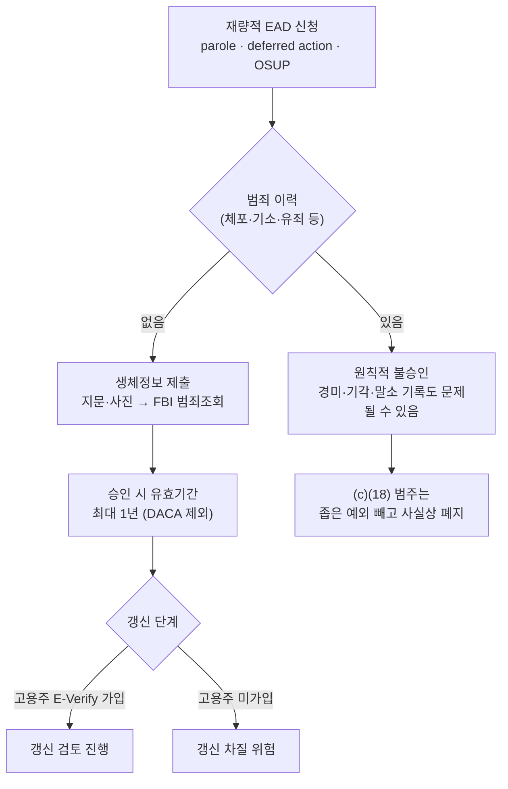

# 6/5 EAD 규칙안 + 로드아일랜드 법원 명령: 한인 취업허가·영주권 대기자가 지금 확인할 것

2026년 6월 5일 하루에 방향이 정반대인 두 가지 이민 소식이 동시에 나왔습니다. 하나는 **연방정부(DHS/USCIS)가 재량적 고용허가(EAD)를 대폭 조이는 규칙안**을 연방관보에 게재한 것이고, 다른 하나는 **로드아일랜드 연방지방법원이 여행금지 39개국 대상 이민 혜택 동결 정책 4건을 무효화**한 것입니다. 한쪽은 일할 권한을 좁히고, 다른 쪽은 멈춰 있던 케이스를 다시 움직이게 합니다.

미국에 사는 한인 중 상당수가 EAD로 생계를 유지하거나, 영주권(신분조정)을 기다리거나, 배우자가 H-4 EAD로 일합니다. 따라서 이 두 소식은 추상적인 정책 뉴스가 아니라 **당장 통장과 직장에 영향을 주는 문제**입니다. 특히 재량적 EAD 규칙안은 의견수렴 마감이 **2026년 8월 4일**로 정해져 있어, 지금이 의견을 낼 수 있는 시간입니다.

> **면책 공지:** 이 글은 일반 정보 안내이며 법률 자문이 아닙니다. 이민 규칙안과 법원 명령은 빠르게 바뀝니다(특히 6월 5일 법원 명령은 6월 말 현재 정부 항소·집행정지 신청이 진행 중). 본인 사례의 신분, 신청 시점, 진행 여부는 반드시 이민 변호사 또는 USCIS에 직접 확인하세요.

## 핵심 요약

- **EAD 규칙안(6/5 발표, 의견수렴 8/4 마감):** 대상은 인도적 가석방(parole), 유예조치(deferred action), 감독부 석방(OSUP)으로 일하는 사람. 범죄 이력자 원칙적 불승인, 모든 재량 EAD에 생체정보 요구, 유효기간 1년으로 단축(DACA 제외), 갱신 시 **고용주의 E-Verify 가입 요구**, (c)(18) 사실상 폐지가 핵심입니다.
- 이 규칙안은 **H-1B·L-1 본인의 취업 권한에는 직접 적용되지 않습니다.** 그러나 가족·배우자가 parole·deferred action·OSUP로 일한다면 직접 영향을 받습니다.
- 별개로 **H-4 등 일부 EAD 자동연장은 이미 2025년 10월 30일부터 폐지**되어, 갱신 공백이 생기지 않도록 조기 갱신이 더 중요해졌습니다.
- **로드아일랜드 법원 명령(6/5):** 여행금지 39개국·팔레스타인 자치정부 발급 여행문서 소지자를 대상으로 한 혜택 동결 등 4개 정책을 무효화. 멈춰 있던 일부 취업허가·영주권 케이스가 재개될 수 있습니다.
- 한국은 39개국에 포함되지 않습니다. 그러나 이 판결의 **"USCIS가 케이스를 무기한 멈출 수 없다"는 원칙**은 모든 신청자에게 의미가 큽니다. 단, 정부 항소로 상황이 다시 바뀔 수 있습니다.

## 먼저, 두 소식을 한눈에 비교

| 구분 | (1) 재량적 EAD 규칙안 | (2) 로드아일랜드 법원 명령 |
|------|----------------------|--------------------------|
| 날짜 | 2026년 6월 5일 연방관보 게재 | 2026년 6월 5일 판결 |
| 성격 | 정부의 규칙 제정안(NPRM, 아직 시행 전) | 법원 판결(정책 무효화) |
| 방향 | 일할 권한을 **좁힘** | 멈춘 케이스를 **재개** |
| 대상 | parole·deferred action·OSUP EAD 신청자 | 여행금지 39개국 등 출신 신청자 |
| 한인 영향 | parole·deferred action·OSUP로 일하는 한인 + 고용주 | 한국은 미포함, 그러나 원칙적으로 중요 |
| 지금 할 일 | **8/4까지 의견 제출** 검토 | 진행 여부·재신청 타이밍 변호사 확인 |
| 불확실성 | 최종 규칙 확정 전(내용 변경 가능) | 정부 항소·집행정지 신청 진행 중 |

## 1) 재량적 EAD 규칙안: 무엇이 어떻게 좁아지나

DHS는 6월 5일 "특정 외국인에 대한 재량적 고용허가의 명확화(Clarification of Discretionary Employment Authorization for Certain Aliens)" 규칙안을 연방관보에 게재했습니다(도켓 USCIS-2026-0067). 여기서 **"재량적(discretionary)"**이란, 신분 자체가 아니라 정부의 재량으로 부여되는 EAD를 말합니다. 구체적으로 세 범주가 핵심 대상입니다.

- **(c)(11) — 인도적 가석방(parole)으로 입국해 일하는 사람**
- **(c)(14) — 유예조치(deferred action)를 받아 일하는 사람**
- **(c)(18) — 최종 추방명령 후 감독부 석방(OSUP)으로 풀려나 일하는 사람**

규칙안에 따르면, FY2024 한 해 동안 이 세 범주의 EAD 신청은 약 97만 8천 건에 달했습니다(parole 약 79만, deferred action 약 15만, OSUP 약 3만). 즉 소수의 예외가 아니라 **대규모 인원**이 대상입니다.

### 규칙안의 5가지 핵심 변화



1. **범죄 이력자 원칙적 불승인:** 중범죄뿐 아니라 체포·기소·기소장 접수·유죄 등 광범위한 기록이 불승인 사유가 될 수 있다고 변호사 분석들은 경고합니다. 경미한 위반, 기각된 혐의, 말소(expunged)된 기록까지 문제가 될 수 있다는 지적이 있습니다.
2. **모든 재량 EAD에 생체정보 요구:** 지문·사진을 제출해 FBI 범죄 이력 조회와 신원 확인에 쓰입니다. DACA 수혜자도 이 생체정보 요건은 적용될 수 있습니다.
3. **유효기간 1년으로 단축:** 기존보다 짧아져 갱신을 더 자주 해야 하고, 자격 유지 입증 책임이 신청자에게 더 무겁게 지워집니다(DACA는 이 단축에서 제외).
4. **갱신 시 고용주 E-Verify 가입 요구:** 이 범주 직원을 초기 EAD 기간 이후에도 고용하려면 **고용주가 E-Verify에 가입**해야 합니다. 소규모 한인 자영업·식당·소매업 고용주에게는 새로운 행정 부담입니다.
5. **(c)(18) 사실상 폐지:** OSUP 범주의 재량적 취업허가 자격을 좁은 예외만 남기고 없애는 방향입니다.

DACA, T비자 신청자, 고문방지협약(CAT) 유예 대상자는 규칙안의 실질적 축소 적용에서 제외되는 것으로 안내되고 있으나, 생체정보 등 일부 요건은 폭넓게 적용될 수 있으니 본인 범주를 변호사와 확인해야 합니다.

### 맥락: H-4 등 일부 EAD 자동연장은 이미 폐지

이번 규칙안과 별개로, **2025년 10월 30일부터 H-4를 포함한 일부 EAD 범주의 자동연장(최대 540일)이 폐지**되었습니다. 즉 갱신 신청이 늦으면 기존처럼 자동으로 일할 수 있는 기간이 사라져 **취업 공백**이 생길 수 있습니다. H-4 EAD로 일하는 배우자는 만료 6개월 전부터 갱신을 서두르는 것이 안전합니다.

## 2) 로드아일랜드 법원 명령: 멈췄던 케이스가 다시 움직인다

같은 날, 로드아일랜드 연방지방법원(*Dorcas International Institute of Rhode Island v. USCIS*, 사건번호 26-cv-132, McConnell 수석판사)은 여행금지 39개국 출신 및 팔레스타인 자치정부 발급·승인 여행문서 소지자를 겨냥한 USCIS의 정책 4건을 **전국적으로 무효화**했습니다. 법원은 이 정책들이 이민국적법(INA)과 행정절차법(APA)을 위반했다고 판단했습니다.

무효화된 4개 정책은 다음과 같습니다.

| 무효화된 정책 | 내용 |
|--------------|------|
| 혜택 동결(Benefits Hold) | 39개국 국적자의 다수 이민 혜택 신청 심사를 보류 |
| 글로벌 망명 보류(Global Asylum Hold) | 망명·추방유보 심사를 광범위 재검토 명목으로 보류 |
| 전면 재심사(Comprehensive Re-Review) | 2021년 1월 20일 이후 입국자의 이미 승인된 케이스까지 재검토 |
| 국가별 요소(Country-Specific Factors) | 여행금지국 출신이라는 점을 재량 심사의 부정적 요소로 취급 |

법원은 "여러 법령과 규정이 정부가 정해진 순서대로 결정을 '내려야 한다(shall)'고 규정한다"며 USCIS가 혜택을 무기한 정지할 법적 근거가 없다고 봤습니다. 또한 판결문은, 같은 정부가 39개국이 심각한 안보 위협이라며 모든 심사를 동결하면서도 **2026 월드컵·2028 올림픽 선수와 의사에게는 예외**를 둔 점을 지적하며 "축구 경기를 도울 수 있거나 환자를 진료할 수 있으면 사라지는 안보 위험은 진정한 안보 논리가 아니다"라고 했습니다.

### 한인에게 의미: 한국은 39개국이 아니지만…

한국은 여행금지 39개국에 포함되지 않으므로 이 동결 정책이 한국 국적자에게 직접 적용되지는 않았습니다. 그럼에도 두 가지 이유로 중요합니다.

- 한인 커뮤니티에는 **39개국 출신 배우자·가족·동료**가 적지 않습니다.
- 무엇보다 이 판결은 **"USCIS가 케이스를 무기한 멈춰 둘 수 없다"**는 원칙을 재확인했습니다. 이는 동결과 무관하게 케이스가 장기 지연된 모든 신청자에게 의미가 있습니다.

### 중요한 단서: 상황은 다시 바뀔 수 있다

6월 말 현재 무효화된 4개 정책은 효력이 정지된 상태이고 USCIS도 이를 따른다고 밝혔습니다. **그러나 정부는 2026년 6월 12일 제1연방항소법원(사건번호 No. 26-1703)에 항소했고, 6월 19일 지방법원에 판결 집행정지(stay)를 신청했습니다. 원고 측 답변 기한은 7월 6일이며, 6월 말 현재 집행정지는 아직 인용되지 않아 4개 정책은 여전히 무효(vacated) 상태입니다.** 집행정지가 인용되면 동결이 되살아날 수 있습니다. 따라서 영향을 받았던 케이스가 있다면 "지금이 기다릴 때가 아니라 움직일 때일 수 있다"는 점을 변호사와 확인하는 것이 좋습니다.

## 누가, 무엇을 해야 하나 — 대상자별 정리

| 당신이… | 6/5 EAD 규칙안 | 6/5 법원 명령 | 우선 행동 |
|---------|---------------|--------------|-----------|
| H-1B/L-1로 신분조정(영주권) 대기 | 본인 EAD엔 직접 영향 없음 | 케이스 지연 시 재개 원칙 적용 가능 | 케이스 진행 상황 점검 |
| H-4 EAD로 일하는 배우자 | 이 규칙안 범위 밖이나, 자동연장 폐지로 갱신 공백 위험 | 직접 무관 | 만료 6개월 전 조기 갱신 |
| parole(c11)로 일하는 한인 | 직접 영향(1년·생체정보·E-Verify·범죄심사) | 동결과 무관하면 직접 무관 | 8/4 의견수렴 검토, 갱신 일정 점검 |
| deferred action(c14)로 일하는 한인 | 직접 영향 | 직접 무관 | 자격 입증 서류 미리 정리 |
| OSUP(c18)로 일하는 한인 | (c)(18) 사실상 폐지 위험 | 직접 무관 | 즉시 변호사 상담 |
| 한인 고용주(E-Verify 미가입) | 갱신 단계서 E-Verify 가입 부담 | 직접 무관 | E-Verify 가입 검토 |

## 실행 체크리스트

```
☐ 내 EAD 범주 확인 (EAD 카드 뒷면/승인서의 (c)(##) 코드)
    → c11(parole) · c14(deferred action) · c18(OSUP)이면 규칙안 직접 대상
☐ H-4 EAD라면: 만료일 확인 → 자동연장 폐지(2025-10-30~) 감안해 6개월 전 갱신
☐ 8/4 의견수렴: regulations.gov에서 USCIS-2026-0067 검색 → 'Comment' 제출 검토
☐ 의견서엔 1년 유효기간·생체정보·E-Verify 요건이 내 사례에 미칠 실제 부담을 사실로 기술
☐ 범죄 이력(경미·기각·말소 포함) 있으면 제출 전 반드시 변호사 검토
☐ 고용주(자영업 포함): E-Verify 가입 여부·가입 절차 사전 확인
☐ 39개국 동결로 멈췄던 가족·동료 케이스: 항소·집행정지 결과 전에 진행 가능성 변호사 확인
☐ 모든 신청서·증빙은 사본 보관, 접수증(receipt) 날짜 기록
```

이민 정책은 규칙안 → 의견수렴 → 최종 규칙의 단계를 거치므로 **재량적 EAD 규칙안은 아직 시행 전**입니다. 내용이 바뀔 수도 있고, 8월 4일까지의 의견이 실제로 반영될 여지도 있습니다. 반대로 법원 명령은 지금 효력이 있지만 항소로 뒤집힐 수 있습니다. **두 사건 모두 "유동적"**이라는 점을 기억하고, 본인 사례의 정확한 판단은 이민 변호사와 함께 내리시기 바랍니다.

## 출처 (Sources)

- [Federal Register — Clarification of Discretionary Employment Authorization for Certain Aliens (2026-06-05)](https://www.federalregister.gov/documents/2026/06/05/2026-11285/clarification-of-discretionary-employment-authorization-for-certain-aliens)
- [Regulations.gov — Docket USCIS-2026-0067 (의견 제출)](https://www.regulations.gov/document/USCIS-2026-0067-0001)
- [USCIS — Court Order on Hold Policies (Newsroom Alert)](https://www.uscis.gov/newsroom/alerts/court-order-on-hold-policies)
- [American Immigration Council — Court Blocks USCIS Immigration Pause for 39 Countries](https://www.americanimmigrationcouncil.org/blog/court-blocks-uscis-immigration-pause-39-countries/)
- [National Immigration Forum — Explainer: Proposed Restrictions on Employment Authorization](https://forumtogether.org/article/explainerproposed-restrictions-on-employment-authorization-for-certain-noncitizens/)
- [Murray Osorio — DHS Proposes Rule to Further Restrict EAD Issuance](https://www.murrayosorio.com/news/2026/june/department-of-homeland-security-proposes-rule-to/)
- [NPZ Law Group — USCIS Proposes New Restrictions on Discretionary EADs](https://visaserve.com/uscis-proposes-new-restrictions-on-discretionary-employment-authorization-documents-eads/)
- [Ahluwalia Law — USCIS Proposes New Limits on Discretionary Work Permits](https://www.ahluwalialaw.com/uscis-discretionary-employment-authorization-proposed-rule-2026/)
- [Nixon Peabody — Rhode Island Federal Court Vacates USCIS Immigration Benefit Freeze Policies](https://www.nixonpeabody.com/insights/alerts/2026/06/08/rhode-island-federal-court-vacates-uscis-immigration-benefit-freeze-policies)
- [WR Immigration — DORCAS on Appeal: District Court Pauses Its Own Ruling as First Circuit Takes Up the Case](https://wolfsdorf.com/dorcas-on-appeal-district-court-pauses-its-own-ruling-as-first-circuit-takes-up-the-case/) (주: 제목의 "Pauses"는 항소·집행정지 신청 단계를 가리키며, 6월 말 현재 법원이 stay를 인용한 것은 아닙니다. 정책은 여전히 무효 상태)
