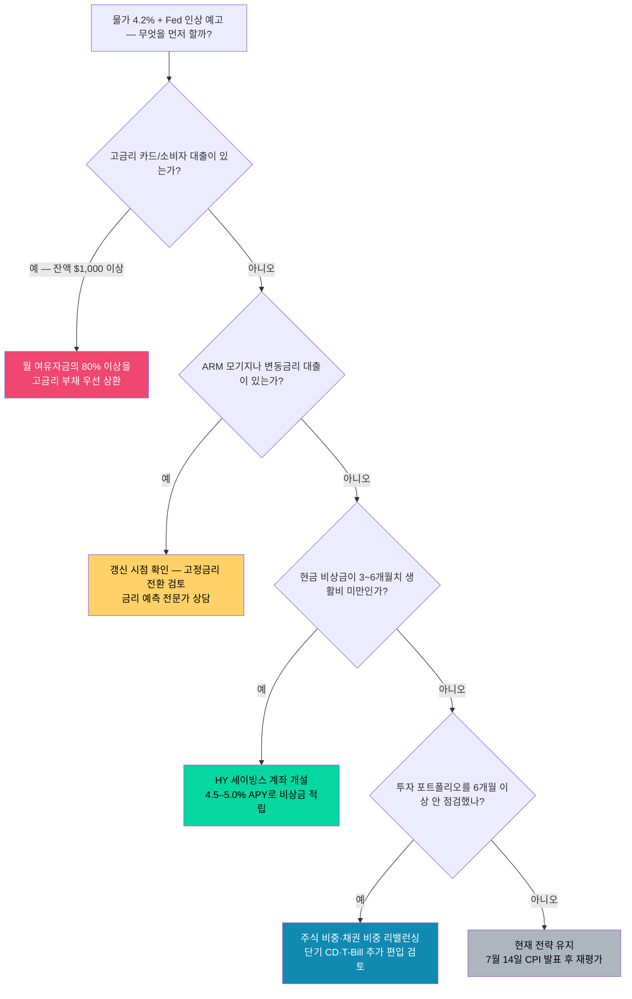

# 미국 물가 4.2% 돌파·Fed 금리 인상 예고: 한인 가정 하반기 재정 체크리스트

미국 소비자물가(CPI)가 2026년 5월 기준 전년 대비 **4.2%** 상승했습니다. 2023년 초 이후 3년 만에 처음으로 4%대를 돌파했습니다. 더 중요한 것은 Fed의 변화입니다. 6월 17일 Kevin Warsh 신임 의장 체제의 첫 FOMC 회의에서 Fed는 금리를 동결했지만, **점도표(dot plot)는 매파(인상 쪽)로 전환**됐습니다. 금리 인하를 기대하던 흐름이 완전히 뒤집힌 것입니다.

한인 가정에게 이것은 이론의 문제가 아닙니다. 장보기 비용이 올라가고, 모기지 금리가 6%대 후반에 갇히고, 카드 이자는 여전히 20%대입니다. 지금이 하반기 재정 계획을 다시 점검할 시점입니다.

## 핵심 요약

| 지표 | 현재 수치 | 전년 대비 | 한인 가정 영향 |
|------|:--------:|:--------:|:------------|
| **CPI (전체)** | +4.2% YoY | ↑ 3년 최고 | 전반적 생활비 상승 |
| **휘발유** | ~$3.91/gallon (6/25 AAA) | +29% (5월 BLS 기준) | 통근·여름 여행 비용 직격 |
| **식료품** | +3.1% YoY | ↑ | 한인 마켓·일반 식료품 동반 상승 |
| **주거비(Shelter)** | +4.8% YoY | ↑ | 렌트·모기지 부담 지속 |
| **기준금리** | 3.50–3.75% | 동결 (4회 연속) | 연내 인상 가능성 ↑ |
| **30년 고정 모기지** | ~6.49% | ↑ 0.1%p | 주택 구입·재융자 비용 |
| **Fed 연내 전망** | 3.8% 중간값 | 인상 신호 | 10월 인상 유력 |

> **참고**: 6월 CPI 데이터는 7월 14일 발표 예정입니다. 중동 정세 안정으로 휘발유 가격이 5월 고점($4.48)에서 다소 내렸지만, 근원 인플레이션(Core CPI)은 여전히 높습니다.

---

## 왜 물가가 다시 올랐나 — 원인 3가지

### ① 이란·호르무즈 해협 사태로 에너지 가격 급등

2026년 5~6월 미국-이란 갈등이 고조되면서 중동산 원유 공급이 불안해졌습니다. 휘발유 가격이 5월에 전국 평균 $4달러 중반까지 치솟아 물가 전반을 끌어올렸습니다. 6월 중순 이후 미-이란 합의가 이뤄지며 다소 내렸지만(6월 25일 기준 ~$3.91/gallon, AAA), BLS CPI 기준 5월 휘발유 가격지수는 전년 동기 대비 29% 높습니다.

### ② 주거비(Shelter)가 꺾이지 않는다

렌트·주거비 항목은 전년 대비 4.8% 상승 중입니다. 임대 시장에서 공급 부족이 지속되고 있어, 모기지 금리가 낮아지지 않는 한 렌트비도 내려가기 어렵습니다.

### ③ 관세 영향이 식료품·소비재로 번지다

2026년 시행된 추가 관세가 중국·멕시코·캐나다산 소비재 가격에 반영되면서 한인 가정이 자주 구입하는 김치·라면·가전제품·의류 등 품목의 가격이 올랐습니다. 식료품 CPI +3.1%는 단순 수입 인플레이션의 영향입니다.

---

## Fed의 신호 — 인상 가능성 타임라인

| 날짜 | 이벤트 | 포인트 |
|------|--------|--------|
| **6월 17일** | FOMC — 금리 동결 | 3.50–3.75% 유지, 도트 플롯 매파 전환, 9명 연내 인상 지지 |
| **7월 14일** | 6월 CPI 발표 | 물가 방향 확인 — 4% 이상이면 인상 가능성 급상승 |
| **7월 28–29일** | FOMC 회의 | 동결 예상, 그러나 CPI 결과에 따라 톤 변화 |
| **9월 16–17일** | FOMC 회의 | 인플레이션 지속 시 첫 인상 가능 시점 |
| **10월 27–28일** | FOMC 회의 | 시장이 **가장 유력한 +25bp 인상 시점**으로 보는 날 |
| **12월 15–16일** | FOMC 회의 | 올해 마지막 회의 — 연내 두 번째 인상 여부 결정 |

**핵심**: Fed 도트 플롯 중간값이 3.8%로 올라갔다는 것은 현재 금리(3.625% 중간값) 대비 **약 +25bp 인상**을 18명 중 과반이 지지한다는 의미입니다. 시장에서는 10월 인상이 가장 유력한 타이밍으로 보고 있습니다.

---

## 한인 가정 영역별 영향 분석

### 🏠 주택·모기지

30년 고정 모기지 금리가 **6.49%** 수준입니다. 2024년 초에 잠깐 6%대 초반으로 내려왔던 것이 다시 올라간 상태입니다.

| 대출액 | 6.0% 시 월납입 | 6.49% 시 월납입 | 차이 |
|:------:|:----------:|:-----------:|:---:|
| $500,000 | $2,998 | $3,154 | +$156/월 |
| $700,000 | $4,197 | $4,415 | +$218/월 |
| $900,000 | $5,396 | $5,676 | +$280/월 |

**ARM(변동금리 모기지)** 을 보유 중이라면 갱신 시점을 확인하세요. 금리 인상이 현실화되면 월납입액이 자동으로 올라갑니다.

**재융자(Refinance)** 를 고려 중이라면 지금 당장은 유리하지 않습니다. 금리가 낮아지는 국면이 아니기 때문에, 3~5%대 고정금리를 이미 가지고 있다면 절대 손대지 마세요.

### 🛒 장보기·생활비

한인 마트·코스트코 장바구니 비용이 체감 3~5% 올랐습니다. 한국 식료품(참기름·고추장·김·라면 등)은 환율 약세와 관세 영향이 겹쳐 더 크게 오를 수 있습니다.

**실천 팁**: 코스트코·HMart 등에서 고가격 제품 위주 비교, 비필수 가공식품 감량, 식사 계획으로 음식 낭비 줄이기.

### 💳 카드·소비자 대출

카드 평균 이자율은 여전히 **20%대 중반**입니다. Fed 금리 인상은 카드·HELOC·학자금 대출(변동금리) 이자를 추가로 높입니다. 고금리 부채를 갖고 있다면 지금이 가장 공격적으로 갚아야 할 시점입니다.

### 💰 저축·예금

고금리 시대의 유일한 수혜자는 **예금자**입니다.

| 예금 상품 | 현재 금리 범위 | 특징 |
|----------|:----------:|:-----|
| 온라인 고금리 세이빙스(HY Savings) | 4.5–5.0% APY | 언제든 인출 가능 |
| 1년 CD | 4.8–5.2% APY | 만기 전 해지 패널티 있음 |
| 6개월 CD | 4.6–5.0% APY | 단기 운용에 적합 |
| T-Bill (3개월) | ~5.1% | 연방정부 보증, 주세 면제 |

*출처: Bankrate 금리 비교 (2026년 6월 26일 기준), TreasuryDirect 경매 결과. 실제 금리는 기관·시점에 따라 다릅니다.*

Fed 인상이 예고된 지금, **CD나 T-Bill을 1년 이상 장기로 묶는 것은 주의**하세요. 인상 후에 더 높은 금리로 재예치하는 옵션을 남겨두는 전략이 유리합니다.

---

## 지금 내 돈, 어떻게 할까 — 결정 플로우차트

---

## 한인 가정 특수 고려사항

### 한국 송금(Remittance) — 달러 강세로 유리한 타이밍

고금리 유지로 달러가 강세를 보이고 있어 원화 환산 시 수령액이 늘어납니다. 한국 부모님에게 정기 송금하거나 한국 부동산 세금을 납부해야 하는 분들에게는 지금이 상대적으로 유리한 시점입니다. 단, 환율은 예측 불가능하므로 정기 소액 분산 송금 원칙을 유지하세요.

### 한인 자영업자 — 물가 상승 원가 관리

음식점·소매업 한인 자영업자는 식재료·포장재·인건비가 동시에 오르는 압박을 받습니다. 메뉴 가격 조정 여부를 점검하고, SBA 7(a) 대출을 이미 갖고 있다면 이자율 갱신 조건을 확인하세요. 변동금리 사업자 대출은 금리 인상 시 즉각 영향을 받습니다.

### 대학생 자녀 학자금 대출

연방 학자금 대출 금리는 해마다 5월 발표되는 10년물 국채 금리에 연동됩니다. 2026-27년 학년도 학부생 대출 금리가 전년 대비 오를 수 있습니다. 이미 대출이 있다면 IBR(소득기반상환) 또는 PSLF(공공서비스 대출 탕감) 자격 여부를 확인하세요.

---

## 지금 당장 할 일 — 하반기 재정 체크리스트

- [ ] **카드 잔액 확인**: 20% 이상 이자 부과 계좌 목록 작성 → 상환 우선순위 설정
- [ ] **모기지 종류 확인**: ARM이면 다음 갱신 시점과 조정 상한(cap) 조항 확인
- [ ] **세이빙스 금리 비교**: 기존 은행 금리가 4% 미만이면 온라인 HY 세이빙스 이동 검토
- [ ] **CD 전략 점검**: 장기 CD(12개월 이상) 신규 가입은 금리 인상 후 재검토
- [ ] **7월 14일 캘린더 알림 설정**: 6월 CPI 발표일 — 수치 확인 후 재평가
- [ ] **장바구니 예산 재설정**: 월 식비 목표액을 정해 앱(Mint·YNAB)으로 추적
- [ ] **한국 송금 계획 확인**: 달러 강세 지금 유리한지 환율 조회 (Wise·Remitly 비교)
- [ ] **자영업자**: 사업자 대출 이자율 갱신 조건 + 메뉴·가격 조정 여부 검토

---

> **법적 고지**: 이 글은 일반 정보 제공 목적이며 세무·재정·법률 자문이 아닙니다. 개인 상황에 맞는 결정을 위해 공인재정계획사(CFP)나 전문가와 상담하세요.

## 출처 (Sources)

- [U.S. Bureau of Labor Statistics — Consumer Price Index Summary, May 2026](https://www.bls.gov/news.release/cpi.nr0.htm)
- [Federal Reserve — FOMC Statement, June 17, 2026](https://www.federalreserve.gov/newsevents/pressreleases/monetary20260617a.htm)
- [Federal Reserve — Economic Projections (Dot Plot), June 2026](https://www.federalreserve.gov/monetarypolicy/fomcprojtabl20260617.htm)
- [Freddie Mac — Primary Mortgage Market Survey, June 26, 2026](https://www.freddiemac.com/pmms)
- [Bankrate — Today's Mortgage Rates, June 26, 2026](https://www.bankrate.com/mortgages/todays-rates/)
- [AAA — Gas Prices, June 2026](https://gasprices.aaa.com/)
- [U.S. Energy Information Administration — Retail Gasoline Prices](https://www.eia.gov/petroleum/gasdiesel/)
- [CNBC — Fed holds rates at June 2026 meeting, signals potential hike ahead](https://www.cnbc.com/2026/06/17/fed-interest-rate-decision-june-2026.html)
- [Bankrate — Best High-Yield Savings Accounts & CD Rates, June 2026](https://www.bankrate.com/banking/savings/best-high-yield-interests-savings-accounts/)
- [TreasuryDirect — Treasury Bills Auction Results](https://www.treasurydirect.gov/auctions/announcements-data-results/announcement-results-press-releases/auction-results/)
- [AAA — National Gas Price Average, June 25, 2026](https://gasprices.aaa.com/)
