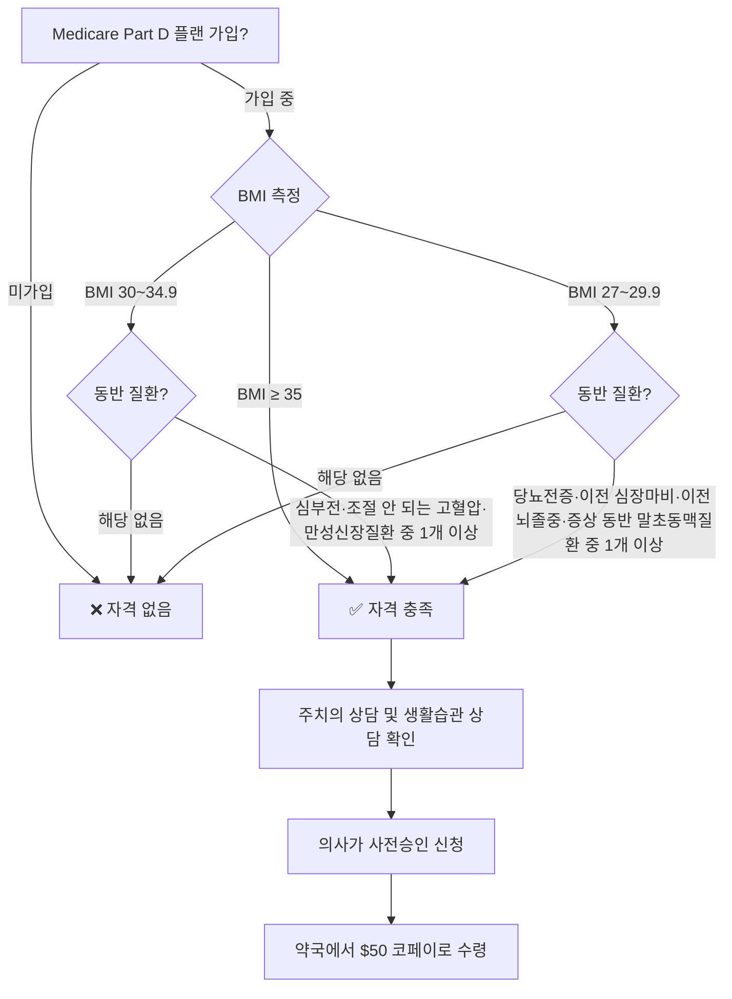

# Medicare GLP-1 다이어트약 월 $50 시대 — 7월 1일 시작, 한인 시니어 자격 확인 가이드

내일인 2026년 7월 1일, Medicare Part D 가입자를 위한 **GLP-1 Bridge 프로그램**이 공식 시작됩니다. Wegovy, Zepbound 같은 비만 치료용 GLP-1 약을 월 **$50 정액 코페이**로 받을 수 있는 CMS(의료보험센터) 시범 프로그램입니다. KFF(Kaiser Family Foundation) 분석에 따르면 **거의 400만 명**의 Medicare 수혜자가 자격을 갖출 것으로 추정됩니다.

한인 시니어 가정은 당뇨 전증(prediabetes), 조절되지 않는 고혈압(uncontrolled hypertension), 만성신장질환 등 GLP-1 자격 조건과 겹치는 만성질환 유병률이 높습니다. 지금 자격 여부를 확인하고 주치의에게 신청 가능성을 문의하세요.

## 핵심 요약

| 항목 | 내용 |
|------|------|
| 프로그램명 | Medicare GLP-1 Bridge (CMS 시범) |
| 시작일 | 2026년 7월 1일 |
| 종료 예정일 | 2027년 12월 31일 |
| 월 코페이 | $50 (30일치) |
| 대상 약 | Wegovy(주사·정제), Zepbound(KwikPen), Foundayo(정제) |
| 필수 요건 | Medicare Part D 가입 + BMI/동반 진단 기준 충족 |
| 비용 산입 | Part D 공제액·연간 본인부담($2,100) 미산입 |

## GLP-1 Bridge 자격 판단 흐름

> **BMI 계산**: 몸무게(kg) ÷ 키(m)². 예) 키 165cm, 몸무게 82kg → 82 ÷ 2.7225 ≈ BMI 30.1

## 동반 질환 조건 상세 설명

CMS가 제시한 동반 질환 조건은 일반 진단명보다 구체적입니다. 아래를 주치의와 함께 확인하세요.

**BMI 30~34.9에서 요구되는 동반 질환 (3가지 중 1가지):**
- **조절되지 않는 고혈압(Uncontrolled Hypertension)**: 단순 고혈압 진단만으로는 부족합니다. 약을 복용 중에도 혈압이 목표 수치에 도달하지 못하는 상태를 의미합니다.
- **심부전 중 보존 박출률 심부전(Heart Failure with Preserved Ejection Fraction, HFpEF)**: 모든 심부전이 아닌 이 특정 유형입니다.
- **만성신장질환(Chronic Kidney Disease, CKD)**

**BMI 27~29.9에서 요구되는 동반 질환 (4가지 중 1가지):**
- **당뇨전증(Prediabetes)**: 당뇨병 진단을 받은 경우와 다릅니다. HbA1c 5.7~6.4%, 또는 공복혈당 100~125 mg/dL 범위를 의미합니다.
- **이전 심장마비(Previous Heart Attack)** 또는 **이전 뇌졸중(Previous Stroke)**: 과거 병력이 있으면 해당됩니다.
- **증상을 동반한 말초동맥질환(Symptomatic Peripheral Artery Disease, PAD)**: 무증상 PAD는 해당되지 않습니다. 다리 통증·저림 등 증상이 있어야 합니다.

## 어떤 약이 포함되고, 포함되지 않나요?

| 약 이름 | 성분 | GLP-1 Bridge 포함 | 비고 |
|---------|------|:----------------:|------|
| Wegovy® | 세마글루타이드 | ✅ 포함 | 주사 또는 경구 정제 |
| Zepbound® KwikPen | 티르제파타이드 | ✅ 포함 | KwikPen 제형만 해당 |
| Foundayo® | — | ✅ 포함 | 경구 정제 |
| Ozempic® | 세마글루타이드 | ❌ 제외 | 당뇨 치료 → 기존 Part D 별도 |
| Mounjaro® | 티르제파타이드 | ❌ 제외 | 당뇨 치료 → 기존 Part D 별도 |
| Victoza®, Trulicity® | — | ❌ 제외 | 당뇨·심혈관 치료제 |

> **당뇨병과 당뇨전증 구분**: 당뇨병(Diabetes) 진단을 받은 분은 이 프로그램 대신, Ozempic·Mounjaro 같은 당뇨 치료 GLP-1을 기존 Part D로 처방받는 경로를 활용하세요. GLP-1 Bridge는 체중 감량이 주된 적응증인 약(Wegovy·Zepbound·Foundayo)에만 적용됩니다.

## 한인 시니어와 대사 질환: 왜 지금 이 뉴스가 중요한가

한인을 포함한 동아시아계 미국인은 같은 BMI라도 당뇨병과 대사 질환 위험이 다른 인종보다 높다는 연구 결과가 꾸준히 발표됩니다. CDC 자료에 따르면 아시아계 미국인의 당뇨전증 유병률은 미국 전체 평균 수준이며, 특히 50~60대 이후 비만 지표 없이도 대사 이상이 나타나는 경우가 많습니다.

GLP-1 Bridge의 BMI 27 기준은 동아시아계 신체 기준으로 상대적으로 낮지 않습니다. 그러나 당뇨전증, 이전 심장마비·뇌졸중 병력이 있는 한인 시니어라면 BMI 27 이상으로 자격이 될 가능성이 있습니다. 최근 혈당 검사나 HbA1c 수치가 있다면 주치의와 함께 검토하세요.

## Medicare Part D 플랜 종류 — 나는 어떤 플랜인가?

GLP-1 Bridge는 Medicare Part D에 가입된 사람만 이용할 수 있습니다. 자신의 플랜 종류를 확인하세요.

| 플랜 유형 | 설명 | GLP-1 Bridge 이용 가능 |
|----------|------|:--------------------:|
| 독립형 처방약 플랜(PDP) | Original Medicare + 별도 약 보험 | ✅ |
| Medicare Advantage + 약(MA-PD) | 통합형 플랜에 약 보험 포함 | ✅ |
| Medicare Advantage(약 미포함) | 통합형이지만 Part D 없음 | ❌ |
| Medicare Part B만 | 의료보험만 있음 | ❌ |

모르겠다면 Medicare.gov에 로그인하거나 1-800-MEDICARE(1-800-633-4227)에 전화해 플랜 유형을 확인하세요.

## 신청 절차 5단계

이 프로그램은 자동 등록이 아닙니다. 반드시 주치의를 통해 신청해야 합니다.

1. **주치의 상담**: BMI 측정 및 동반 질환 진단 확인
2. **생활습관 상담(필수)**: CMS 규정상 의사가 식이·운동 등 라이프스타일 변화에 대해 상담을 제공했음을 확인해야 승인 신청 가능. 일회성이 아닌 지속적 상담을 포함합니다.
3. **사전승인(Prior Authorization) 제출**: 의사가 중앙 처리센터에 환자 자격 서류와 처방전 제출
4. **승인 통보**: 처리 후 플랜 또는 CMS로부터 승인 여부 통보
5. **약국 수령**: 참여 약국에서 30일치 $50 정액 결제

**문의**: 1-800-MEDICARE (1-800-633-4227) — 전화 연결 후 한국어 통역 서비스 요청 가능

## 꼭 알아야 할 주의사항

**비용 구조가 다릅니다**: GLP-1 Bridge의 $50 코페이는 Part D 공제액(deductible)과 연간 최대 본인부담($2,100) 계산에 포함되지 않습니다. 이 약에 지출한 $50은 다른 약의 본인부담 감면에 기여하지 않습니다.

**임시 시범 프로그램**: 2027년 12월 31일이 현재 종료 예정일입니다. CMS 평가 결과에 따라 연장 또는 상설화될 수 있으나 보장되지 않습니다.

**Medicare 역사상 첫 체중 감량 전용 GLP-1 커버**: 기존 Medicare는 당뇨·심혈관 적응증 GLP-1만 커버했습니다. 체중 감량 단독 목적으로 GLP-1을 Medicare로 받는 것은 이번이 처음입니다.

**저소득 보조(LIS/Extra Help) 수혜자**: 저소득 보조 프로그램을 받고 있어도 GLP-1 Bridge의 $50 코페이는 별도 적용됩니다. LIS 혜택이 이 $50 코페이를 자동으로 낮춰주지 않습니다. 구체적인 적용 방식은 주치의 또는 1-800-MEDICARE에 문의하세요.

**Part D 플랜 필수**: Medicare Part B(의료보험)만 있으면 해당되지 않습니다.

## 한인 시니어 가정 체크리스트

- [ ] 현재 Medicare Part D 플랜 종류 확인 (PDP 또는 MA-PD인지)
- [ ] BMI 계산: 몸무게(kg) ÷ 키(m²)
- [ ] 동반 질환 기록 준비: 당뇨전증(HbA1c·공복혈당 수치 포함), 조절 안 되는 고혈압, 심부전, 만성신장질환, 이전 심장마비·뇌졸중
- [ ] 주치의에게 "Medicare GLP-1 Bridge 신청 가능한지" 문의
- [ ] 현재 복용 중인 당뇨·혈압·체중 관련 약 목록 지참
- [ ] 한국어 통역 필요 시 1-800-MEDICARE 전화 시 통역 서비스 요청

## 마무리

7월 1일 시작되는 Medicare GLP-1 Bridge 프로그램은 비만과 대사 질환으로 고민하는 Medicare 수혜자에게 현실적인 선택지를 제공합니다. 이전까지 월 수백~수천 달러에 달했던 GLP-1 비만 치료제를 $50에 접근할 수 있게 된 것은 큰 변화입니다. 2027년 12월 이후 프로그램 존속이 확정되지 않은 만큼, 자격이 된다면 올해 안에 신청을 시작하는 것이 유리합니다. 자격 조건을 확인하고 주치의와 상담해 빠르게 신청하세요.

> 본 글은 일반 정보 제공 목적이며 의료 자문이 아닙니다. 동반 질환 진단, 약물 선택 및 처방은 반드시 주치의와 상의하시기 바랍니다.

## 출처 (Sources)

- [CMS — Medicare GLP-1 Bridge 공식 페이지](https://www.cms.gov/medicare/coverage/prescription-drug-coverage/medicare-glp-1-bridge)
- [CMS 보도자료 — GLP-1 약 월 $50 제공 발표](https://www.cms.gov/newsroom/press-releases/coming-soon-cms-provide-50-monthly-access-glp-1-medications-medicare-beneficiaries)
- [Medicare.gov — GLP-1 Bridge 안내](https://www.medicare.gov/glp1bridge)
- [Medicare Rights Center — GLP-1 시범 프로그램 7월 시작](https://www.medicarerights.org/medicare-watch/2026/06/04/glp-1-weight-loss-drug-demonstration-begins-july-2026)
- [NPR — Medicare 체중감량약 7월 $50 코페이 시작](https://www.npr.org/2026/05/06/nx-s1-5812662/medicare-bridge-glp1-drugs-copay)
