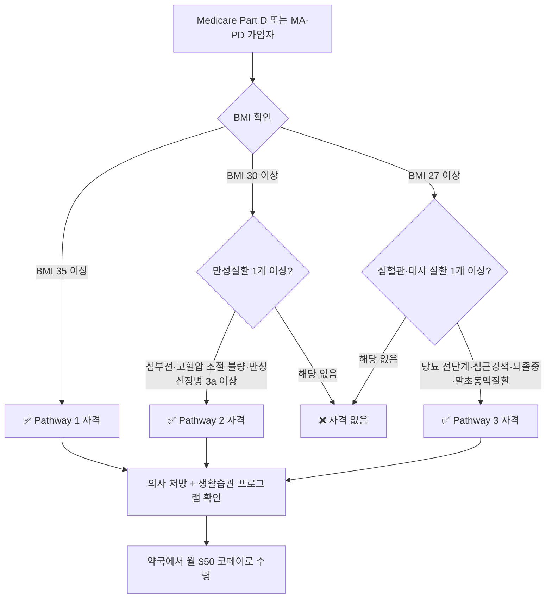

# 7월 1일부터 Medicare에서 비만약 월 $50 — 한인 시니어 GLP-1 브리지 자격·신청 완전 가이드

2026년 7월 1일, 미국 노인 의료보험 역사에서 주목할 만한 변화가 시작됩니다. CMS(Centers for Medicare & Medicaid Services)가 **Medicare GLP-1 Bridge 프로그램**을 공식 출범해, 자격이 되는 Medicare 가입자가 비만 치료용 GLP-1 약물(Wegovy·Zepbound·Foundayo)을 **월 $50 코페이**만으로 받을 수 있게 됩니다.

그동안 이 약들은 월 $1,000~$1,300에 달하는 가격 때문에 Medicare 시니어에게는 사실상 그림의 떡이었습니다. 7월 1일부터는 BMI와 만성질환 조합 요건을 충족하면 누구나 신청할 수 있습니다. 한인 시니어 가정이 알아야 할 자격 기준과 신청 절차를 상세히 정리했습니다.

## 핵심 요약

| 항목 | 내용 |
|---|---|
| **시작일** | 2026년 7월 1일 |
| **종료 예정일** | 2027년 12월 31일 |
| **본인 부담** | 30일 처방 기준 $50 코페이 |
| **대상 약물** | Foundayo®, Wegovy®(주사·정제), Zepbound®(KwikPen®) |
| **필수 가입 요건** | Medicare Part D 또는 처방약 커버리지 포함 MA 플랜 |
| **의사 확인 사항** | 식이·운동 생활습관 프로그램 병행 서약 |

---

## 프로그램 배경: 왜 지금 Medicare가 GLP-1을 덮는가

GLP-1 수용체 작용제(Glucagon-Like Peptide-1 Receptor Agonist)는 원래 당뇨 치료제로 개발됐습니다. 그런데 임상 연구에서 비만 치료 효과가 탁월하다는 결과가 잇따라 나오면서 FDA가 비만 치료 용도로 별도 승인했습니다. Wegovy(세마글루타이드)는 약 15%, Zepbound(티르제파타이드)는 최대 22%까지 체중을 줄이는 것으로 알려져 있습니다.

문제는 비용이었습니다. Medicare는 전통적으로 비만 치료약을 보험 급여 대상에서 제외해왔습니다. CMS가 이번에 내놓은 GLP-1 Bridge는 2026년 7월 1일부터 2027년 12월 31일까지 18개월간 운영되는 시범 프로그램입니다. 단, CMS는 2026년 5월 후속 프로그램으로 검토하던 BALANCE 모델의 Part D 적용을 무기한 연기한다고 발표했습니다. 따라서 2028년 이후의 급여화 여부는 현재로서 불확실하며, CMS와 의회의 결정을 지속적으로 모니터링해야 합니다.

---

## 자격 기준: 세 가지 경로(Pathway)

CMS는 BMI와 만성질환 조합에 따라 세 가지 자격 경로를 만들었습니다.

### Pathway 1 — BMI 35 이상

조건이 가장 단순합니다. BMI만 35 이상이면 만성질환 여부에 무관하게 자격이 됩니다.

### Pathway 2 — BMI 30 이상 + 특정 만성질환

BMI가 30~34.9 범위인 경우 다음 중 하나가 있어야 합니다.

- 수축기 보존 심부전(HFpEF)
- 2가지 이상의 혈압약을 복용해도 수축기 혈압 140mmHg 이상 또는 이완기 혈압 90mmHg 이상으로 조절되지 않는 경우
- 만성신장병 3a기(GFR 45~59) 이상

### Pathway 3 — BMI 27 이상 + 심혈관·대사 질환

BMI가 27~29.9 범위인 경우 다음 중 하나가 있어야 합니다.

- 당뇨 전단계(Prediabetes, HbA1c 5.7~6.4%)
- 과거 심근경색 이력
- 과거 뇌졸중 이력
- 증상이 있는 말초동맥질환(PAD)

**중요:** BMI 자격 기준은 GLP-1 치료를 처음 시작한 시점 기준으로 평가합니다. 이미 Wegovy·Zepbound를 자비로 복용 중이었다면, 치료 시작 당시 BMI를 의무기록에서 확인해 자격 여부를 판단할 수 있습니다.

---

## 한인·아시아계 시니어를 위한 BMI 특별 고려사항

서양인 기준으로 만들어진 BMI 지표는 동아시아인에게 불리하게 적용될 수 있습니다. 국제비만학회(WHO 아시아태평양 소위)와 한국비만학회는 동아시아인의 경우 BMI 23 이상에서 이미 대사 위험이 시작된다고 봅니다. 이는 이 프로그램의 Pathway 3 기준인 BMI 27이 한인 시니어에게 생각보다 접근 가능한 기준임을 의미합니다.

| 집단 | 비만 판정 BMI | 대사 위험 시작 BMI |
|---|---|---|
| 서양인(일반 기준) | 30 이상 | 25 이상 |
| 동아시아인(WHO 아태 기준) | 25 이상 | 23 이상 |
| 한국비만학회 기준 | 25 이상 | 23 이상 |

미국 한인 커뮤니티에서는 대사증후군(복부비만·혈당 이상·혈압 이상·중성지방 이상 중 3개 이상)이 일반 BMI 기준으로는 정상 범주에 속하는 분들에게도 높은 비율로 나타나는 것으로 보고됩니다. BMI 27 미만이더라도 당뇨 전단계나 심혈관 위험 인자가 있다면 주치의에게 **"아시아계 BMI 기준을 참고해달라"**고 요청하세요. 의사가 GLP-1 처방 임상적 합리성을 기록에 남기면 보험 선인가(prior authorization) 과정에서 도움이 됩니다.

**한인 커뮤니티 지원 자원:** 지역 한인 커뮤니티 보건 네비게이터나 HANA Center(하나센터) 등 한인 서비스 기관은 Medicare 신청 과정에서 언어 지원과 서류 준비를 도와줄 수 있습니다. 시카고 지역 외에도 각 지역의 한인회나 한인 복지관에 보건 서비스 담당자가 있는 경우가 많습니다.

---

## 대상 약물과 복용 형태

현재 Medicare GLP-1 Bridge에서 커버하는 약물은 다음 세 가지입니다.

| 약물 이름 | 성분 | 복용 방법 |
|---|---|---|
| **Wegovy®** | 세마글루타이드(Semaglutide) | 주 1회 피하주사 또는 경구 정제 |
| **Zepbound®** (KwikPen®) | 티르제파타이드(Tirzepatide) | 주 1회 피하주사 |
| **Foundayo®** | 오르포글리프론(Orforglipron) | 경구 정제(매일 복용, 주사 불필요) |

**Foundayo에 대한 중요 안내:** Foundayo(오르포글리프론)는 Eli Lilly가 개발한 소분자(small-molecule) 비펩타이드 GLP-1 수용체 작용제로, 세마글루타이드(Wegovy/Ozempic의 성분)와 화학적으로 완전히 다릅니다. 가장 큰 실용적 차이는 **경구 복용**이 가능하다는 점입니다. 주사가 부담스럽거나 주사 부위 반응이 걱정되는 시니어에게 특히 적합할 수 있습니다. 다만 신규 승인 약물이므로 장기 데이터는 Wegovy·Zepbound에 비해 축적이 덜 됩니다.

**주의:** Ozempic(당뇨 용도의 세마글루타이드)과 Mounjaro(당뇨 용도의 티르제파타이드)는 이 프로그램 대상이 아닙니다. GLP-1 Bridge는 비만 치료 목적으로 FDA 승인된 버전에만 적용됩니다.

---

## 약물별 주요 부작용 — 한인 시니어 복약 중인 분들이 꼭 알아야 할 정보

GLP-1 약물은 효과적이지만 부작용이 있습니다. 특히 혈압약·스타틴·메트포르민 등 여러 약을 동시에 복용하는 한인 시니어는 아래 내용을 주치의와 반드시 확인하세요.

### Wegovy® (세마글루타이드, 주사/경구)

- **소화기 부작용:** 메스꺼움(nausea), 구토, 설사가 특히 용량을 처음 올릴 때(titration 기간) 흔합니다. 혈압약이나 메트포르민과 병용 시 위장 증상이 심해질 수 있으므로 복용 시간을 조정하거나 용량 증량 속도를 늦추는 방안을 의사와 상의하세요.
- **저혈당 위험:** 세마글루타이드 단독으로는 저혈당 위험이 낮지만, 인슐린이나 설포닐우레아 계열 당뇨약을 함께 복용 중이라면 저혈당에 주의해야 합니다.
- **위 배출 지연(Gastroparesis):** 위 내용물이 천천히 배출되어 포만감이 오래 지속되고, 심한 경우 구토·복부 팽만이 생길 수 있습니다. 당뇨성 위마비 진단이 있는 분은 사용 전 전문의와 심층 상담이 필요합니다.

### Zepbound® (티르제파타이드, 주사)

- **소화기 부작용:** 메스꺼움과 구토가 세마글루타이드보다 다소 강하게 나타날 수 있으며, 설사·변비가 교대로 오는 경우도 있습니다. 스타틴(콜레스테롤약) 복용 중인 분은 근육 피로감(myalgia) 여부를 관찰하세요.
- **심박수 변화:** 일부에서 안정 시 심박수가 소폭 증가할 수 있습니다. 베타차단제(혈압약 중 하나) 복용 중인 분은 주치의에게 반드시 알리세요.
- **췌장염 위험:** 과거에 췌장염을 앓았거나 담석 이력이 있는 경우 사용 전 위험-이익을 신중히 검토해야 합니다. 심한 복통이 생기면 즉시 응급실을 방문하세요.

### Foundayo® (오르포글리프론, 경구)

- **소화기 부작용:** 오르포글리프론 역시 GLP-1 계열이므로 메스꺼움, 구토, 설사가 나타날 수 있습니다. 경구 투여이므로 음식과 함께 또는 직후 복용 여부를 라벨 지시에 따르면 위장 증상을 줄이는 데 도움이 됩니다.
- **혈압약과의 상호작용:** 오르포글리프론은 소분자 약물로 일부 혈압약(특히 칼슘채널차단제, ACE 억제제)과의 상호작용 프로파일이 아직 완전히 정립되지 않았습니다. 처방 전 현재 복용 중인 모든 약의 목록을 의사에게 제시하세요.
- **신규 약물임을 감안한 모니터링:** 장기 심혈관 아웃컴 데이터가 Wegovy·Zepbound에 비해 적으므로, 주치의가 정기적 추적관찰(3~6개월 간격 혈액검사)을 권고할 수 있습니다.

---

## 2027년 이후는 어떻게 되나? BALANCE 모델 무기한 연기의 의미

현재 GLP-1 Bridge 프로그램은 **2027년 12월 31일에 종료**됩니다. 많은 분들이 "그 이후에는 어떻게 되나요?"라고 묻습니다.

**CMS는 2026년 5월, BALANCE(Benefit-Based Alignment for Lower-Cost Access to Notable Chronic condition Essential treatments) 모델의 Part D 부분 적용을 무기한 연기한다고 발표했습니다.** 이는 GLP-1 Bridge 종료 후 곧바로 후속 급여화 프로그램이 시작될 것이라는 기대에 찬물을 끼얹는 결정입니다. 현재로서 2028년 이후 Medicare GLP-1 커버리지에 대한 확정된 계획은 없습니다.

**한인 시니어가 지금 당장 취해야 할 행동:**

1. **처방을 꾸준히 유지하세요.** Bridge 기간 중 GLP-1 치료를 시작하고 효과를 보고 있다면, 2027년 말 이후를 대비해 플랜 변경이나 대체 재원 확보 방안을 1~2년 전부터 주치의, 보험 설계사와 논의하세요.
2. **CMS 발표를 구독하세요.** CMS 공식 웹사이트(cms.gov)의 Medicare 약물 커버리지 섹션과 NCOA(전국노령화협의회) 뉴스레터를 구독하면 정책 변화를 빠르게 파악할 수 있습니다.
3. **의회 입법 동향을 주시하세요.** 미국 의회에서 Medicare 비만약 급여화를 법제화하려는 시도(TREAT and REDUCE OBESITY Act 등)가 반복적으로 발의되어 왔습니다. 의회가 입법으로 해결한다면 CMS 모델 연기와 무관하게 커버리지가 지속될 수 있습니다.
4. **현재 플랜에 문의하세요.** 일부 Medicare Advantage 플랜은 CMS Bridge 외에 자체적으로 GLP-1 커버리지를 제공하는 경우가 있습니다. 2027년 연말 플랜 가입 기간(AEP: 10월 15일~12월 7일)에 비교 검토하세요.

---

## 신청 절차: 5단계

### 1단계 — Part D 또는 MA-PD 가입 확인

Medicare.gov 또는 1-800-MEDICARE(1-800-633-4227)에 전화해 현재 플랜이 처방약 커버리지를 포함하는지 확인합니다. 한국어 통역 서비스(TTY 1-877-486-2048)도 이용할 수 있습니다.

### 2단계 — 주치의 방문

자신의 BMI, 만성질환 이력을 가지고 주치의를 만납니다. 의사가 Pathway 1/2/3 중 해당 경로를 확인하고 처방전을 작성합니다.

### 3단계 — 생활습관 프로그램 확인 서약

의사는 환자가 식이·운동 중심의 생활습관 개선 프로그램에 참여하고 있음을 확인(certify)해야 합니다. 지역 병원 비만 클리닉, YMCA 건강 프로그램, 또는 온라인 체중 관리 코칭이 모두 인정됩니다.

### 4단계 — 선인가(Prior Authorization) 처리

보험사가 처방 내용과 자격 기준을 검토합니다. 처리 기간은 통상 3~7 영업일이며, 긴급 사유가 있으면 72시간 내 결정을 요청할 수 있습니다.

### 5단계 — 약국 수령

인가 완료 후 지정 약국에서 30일치 처방을 $50에 받습니다. CVS, Walgreens, Costco Pharmacy 등 대부분의 주요 약국이 참여합니다.

---

## 2026년 7월 기준 월별 행동 타임라인

프로그램이 7월 1일부터 시작되므로, 지금 바로 움직이는 것이 중요합니다. 아래 타임라인을 참고해 단계별로 준비하세요.

1. **7월 (지금 당장):** Medicare.gov 또는 현재 플랜 보험사에 연락해 Part D 또는 MA-PD 가입 여부 확인. BMI 계산(체중kg ÷ 키m²) 및 최근 혈액검사 결과(HbA1c, 혈압 기록) 찾아두기.
2. **7월 중순까지:** 주치의 예약 잡기. 예약 시 "Medicare GLP-1 Bridge 자격 검토"를 목적으로 명시하면 의사가 사전 준비를 할 수 있습니다. 본인 만성질환 이력(심부전, 고혈압, 신장병, 당뇨 전단계 등) 정리해 가져가기.
3. **7월 말~8월 초:** 의사 방문 후 처방전 발급. 보험사에 선인가(Prior Authorization) 신청. 처리 현황을 추적하고, 거부될 경우 의사와 함께 이의신청(appeal) 준비.
4. **8월:** 선인가 승인 후 지역 약국에서 첫 번째 처방 수령. 복약 초기 2~4주는 용량을 낮게 유지하는 titration 기간이므로 부작용 여부 모니터링. 소화기 부작용이 심하면 즉시 의사에게 연락.
5. **9월:** 첫 번째 처방 후 3개월 시점에 주치의 추적 방문. 체중, 혈당, 혈압 변화 확인. 부작용 기록 공유. 플랜이 커버리지를 지속하는지 확인.
6. **10월~12월 (AEP 기간):** 2027년 Medicare 플랜 갱신 결정 기간. GLP-1 Bridge 약물을 계속 적용받기 위해 플랜 변경 여부 검토. 보험 설계사(SHIP 카운슬러, 무료 서비스) 상담 권고.

---

## 주의해야 할 한계 및 주의사항

**$50 코페이는 본인부담 한도에 미포함**
일반 Part D 약물과 달리, GLP-1 Bridge 코페이는 연간 본인부담 한도(2026년 기준 $2,000) 계산에 포함되지 않습니다. 즉, 다른 고가 약물을 많이 복용하는 분은 이중 부담이 될 수 있습니다.

**Extra Help 혜택 미적용**
저소득층 Medicare 가입자를 위한 Extra Help(LIS)로 이 $50 코페이를 줄일 수 없습니다.

**2027년 말 이후 불확실**
이 프로그램은 2027년 12월 31일에 종료됩니다. CMS가 BALANCE 모델 Part D 적용을 2026년 5월 무기한 연기한 만큼, 이후 커버리지 지속 여부는 현재 불확실합니다. 처방을 유지하면서 CMS 발표와 의회 입법 동향을 주시하세요.

**약물 부작용 모니터링**
GLP-1 약물은 메스꺼움, 구역질, 위 배출 지연, 일부 경우 췌장염 위험 등 부작용이 있습니다. 한인 시니어의 경우 이미 복용 중인 약물(혈압약, 당뇨약, 스타틴, 메트포르민 등)과의 상호작용을 반드시 의사와 점검하세요.

---

## 이 결정이 왜 한인 시니어에게 중요한가

미국에 거주하는 한인 시니어들은 이민 초기 고강도 노동, 한식 위주의 탄수화물 식단, 언어 장벽으로 인한 의료 접근성 부족 등으로 복부비만·고혈압·당뇨 전단계 유병률이 적지 않습니다. 그러나 GLP-1 약물 가격이 너무 높아 치료 자체를 포기하는 경우가 많았습니다.

특히 동아시아인은 BMI 23부터 대사 위험이 증가하는 만큼, Pathway 3의 BMI 27 기준은 한인 시니어 상당수가 충족할 수 있는 현실적인 기준입니다. 월 $50이라는 접근 가능한 가격은, 특히 처방과 생활습관 관리가 동반된다면 심혈관 사건·당뇨 합병증 예방에 실질적 도움이 될 수 있습니다. 부모님 또는 본인이 Medicare 가입자라면 7월 1일 이후 빠른 시일 내에 주치의와 상담해보시기 바랍니다.

---

## 실천 체크리스트

- [ ] 현재 Medicare Plan이 Part D 또는 MA-PD인지 확인
- [ ] 최근 체중·키 측정 → BMI 계산 (BMI = 체중(kg) ÷ 키(m)²)
- [ ] 당뇨 전단계, 고혈압, 심혈관 질환 이력 정리
- [ ] 7월 이후 주치의 방문 예약 잡기
- [ ] 생활습관 개선 프로그램(지역 YMCA, 병원 비만 클리닉 등) 확인
- [ ] 처방 후 보험사 선인가 진행 여부 추적
- [ ] 2027년 AEP 기간에 플랜 갱신 및 GLP-1 커버리지 지속 여부 재검토

---

## 출처 (Sources)

- [CMS — Medicare GLP-1 Bridge 공식 안내](https://www.cms.gov/medicare/coverage/prescription-drug-coverage/medicare-glp-1-bridge)
- [CMS 보도자료 — Medicare GLP-1 Bridge $50 코페이 발표](https://www.cms.gov/newsroom/press-releases/coming-soon-cms-provide-50-monthly-access-glp-1-medications-medicare-beneficiaries)
- [Medicare Rights Center — GLP-1 브리지 2026년 7월 시작](https://www.medicarerights.org/medicare-watch/2026/06/04/glp-1-weight-loss-drug-demonstration-begins-july-2026)
- [NCOA — Medicare GLP-1 Bridge 프로그램 설명](https://www.ncoa.org/article/expanding-access-to-weight-loss-medications-the-medicare-glp-1-bridge-program/)
- [NPR — Medicare, 비만약 $50 코페이 옵션 시작](https://www.npr.org/2026/05/06/nx-s1-5812662/medicare-bridge-glp1-drugs-copay)
- [Medicare.gov — 체중감량 약물 커버리지 공식 페이지](https://www.medicare.gov/coverage/weight-loss-drugs)
- [한국비만학회 2024 임상진료지침](https://pmc.ncbi.nlm.nih.gov/articles/PMC12583794/)
- [AMCP — CMS GLP-1 Bridge FAQ 분석](https://www.amcp.org/regulatory-newsbreak-cms-releases-frequently-asked-questions-medicare-glp-1-bridge)
