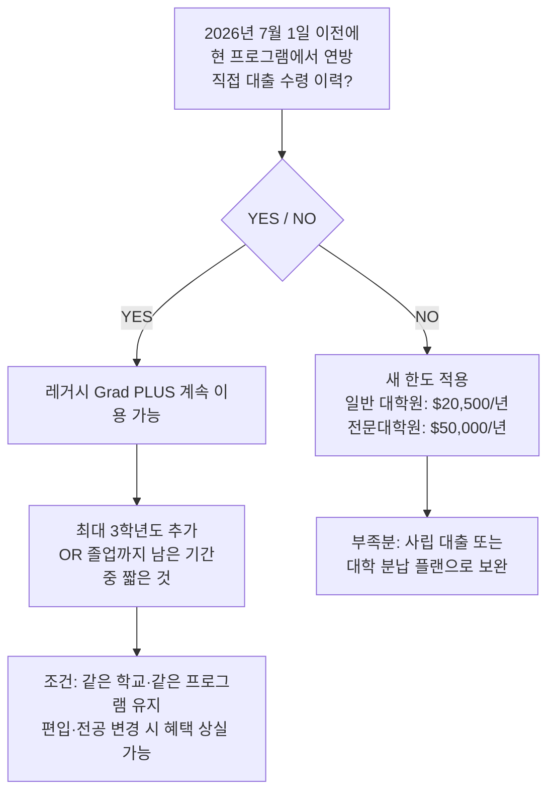

# 7월 1일부터 바뀐 연방 학자금 — Grad PLUS 폐지·Parent PLUS 한도·SAVE 종료: 한인 대학생 가정 긴급 점검

2026년 7월 1일, 원 빅 뷰티풀 빌(One Big Beautiful Bill Act, OBBBA)이 시행되면서 미국 연방 학자금 대출 제도가 수십 년 만에 가장 큰 폭으로 바뀌었습니다. **Grad PLUS 폐지, Parent PLUS 한도 신설, SAVE·PAYE·ICR 신규 등록 종료, 그리고 새 상환 플랜 RAP 출시**가 모두 이날 동시에 발효됐습니다.

자녀를 미국 대학·대학원에 보내거나 본인이 대학원에 다니는 한인 가정에게는 지금 당장 행동이 필요한 사안이 있습니다. 변경 내용과 실천 체크리스트를 정리합니다.

> **면책 공지:** 이 글은 일반 정보 안내이며 개별 법률·재무·세무 자문이 아닙니다. 학자금 대출 조건은 개인 상황과 학교, 대출 개시 시점에 따라 달라집니다. 중요한 결정 전에 학교 재정지원실 및 공인 학자금 전문가와 상담하세요.

---

## 핵심 요약

| 변경 항목 | 이전 | 2026년 7월 1일 이후 |
|----------|------|---------------------|
| Grad PLUS | 신용 조건만 충족하면 무제한 | **신규 대출자 폐지** (레거시 조항 있음) |
| 대학원 연간 한도 | Grad PLUS로 사실상 무제한 | **$20,500/년 (일반 대학원), $50,000/년 (전문대학원)** |
| 대학원 평생 한도 | Grad PLUS로 사실상 무제한 | **$100,000 (일반), $200,000 (전문대학원)** |
| Parent PLUS | 한도 없음 | **연 $20,000·평생 $65,000 (자녀 1인당)** |
| SAVE/PAYE/ICR | 신규 가입 가능 | **신규 등록 종료 (2028년 7월 완전 종료)** |
| 소득 기반 상환 | SAVE, PAYE, IBR, ICR | **RAP 출시 (2026년 7월 1일~)** |

---

## 1. Grad PLUS 폐지: 대학원생·전문대학원생에게 무슨 일이?

**Grad PLUS**는 석·박사 과정 학생이 신용 조건만 충족하면 등록금 전액까지 빌릴 수 있었던 연방 대출 프로그램입니다. OBBBA는 이를 **2026년 7월 1일 이후 신규 대출자에게 폐지**했습니다.

대신 연방 직접 대출(Direct Unsubsidized Loan) 한도를 아래와 같이 상향했습니다.

| 구분 | 연간 한도 | 평생 한도 |
|------|----------|----------|
| 일반 대학원 (석·박사) | $20,500 | $100,000 |
| 전문대학원 (의·치·법학 등) | $50,000 | $200,000 |

이전 Grad PLUS를 대체하는 프로그램이지만, **과거 Grad PLUS처럼 등록금 전액을 커버하지는 못합니다.** 실제 주요 대학원 등록금과 새 한도의 격차는 상당합니다.

| 전공·대학원 유형 | 연간 등록금 추정 | 새 연방 한도 | 연간 부족분 |
|----------------|--------------|------------|-----------|
| 일반 대학원 (주요 사립, 석·박사) | $30,000~$60,000 | $20,500 | $10,000~$40,000 |
| MBA (상위 경영대학원) | $60,000~$80,000 | $50,000 | $10,000~$30,000 |
| 의과대학원 (MD) | $55,000~$70,000 | $50,000 | $5,000~$20,000 |
| 법과대학원 (JD) | $55,000~$75,000 | $50,000 | $5,000~$25,000 |

전문대학원($50,000/년 한도)은 의대·법대 등록금과 상당 부분 겹치지만, 생활비·교재비를 합산하면 연방 대출만으로는 부족한 경우가 많습니다. 일반 대학원($20,500/년)은 상위 사립대 학비의 절반에도 못 미치는 경우가 있어, 신입 대학원생은 지금 당장 부족분 조달 계획을 세워야 합니다.

### 레거시 조항: 재학 중이라면 지금 바로 확인

이미 같은 학교·같은 프로그램에서 **2026년 7월 1일 이전에 연방 직접 대출을 한 번이라도 받은 경우** 레거시 조항이 적용됩니다.



**지금 해야 할 일:** 학교 재정지원실에 "Am I eligible for the Grad PLUS legacy provision under OBBBA?" 라고 확인 이메일을 보내세요. 특히 2026년 가을 학기 등록을 앞둔 분들이라면 시급합니다.

---

## 2. Parent PLUS: 연 $20,000·평생 $65,000 한도 신설

자녀 학비를 대신 빌려주는 **Parent PLUS**도 처음으로 법적 한도가 생겼습니다.

- **연간 한도:** 자녀 1인당 **$20,000**
- **평생 한도:** 자녀 1인당 **$65,000**

미국 사립대 등록금이 연 $60,000~$80,000에 이르는 현실에서 연 $20,000 한도는 상당한 제약입니다. 자녀가 둘 이상이라면 부모 입장에서 총 학비 부담 계산을 새로 해야 합니다.

**보완 방법:**
1. 자녀가 직접 받는 연방 Stafford 대출(학부 최대 $12,500/년)
2. 대학의 자체 분납 플랜(Interest-free payment plan)
3. 사립 학자금 대출(이자율·조건 비교 필수)
4. 529 계좌 활용 (미리 준비됐다면)

---

## 3. SAVE 종료와 새 RAP 출시

### SAVE·PAYE·ICR 신규 등록 종료

2026년 7월 1일부터 **SAVE, PAYE(Pay As You Earn), ICR(Income-Contingent Repayment)** 세 플랜은 신규 가입이 막혔습니다. 기존 가입자는 **2028년 7월 1일까지** 유지할 수 있습니다.

참고로 SAVE는 2026년 3월 초 제8연방항소법원(8th Circuit)의 최종 판결로 이미 실질적으로 효력을 잃었고, 정부는 해당 가입자들에게 전환 안내를 진행 중입니다.

### 새 RAP(Repayment Assistance Plan) — 2026년 7월 1일 출시

OBBBA는 SAVE를 대체하는 새 소득 기반 상환 플랜 **RAP**를 도입했습니다.

| RAP 주요 조건 | 내용 |
|--------------|------|
| 월 납부액 기준 | AGI의 1%~10% (소득 구간에 따라 단계적 증가) |
| 최소 납부액 | AGI $10,000 이하 → 월 **$10** |
| 부양가족 공제 | 부양가족 1인당 월 **$50** 차감 (최소 $10 유지) |
| 마이너스 상각 방지 | 납부액이 이자를 못 따라잡아도 정부가 차액 보전 (원금 침식 없음) |
| 대출 면제 기준 | **360회 적격 납부 (30년)** 후 잔액 면제 |
| PSLF 적격 여부 | **인정됨** |

**RAP 납부액 계산 예시 (단순 추산)**

| 연 소득(AGI) | 적용 비율 | 연간 납부 | 월 납부 |
|------------|---------|---------|--------|
| $40,000 | ~4% | ~$1,600 | ~$133 |
| $70,000 | ~7% | ~$4,900 | ~$408 |
| $100,000 | ~10% | ~$10,000 | ~$833 |

> **주의:** 위 비율은 해당 소득 구간 전체 AGI에 일괄 적용되는 단일 세율(누진 한계세율 방식이 아님)입니다. 실제 납부액은 부양가족 수, 대출 잔액, 적용 구간 계산 방식에 따라 달라집니다. 공식 계산은 StudentAid.gov의 대출 시뮬레이터를 활용하세요.

---

## 4. PSLF(공공서비스 대출 면제)에 미치는 영향

PSLF는 폐지되지 **않았습니다.** 정부기관·비영리단체 등에서 10년(120회 납부) 일하면 대출이 면제되는 프로그램은 계속 유효합니다. 다만 다음 두 가지가 달라졌습니다.

### 변경 1: 자격 고용주(employer) 규정 개정 (2026년 7월 1일~)

2025년 10월 공포되고 2026년 7월 1일 시행된 교육부 별도 규정(OBBBA 직접 조항이 아닌 34 CFR 685.219 개정)에 따라, 연방·주 법을 위반하는 실질적 불법 목적의 고용주가 PSLF 자격에서 제외됩니다. **병원, 법률구조단체, 공립학교, 501(c)(3) 비영리 단체 대부분은 영향이 없습니다.** 그러나 고용주 상황이 불확실하다면 StudentAid.gov의 **PSLF 고용주 검색 도구(Employer Search Tool)**에서 재확인하세요.

### 변경 2: 신규 대출 규모에 따라 표준 상환 기간이 늘어날 수 있음

OBBBA 하에서 신규 대출 잔액이 클수록 표준 상환 기간이 10년 이상으로 늘어납니다. **10년을 초과하는 표준 플랜 납부는 PSLF 적격 횟수로 인정받지 못합니다.** 따라서 2026년 7월 1일 이후 대출을 받고 나중에 PSLF를 목표로 한다면, **RAP를 선택하는 것이 가장 안전한 경로**입니다. 정확한 계산은 StudentAid.gov 공식 시뮬레이터를 이용하세요.

---

## 한인 가정 맞춤 체크리스트

```
[ 대학원 재학 중 ]
☐ 재정지원실에 레거시 Grad PLUS 자격 확인 이메일 발송
☐ 2026-27 학년도 대출 패키지가 새 한도 기준으로 바뀌었는지 확인
☐ 부족 학비 보완 방법(사립 대출·분납 플랜) 비교 검토
☐ PSLF 진행 중이라면 → 고용주 재적격 확인, RAP 전환 필요성 검토

[ 자녀 학비를 Parent PLUS로 지원 중 ]
☐ 2026-27년 Parent PLUS 한도 $20,000 내로 사용 가능한지 확인
☐ 부족 금액 대안(자녀 Stafford, 사립 대출, 529) 마련
☐ 기존 Parent PLUS 대출 상환 플랜 점검 (RAP or 표준)

[ 현재 SAVE·PAYE·ICR 상환 중 ]
☐ 학교·서비스사(servicer)로부터 전환 안내 공문 확인
☐ 2028년 7월 완전 종료 전에 RAP 또는 표준 상환 전환 계획 수립
☐ StudentAid.gov 대출 시뮬레이터로 RAP 납부액 시뮬레이션

[ 2026년 하반기 대학원 진학 예정 ]
☐ 목표 학교·프로그램의 연간 등록금 vs 새 대출 한도 격차 계산
☐ 사립 학자금 대출 사전 비교 (Credible, NerdWallet 등 비교 도구 활용)
☐ 졸업 후 PSLF 진로 고려한다면 → RAP 선택이 유리한지 시뮬레이션
```

---

## 지금 행동해야 하는 이유

이번 변경은 **이미 시행 중**입니다. 2026년 가을 학기 등록을 앞두고 Grad PLUS가 없어진 상태에서 대출 계획을 세우지 않은 대학원생, 자녀 등록금을 Parent PLUS에 전적으로 의존해 온 한인 부모, 그리고 SAVE 플랜 아래 상환하고 있는 대출자 모두 지금 당장 상황을 점검해야 합니다.

StudentAid.gov는 현재 대출 잔액, 상환 플랜, 상환 이력을 한눈에 볼 수 있는 공식 포털입니다. 모든 연방 대출 정보를 가장 먼저 확인할 곳입니다.

---

## 출처 (Sources)

- [Federal Student Aid — One Big Beautiful Bill Act Updates (studentaid.gov)](https://studentaid.gov/announcements-events/big-updates)
- [FSA Partners (ed.gov) — OBBBA NSLDS Professional Access Updates, July 2026](https://fsapartners.ed.gov/knowledge-center/library/electronic-announcements/2026-07-01/one-big-beautiful-bill-act-nslds-professional-access-updates-july-2026)
- [U.S. Department of Education — Fact Sheet: Simplifying Student Loan Repayment](https://www.ed.gov/about/news/press-release/fact-sheet-trump-administration-simplifying-student-loan-repayment)
- [Congressional Research Service (congress.gov) — Repayment Assistance Plan (RAP) in P.L. 119-21](https://www.congress.gov/crs-product/IF13075)
- [NerdWallet — What Is the New Repayment Assistance Plan (RAP)?](https://www.nerdwallet.com/student-loans/learn/what-is-the-new-repayment-assistance-plan-rap-for-student-loans)
- [SoFi — Repayment Assistance Plan Explained](https://www.sofi.com/learn/content/repayment-assistance-plan-explained/)
- [Britannica Money — Trump Student Loan Plan: How OBBBA Affects Loan Forgiveness](https://www.britannica.com/money/trump-student-loan-plan-obbba)
- [SavingForCollege.com — Grad PLUS Loans Ending in 2026: New Borrowing Rules + Limits](https://www.savingforcollege.com/article/grad-plus-loan-changes-2026)
- [PHEAA — One Big Beautiful Bill Act: Paying Back Your Loans](https://www.pheaa.org/tools-resources/how-obbba-impacts-student-loans/repayment-and-forgiveness)
- [TATE ESQ — PSLF Changes in 2026](https://www.tateesq.com/learn/pslf-changes-2026)
