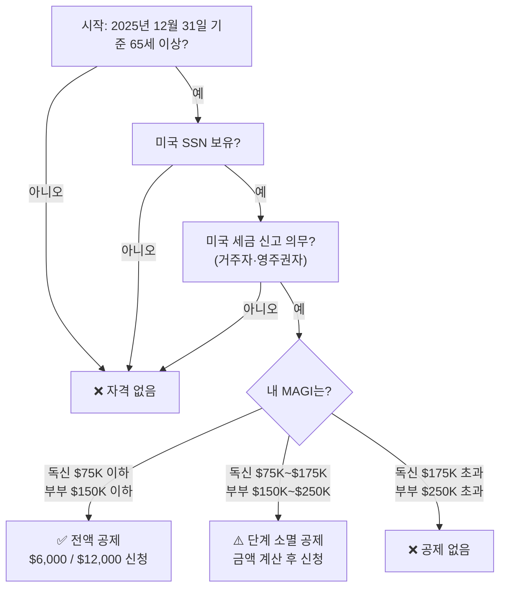

미국 정부가 65세 이상 시니어에게 연방 소득세를 줄여주는 새 공제를 도입했습니다. 2025년 7월 4일 서명된 **원 빅 뷰티풀 빌(One Big Beautiful Bill Act, Public Law 119-21)**의 핵심 조항으로, 자격이 되는 시니어는 과세 소득에서 최대 **$6,000**(부부는 **$12,000**)를 추가로 공제받을 수 있습니다. 한인 시니어 중 이 사실을 아직 모르는 분이 많습니다. 지금이 바로 확인할 때입니다.

## 핵심 요약

- **공제 금액:** 1인당 $6,000, 부부 둘 다 65세 이상이면 $12,000
- **적용 연도:** 2025·2026·2027·2028 과세연도(세금 신고 시 청구)
- **자격 기준:** 해당 세금 연도 말 기준 65세 이상 + SSN 보유
- **소득 제한:** 조정총소득(MAGI) 독신 $75,000 이하, 부부 합산 $150,000 이하면 전액 공제
- **항목 공제 불필요:** 표준 공제를 선택해도 추가로 받을 수 있는 공제

---

## 1. 시니어 추가 공제란 무엇인가

원 빅 뷰티풀 빌 이전에도 65세 이상 납세자는 표준 공제에 더해 소액의 추가 공제를 받았습니다(2025년 기준: 독신 $2,000, 부부 1인당 $1,600). 새 법은 여기에 **별도의 시니어 보너스 공제**를 추가합니다.

이 공제의 가장 중요한 특징은 **항목별 공제(itemize)를 하지 않아도** 적용된다는 점입니다. 표준 공제를 선택하는 대부분의 한인 시니어도 해당 금액만큼 과세 소득을 추가로 낮출 수 있습니다.

---

## 2. 자격 요건과 공제 금액 비교

| 구분 | 독신 / 부부 한 명만 65세 이상 | 부부 둘 다 65세 이상 |
|---|---|---|
| 기본 공제액 | $6,000 | $12,000 |
| 소득 상한(전액) | MAGI $75,000 이하 | MAGI $150,000 이하 |
| 단계 소멸 시작 | $75,001~ | $150,001~ |
| 공제 완전 소멸 | MAGI $175,000 초과 | MAGI $250,000 초과 |

**SSN 필수:** 공제를 청구하려면 세금 신고서에 해당 시니어의 유효한 SSN을 반드시 기입해야 합니다.

---

## 3. 소득별 실제 공제액 — 내 경우는?

MAGI가 기준을 초과하면 $1,000 초과할 때마다 공제가 6%(=약 $60)씩 줄어듭니다.

### 독신 시니어 기준

| 연간 MAGI | 공제 가능액 | 절감 세액(세율 22% 가정) |
|---|---|---|
| $75,000 이하 | $6,000 (전액) | 약 $1,320 절감 |
| $100,000 | $4,500 | 약 $990 절감 |
| $125,000 | $3,000 | 약 $660 절감 |
| $150,000 | $1,500 | 약 $330 절감 |
| $175,000 이상 | $0 (소멸) | — |

### 부부 기준 (둘 다 65세 이상)

| 연간 MAGI | 공제 가능액 | 절감 세액(세율 22% 가정) |
|---|---|---|
| $150,000 이하 | $12,000 (전액) | 약 $2,640 절감 |
| $175,000 | $9,000 | 약 $1,980 절감 |
| $200,000 | $6,000 | 약 $1,320 절감 |
| $225,000 | $3,000 | 약 $660 절감 |
| $250,000 이상 | $0 (소멸) | — |

> 실제 절감액은 개인 세율에 따라 달라집니다. CPA나 세무사와 함께 확인하세요.

---

## 4. 내가 자격이 되는지 확인하는 흐름도

---

## 5. 2026 소셜시큐리티 COLA 2.8%, 메디케어가 반을 가져간다

이 공제 소식과 함께 한인 시니어가 꼭 알아야 할 또 다른 변화가 있습니다. 2026년 소셜시큐리티 급여 인상 내용과, 메디케어 보험료 인상으로 실수령액이 어떻게 바뀌는지입니다.

| 항목 | 2025년 | 2026년 | 변동 |
|---|---|---|---|
| SS COLA 인상률 | 2.5% | **2.8%** | +0.3%p |
| 평균 SS 월 급여 | 약 $2,015 | 약 **$2,071** | +$56/월 |
| 메디케어 파트B 월 보험료 | $185.00 | **$202.90** | **+$17.90** |
| 파트B 연간 공제액(deductible) | $257 | **$283** | +$26 |

**결론:** 2026년 SS가 월 $56 올랐지만, 파트B 보험료도 $17.90 올라 **실제 손에 쥐는 금액 증가는 약 $38** 수준입니다. 소득이 낮은 시니어(월 SS $640 이하)는 '해롭지 않음 규정(hold harmless provision)'이 적용돼 SS 인상폭을 초과해 파트B를 내지 않습니다. 단, 이 규정은 SS를 받는 분들에게만 적용됩니다.

---

## 6. 한인 시니어에게 미치는 실질적 영향 시나리오

### 시나리오 A: 소셜시큐리티와 IRA 인출이 주 소득인 부부
- 부부 모두 68세, MAGI $120,000(SS + IRA 인출)
- 부부 둘 다 65세 이상 → $12,000 공제 전액 적용
- 22% 세율 가정 시 **약 $2,640 절감**
- 2026년 세금 신고 때 반드시 청구할 것

### 시나리오 B: 파트타임 소득이 있는 독신 시니어
- 65세, 파트타임 + SS로 MAGI $95,000
- 초과 $20,000 × 6% = $1,200 감소 → 공제 가능액 $4,800
- 22% 세율 기준 **약 $1,056 절감**

### 시나리오 C: 자녀와 함께 거주하며 임대 수입 있는 시니어
- 67세, 임대 + SS + 배당으로 MAGI $60,000
- 독신 $75,000 이하 → **$6,000 전액 공제**
- 22% 세율 기준 **약 $1,320 절감**

---

## 7. MAGI를 낮춰 더 많은 공제 받는 전략

시니어 공제의 핵심은 MAGI입니다. 소득이 기준을 조금 넘는다면 MAGI를 합법적으로 줄이는 방법을 고려해 볼 수 있습니다.

### QCD (Qualified Charitable Distribution, 적격 자선 배분)
- 만 70½세 이상이면 IRA에서 직접 자선단체에 최대 **$105,000+(매년 물가 연동 조정)**까지 이체 가능
- QCD는 과세 소득에 포함되지 않아 MAGI를 낮추는 직접적 효과
- 한인 교회·단체에 헌금이나 기부를 계획 중이라면 IRA QCD를 활용하면 세금과 기부를 동시에

### Roth 전환 타이밍
- 소득이 많은 해에 Roth 전환을 늘리면 MAGI가 올라가 시니어 공제가 줄어들 수 있음
- 반대로 소득이 낮은 해(예: 은퇴 첫해, RMD 시작 전)에 Roth 전환을 집중하면 시니어 공제를 온전히 받으면서 절세 가능
- CPA와 함께 연도별 MAGI 시뮬레이션을 돌려 최적 전환 시점을 설계하세요

### IRMAA(소득 연동 메디케어 보험료) 주의
- MAGI가 일정 기준(독신 $106,000, 부부 $212,000 초과)을 넘으면 메디케어 파트B·D 보험료에 소득 연동 추가 부담금(IRMAA)이 붙습니다
- 2026년 기준: 독신 $106,001~$133,000이면 파트B 월 보험료가 $202.90 대신 **$284.10**으로 올라갑니다
- RMD를 계획 없이 받으면 IRMAA 구간에 걸려 메디케어 비용이 급증할 수 있으니 2년 전 소득이 기준이 됨을 기억하세요

### 기존 시니어 추가 공제(새 법 이전)와의 합산
- 2025년 이전에도 65세 이상 납세자는 일반 표준 공제에 더해 추가 공제를 받았습니다 (독신 $2,000, 부부 1인당 $1,600, IRS Publication 501 기준)
- 원 빅 뷰티풀 빌의 $6,000 공제는 이 기존 공제와 **별도로** 추가 적용됩니다
- 즉 독신 기준: 표준 공제($15,000) + 기존 시니어 공제($2,000) + 새 시니어 공제($6,000) = 최대 **$23,000** 공제 가능

---

## 8. 지금 해야 할 체크리스트

- [ ] 본인 및 배우자 나이 확인(2025·2026년 말 기준 65세 이상인지)
- [ ] MAGI 추정: 소셜시큐리티 + IRA·401(k) 인출 + 임대소득 + 배당 + 파트타임 급여 합산
- [ ] MAGI가 $75,000(독신) 또는 $150,000(부부) 이하인지 확인 → 전액 공제 가능
- [ ] MAGI가 기준 초과라면: QCD·Roth 전환 시기 조정으로 내년 MAGI 절감 검토
- [ ] IRMAA 구간(독신 $106,000 초과) 여부 확인 — 메디케어 보험료 추가 부담 방지
- [ ] 2025년 세금 신고 연장한 경우: 10월 15일 마감 전 시니어 공제 포함 여부 확인
- [ ] 이미 제출한 2025년 세금 신고에 시니어 공제를 누락했다면 Form 1040-X로 수정 신고
- [ ] 2026년 메디케어 파트B 보험료 인상($202.90/월) 월별 예산에 반영
- [ ] 세무사·CPA에게 시니어 공제 + QCD + Roth 전환 + RMD 조합 전략 상담

---

## 자주 묻는 질문 (FAQ)

**Q1. 원 빅 뷰티풀 빌 시니어 공제는 소셜시큐리티 세금을 없애주나요?**
A. 아닙니다. 시니어 공제는 과세 소득을 최대 $6,000 줄여주는 추가 공제이지, 소셜시큐리티 급여 자체의 세금을 직접 면제하는 것은 아닙니다. 다만 공제 후 낮아진 과세 소득 덕분에 소셜시큐리티 세금도 간접적으로 줄 수 있습니다.

**Q2. 소셜시큐리티를 받지 않아도 시니어 공제를 신청할 수 있나요?**
A. 네. 65세 이상이고 SSN을 보유한 납세자라면 소셜시큐리티 수령 여부와 관계없이 신청 가능합니다. IRA·401(k) 인출, 연금, 임대 수입 등 다른 소득이 있어도 됩니다.

**Q3. 그린카드 보유자(영주권자)도 해당되나요?**
A. 네. 미국 거주자로서 세금 신고 의무가 있고 SSN을 보유한 영주권자도 자격이 됩니다. 비거주 외국인(nonresident alien)은 대상 외입니다.

**Q4. 2025년 세금 신고를 연장했는데 이 공제를 받을 수 있나요?**
A. 네. 2025년 세금 신고 마감이 연장된 경우(최대 2026년 10월 15일까지) 시니어 공제를 포함해 신고하면 됩니다. 공제는 2025~2028 과세연도 모두 적용됩니다.

---

## 마무리

원 빅 뷰티풀 빌 시니어 공제는 2025~2028년 한시 혜택입니다. 자격이 되는데 청구하지 않으면 그냥 날리는 돈입니다. 특히 소득이 $75,000(독신) 또는 $150,000(부부 합산) 이하인 한인 시니어라면 전액 $6,000~$12,000 공제를 반드시 챙기십시오.

2025년 세금 신고를 이미 완료했는데 이 공제를 빠뜨렸다면, 수정 신고서(Form 1040-X)를 제출해 환급받을 수 있습니다.

**세무사·CPA 상담 시 꼭 물어볼 것:** "원 빅 뷰티풀 빌 시니어 추가 공제(Enhanced Deduction for Seniors) 신청을 세금 신고에 반영했나요?"

---

## 출처(Sources)

- [IRS — One Big Beautiful Bill Act: Tax Deductions for Working Americans and Seniors](https://www.irs.gov/newsroom/one-big-beautiful-bill-act-tax-deductions-for-working-americans-and-seniors)
- [IRS — Check Your Eligibility for the New Enhanced Deduction for Seniors](https://www.irs.gov/newsroom/check-your-eligibility-for-the-new-enhanced-deduction-for-seniors)
- [IRS — Publication 501: Dependents, Standard Deduction, and Filing Information (기존 시니어 추가 공제)](https://www.irs.gov/publications/p501)
- [SSA — 2026 Cost-of-Living Adjustment (COLA) Fact Sheet](https://www.ssa.gov/news/en/cola/factsheets/2026.html)
- [CMS — 2026 Medicare Parts A & B Premiums and Deductibles (공식 팩트시트)](https://www.cms.gov/newsroom/fact-sheets/2026-medicare-parts-b-premiums-deductibles)
- [Kiplinger — How the Senior Bonus Deduction Works](https://www.kiplinger.com/taxes/how-the-senior-bonus-deduction-works)
- [CNBC — New $6,000 Senior Tax Deduction: Who Qualifies](https://www.cnbc.com/select/new-6k-tax-deduction-for-seniors/)
- [Charles Schwab — 4 Questions About the $6,000 Senior Tax Deduction](https://www.schwab.com/learn/story/questions-about-bonus-senior-tax-deduction)
