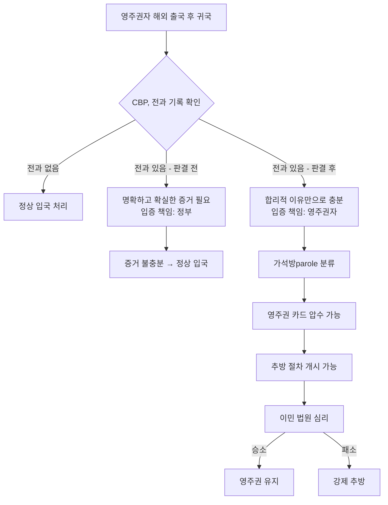

# 대법원 판결 Blanche v. Lau — 영주권자 해외 출국 전 반드시 알아야 할 재입국 위험

2026년 6월 23일, 미국 연방대법원이 **Blanche v. Muk Choi Lau(사건번호 25-429)** 판결에서 6대 3으로 정부 손을 들어줬습니다. *(사건명의 "Blanche"는 토드 블란체(Todd Blanche) 법무장관 대행을 가리킵니다. 이 사건은 처음에 팸 본디(Pam Bondi) 법무장관 시절 **Bondi v. Lau**로 제기되었다가, 블란체가 장관직을 이어받은 후 현재 이름으로 변경되었습니다.)* 이 판결로 **입국심사관(CBP)이 전과 기록이 있는 영주권자(LPR)를 재입국 신청자로 분류하는 데 필요한 증거 기준이 대폭 낮아졌습니다.** 미주 한인 이민 사회에서 가장 긴급하게 공유해야 할 이민 관련 소식입니다.

## 핵심 요약

- **판결일**: 2026년 6월 23일
- **판결 결과**: 6대 3, 정부 승소 (다수 의견: 클래런스 토머스 대법관)
- **변경 전 기준**: 입국 거부 시 "명확하고 확실한 증거(clear and convincing evidence)" 필요
- **변경 후 기준**: "합리적 이유(reason to believe)"만으로 충분 — 기소나 유죄 판결 불필요
- **핵심 위험**: 전과 기록(체포·기소·기각·유죄 모두)이 있는 영주권자는 해외 출국 후 재입국 시 입국 거부·추방 절차 개시 위험 상승
- **즉시 효력**: 판결 이후 CBP는 별도 정책 메모 없이 바로 적용 가능

---

## 1. 이 사건은 어디서 시작됐나

Muk Choi Lau는 2007년 영주권을 취득한 중국계 미국 영주권자입니다. 2012년 약 30만 달러 상당의 위조품 판매 혐의로 체포됐으나, 혐의가 계류 중인 상태에서 중국을 단기 방문했습니다. 귀국 당시 공항 입국심사관은 계류 중인 혐의를 확인하고, Lau를 정식 입국(admission) 처리하는 대신 **가석방(parole)** 상태로 입국시키고 영주권 카드를 압수했습니다.

이후 이민 항소위원회(BIA)는 Lau가 "입국 신청자" 신분이기 때문에 추방이 가능하다고 결정했고, **제2순회항소법원(Second Circuit, Lau v. Bondi, No. 21-6623, 2d Cir. 2025)**은 이 결정을 뒤집어 "명확하고 확실한 증거" 기준이 필요하다고 판결했습니다. 대법원이 이 항소법원 판결을 다시 뒤집은 것입니다.

### 대법원까지 오기까지의 절차적 경과

사건은 십 년 이상에 걸친 복잡한 법적 여정을 거쳤습니다. 이민 법원과 BIA에서 Lau가 패소한 뒤, 제2순회항소법원은 2025년 정부 측에 더 높은 증거 기준을 요구하며 파기환송했습니다. 정부는 연방대법원에 상고(certiorari)를 신청했고, 대법원은 이 사건을 받아들여 2025-26 개정기에 심리했습니다. 사건은 처음 **Bondi v. Lau**로 접수되었다가, 팸 본디 법무장관이 물러나고 토드 블란체(Todd Blanche) 법무장관 대행이 취임하면서 **Blanche v. Lau**로 이름이 바뀌었습니다. 2026년 6월 23일 최종 6대 3 판결이 나왔습니다.

---

## 2. 법적 변화: 무엇이 달라졌나

이 판결의 핵심은 **이민국적법(INA) §101(a)(13)(C)(v)** 조항 해석입니다.

INA는 일반적으로 해외에서 돌아오는 영주권자를 "이미 입국한 자"로 간주합니다. 그러나 여섯 가지 예외 상황에서는 "입국 신청자"로 재분류할 수 있는데, 그중 하나가 **INA §1182(a)(2)에 해당하는 범죄(도덕적 비행 범죄·마약 관련 범죄 등)를 저질렀다고 볼 수 있는 경우**입니다.

```
[판결 전] 
CBP가 LPR을 "입국 신청자"로 분류하려면
→ 범죄 혐의에 대한 "명확하고 확실한 증거" 필요
→ 기각된 혐의 또는 체포만으로는 부족
→ 입증 책임: 정부 측

[판결 후]
CBP가 LPR을 "입국 신청자"로 분류하려면
→ "합리적 이유(reason to believe)"만으로 충분
→ 유죄 판결이 아닌 "혐의 행위(commission)" 수준으로 충분
→ 재입국 시 입증 책임: 영주권자 본인 (추방 심리에서는 정부가 범죄 성립 입증 필요)
```

### 판결 전후 비교표

| 구분 | 판결 전 | 판결 후 |
|------|---------|---------|
| 필요 증거 기준 | 명확하고 확실한 증거 | 합리적 이유 |
| 유죄 판결 필요 여부 | 필요 | 불필요 |
| 체포·기소만으로 분류 가능 | 불가 | 가능 |
| 재입국 시 입증 책임 | 정부 | 영주권자 본인 (단, 추방 심리에서는 정부가 범죄 성립 입증 필요) |
| 영주권 카드 압수 | 예외적 | 더욱 용이 |
| 추방 절차 개시 위험 | 낮음 | 상승 |

---

## 3. 재입국 위험 흐름도



---

## 4. 한인 영주권자에게 미치는 실질적 영향

### 어떤 경우가 위험한가

**도덕적 비행 범죄(Crime Involving Moral Turpitude, CIMT)**와 **마약 관련 범죄**가 주요 대상입니다. CIMT의 범위는 매우 넓습니다.

- 사기, 절도, 위조
- 폭행(의도가 수반된 경우)
- 음주운전(DUI) — 일부 주에서 CIMT 해당
- 무기 관련 범죄

**중요**: "기각됐다", "아주 오래됐다", "벌금만 냈다"고 해서 안전하지 않습니다. 판결은 **유죄 판결이 아닌 혐의 행위(commission) 자체**로 충분하다고 했기 때문입니다.

### 실제 공항에서 벌어질 수 있는 일

1. CBP 입국심사관이 데이터베이스에서 전과 기록 확인
2. "합리적 이유" 판단 → 입국 신청자로 재분류
3. 영주권 카드(I-551) 압수, 임시 I-94 스탬프 발급
4. 추방 절차(removal proceedings) 개시
5. 이민 법원 심리까지 수개월~수년 소요

이 과정에서 고용주에게 증명할 체류 서류가 없어 직장을 잃거나, 은행 계좌 갱신·자녀 학교 등록·의료 보험 등에 차질이 생길 수 있습니다.

### 구체적 시나리오: 한인 영주권자 김씨의 경우

2015년 음주운전(DUI) 전과가 있는 한인 영주권자 김씨(40대, IT 직종)가 2026년 여름 부모님 칠순 잔치에 참석하기 위해 한국을 방문한다고 가정합시다. 귀국 시 인천발 항공편으로 인천공항→인천→LAX에 도착하면, CBP 입국심사관은 NCIC(국가범죄정보센터) 데이터베이스에서 DUI 기록을 확인합니다. 판결 이전이라면 단순 DUI 하나만으로는 "명확하고 확실한 증거" 기준을 충족하기 어려웠습니다. 그러나 판결 이후에는 "합리적 이유"만으로 충분하므로, 심사관이 해당 주의 DUI가 CIMT에 해당하는지 판단하고 필요하면 Lau를 가석방 상태로 분류할 수 있습니다. 영주권 카드가 압수되면 김씨는 체류 서류 없이 직장으로 돌아가야 하며, 이민 법원 심리가 시작될 수 있습니다. **사전에 이민 변호사와 위험 수준을 확인했다면 예방할 수 있었던 상황입니다.**

---

## 5. 추방 심리에서 실제로 벌어지는 일

"입국 신청자"로 재분류된 영주권자가 추방 심리(removal hearing)에 서게 되면, 절차는 다음과 같이 진행됩니다.

1. **이민 법원 출두**: 공항에서 가석방 처리된 후 일정 기간 내 이민 법원에 출두해야 합니다. 이 기간 동안 임시 I-94 스탬프가 유일한 체류 증명입니다.
2. **정부의 입증 책임**: 추방 심리 단계에서는 정부가 해당 범죄가 INA §1182(a)(2)에 열거된 범죄(CIMT, 마약 등)에 실제로 해당함을 입증해야 합니다. 즉, 공항에서의 "합리적 이유" 기준과 달리, 법원에서는 정부가 추방 사유를 구체적으로 증명해야 합니다.
3. **영주권자의 방어권**: 영주권자는 변호사를 선임하고, 증거를 제출하며, 증인을 신청할 권리가 있습니다. 전과 기록이 CIMT에 해당하지 않는다고 주장하거나, 소규모 예외(petty offense exception) 적용을 주장할 수 있습니다.
4. **절차 기간**: 이민 법원 적체 현상으로 심리까지 수개월에서 수 년이 걸릴 수 있습니다. 이 기간 동안 영주권 카드 없이 생활해야 하는 현실적 어려움이 발생합니다.
5. **항소**: 이민 법원에서 패소 시 BIA, 연방항소법원 순으로 항소할 수 있습니다.

핵심은 **공항 문에서의 기준(합리적 이유)과 법정에서의 기준(정부의 범죄 성립 입증)이 다르다**는 점입니다. 그러나 공항에서 이미 가석방으로 분류되어 영주권 카드가 압수된 후라면, 법정 다툼을 이기더라도 그 과정에서 치르는 시간적·경제적·정신적 비용은 막대합니다.

---

## 6. 반대 의견 — 잭슨 대법관의 경고

케탄지 브라운 잭슨(Ketanji Brown Jackson) 대법관은 소토마요르(Sotomayor), 케이건(Kagan) 대법관과 함께 반대 의견을 냈습니다.

잭슨 대법관은 판결문에서 이렇게 경고했습니다:

> "정부에게 거대한 백지 수표를 건네준 셈이다."

반대 의견은 "영주권을 보유한다는 것은 법적 안전과 권리를 의미해야 하는데, 이번 판결은 영주권자를 이민법 유예 상태에 놓는 것"이라고 비판했습니다.

DHS 마크웨인 멀린(Markwayne Mullin) 장관은 2026년 6월 25일 성명을 통해 이 판결을 "여러 대법원 승리 중 하나"로 환영했습니다.

---

## 7. 지금 당장 해야 할 체크리스트

해외 여행을 계획 중이거나 전과 기록이 있는 한인 영주권자라면 지금 즉시 다음을 점검하십시오.

- [ ] **전과 기록 전체 파악**: 체포·기소·기각·유죄·벌금 납부 여부 포함, 미국 각 주(state) 전체 기록 조회
- [ ] **이민 변호사 상담**: 해외 여행 전 전과 기록이 CIMT나 마약 범죄에 해당하는지 이민 전문 변호사에게 확인
- [ ] **해외 여행 보류 검토**: 전과 기록이 있다면 변호사 검토 전 해외 출국을 자제
- [ ] **여권·서류 준비**: 만약의 경우를 대비해 영주권 카드 번호·여권 정보를 별도 사진으로 보관
- [ ] **비상 연락처 확보**: 공항에서 문제가 생기면 즉시 연락할 이민 변호사·한인 법률 지원 기관 번호 저장
- [ ] **영주권 갱신 여부 확인**: I-551 만료일을 점검하고, 추방 절차와 별개로 I-90(영주권 갱신) 처리 상태 확인

---

## 8. 한국 방문·가족 행사를 앞둔 분들을 위한 안내

여름 방학과 추석(2026년 10월), 한국 가족 방문을 계획하는 한인 영주권자가 많습니다. 특히 다음 상황이라면 반드시 출국 전 변호사 상담을 받으십시오.

- **미해결 법적 분쟁이나 체포 기록**: 미국 내외를 불문하고 데이터베이스에 기록된 경우 CBP 조회 시 확인될 수 있음
- **주류·교통 위반 전력**: 일부 주에서 CIMT에 해당
- **수년 전 체포 후 기각된 혐의**: 기각됐더라도 데이터베이스에 기록이 남아 있을 수 있음
- **미국 내 민사·형사 소송 계류 중**: CBP가 조회 시 확인될 수 있음

---

## 마무리

Blanche v. Lau 판결은 영주권자가 미국에서 누려온 "이미 입국한 자"로서의 법적 보호를 실질적으로 약화시킵니다. 이제 공항 입국심사관은 더 낮은 기준으로 영주권자를 "입국 신청자"로 전환하고 추방 절차를 시작할 수 있습니다.

한인 커뮤니티에서 영주권을 소중히 여기고 한국을 자주 오가는 분들이라면, 이 판결의 영향을 과소평가하지 마십시오. **전과 기록이 있는 모든 한인 영주권자는 해외 여행 전 이민 전문 변호사 상담을 최우선으로 받으시기 바랍니다.**

> **면책 조항**: 이 글은 법률 자문이 아닙니다. 개별 사안에 따라 법적 영향이 크게 다를 수 있으므로, 이민 전문 변호사와 반드시 상담하십시오. 저소득 한인 가정은 한인타운의 무료·저비용 법률 지원 기관(예: Korean American Family Services, NAKASEC 제휴 단체)을 통해 초기 상담을 받을 수 있습니다.

---

## 출처 (Sources)

- [Supreme Court slip opinion — Blanche v. Lau, No. 25-429 (June 23, 2026)](https://www.supremecourt.gov/opinions/25pdf/25-429_h3ci.pdf)
- [SCOTUSblog — Court sides with government in dispute over rights of green card holders](https://www.scotusblog.com/2026/06/court-sides-with-government-in-dispute-over-rights-of-green-card-holders-accused-of-committing-a/)
- [SCOTUSblog — Case page: Blanche v. Lau](https://www.scotusblog.com/cases/bondi-v-lau/)
- [Newsweek — What Green Card Holders Need To Know](https://www.newsweek.com/what-green-card-holders-need-know-supreme-court-ruling-12114584)
- [Newsweek — Jackson dissent "blank check" warning](https://www.newsweek.com/jackson-dissent-supreme-court-green-card-ruling-blanche-12109622)
- [National Law Review — Supreme Court Clarifies When Returning Green Card Holders May Be Treated as Applicants for Admission](https://natlawreview.com/article/supreme-court-clarifies-when-returning-green-card-holders-may-be-treated-applicants)
- [American Immigration Council — Traveling Green Card Holders in Limbo](https://www.americanimmigrationcouncil.org/blog/supreme-court-green-card-holders-traveling-lau/)
- [FindLaw — Green Card Holders May Be Denied Reentry Without Clear and Convincing Evidence](https://www.findlaw.com/legalblogs/supreme-court/supreme-court-green-card-holders-may-be-denied-reentry-into-u-s-without-clear-and-convincing-evidence-of-a-crime/)
- [Envoy Global — Supreme Court Expands Border Authority Over Green Card Holders](https://www.envoyglobal.com/news-alert/supreme-court-expands-border-authority-over-green-card-holders-with-criminal-issues/)
- [DHS Statement Following Multiple Supreme Court Wins (June 25, 2026)](https://www.dhs.gov/news/2026/06/25/dhs-issues-statement-following-multiple-supreme-court-wins)
- [Democracy Now — "Blank Check" ruling summary](https://www.democracynow.org/2026/6/24/headlines/supreme_court_ruling_gives_us_blank_check_to_weaken_green_card_holders_rights)
- [Just Security — Blanche v. Lau analysis](https://www.justsecurity.org/143979/blanche-lau-supreme-court/)
- [Cyrus Mehta Immigration Blog — Blanche v. Lau: Degraded Rights of LPRs](https://blog.cyrusmehta.com/2026/06/blanche-v-lau-the-supreme-court-has-degraded-the-rights-of-lawful-permanent-residents.html)
- [VisaVerge — SCOTUS Green Card Reentry Ruling Explained](https://www.visaverge.com/news/supreme-court-ruling-lets-border-officers-treat-returning-green-card-holders-as-applicants-for-admission/)
