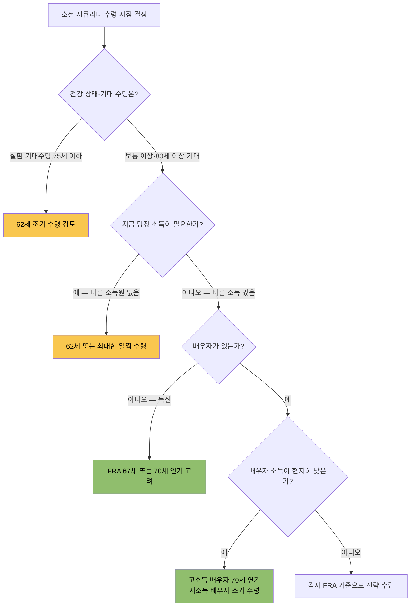

# 소셜 시큐리티 언제 받을까 — 62세·67세·70세 손익분기점과 한인 가정 최적 선택 가이드 2026

소셜 시큐리티(Social Security) 수령 시점 결정은 은퇴 계획에서 가장 큰 단일 금융 결정 중 하나입니다. 62세에 일찍 시작할지, 67세 정년(FRA)에 맞출지, 70세까지 기다릴지에 따라 평생 총수령액이 수십만 달러 차이날 수 있습니다. 특히 1960년 이후 출생자는 정년(FRA)이 67세로 확정되어 62세 조기 수령 시 감액 폭이 더 커졌습니다.

한인 가정은 한국 국민연금(NPS), 배우자 소득 구조, 한국 방문 빈도, 401k·임대 수익 등 복합적인 변수가 있습니다. 이 글에서는 2026년 기준 숫자와 함께 한인 가정이 실제로 결정할 때 쓸 수 있는 프레임을 정리합니다.

## 핵심 요약

| 수령 나이 | PIA 대비 비율 | 2026년 최대 월수령액 | 62세 대비 손익분기점 |
|-----------|:----------:|:---------------:|:--------------:|
| **62세** | 70% | $2,969 | — |
| **67세 (FRA)** | 100% | $4,152 | 약 78~80세 |
| **70세** | 124% | $5,181 | 약 82~83세 |

PIA(Primary Insurance Amount)는 정년(FRA)에 받는 기준 급여액입니다. 위 최대 수령액은 40년간 최고 과세 소득($184,500/년)을 납부한 경우이며, 개인 실수령액은 SSA my Social Security 계정에서 확인하세요.

## 정년(FRA)부터 이해하기 — 1960년 이후 출생이면 67세

Full Retirement Age(정년, FRA)는 Social Security를 감액 없이 100%로 받을 수 있는 나이입니다. 1983년 법 개정으로 출생연도에 따라 단계적으로 높아졌으며, 현재는 아래와 같이 확정되어 있습니다.

| 출생연도 | 정년(FRA) |
|--------|:-------:|
| 1954 이전 | 66세 |
| 1955 | 66세 2개월 |
| 1956 | 66세 4개월 |
| 1957 | 66세 6개월 |
| 1958 | 66세 8개월 |
| 1959 | 66세 10개월 |
| **1960 이후** | **67세** |

1960년 이후 출생이면 62세 조기 수령 시 정년까지 5년을 앞당기게 됩니다. 이 5년이 감액 계산의 기준입니다.

## 62세 조기 수령 — 30% 영구 감액, 그래도 선택지가 되는 이유

### 감액 공식

FRA가 67세인 경우 62세 수령 시 정확히 **70% (30% 영구 감액)** 을 받습니다.

- FRA 전 36개월: 매월 5/9 × 1% 감액 (= 3년간 20%)
- 그 이전 24개월: 매월 5/12 × 1% 감액 (= 2년간 10%)
- 총 60개월 조기 수령: **30% 영구 감액**

감액은 평생 고정입니다. COLA(물가 조정)는 감액된 금액에 적용되므로 FRA 수령자와의 격차는 유지됩니다.

### 62세 조기 수령이 유리한 경우

- 심각한 질환이 있거나 기대 수명이 75세 이하로 예상될 때
- 즉시 생활비가 필요하고 다른 소득원이 없을 때
- 배우자 연금이 충분해 본인 연금 크기 최대화가 급하지 않을 때
- 은퇴 후 투자 수익이 SS 지연 크레딧(8%/년)을 웃돌 것으로 판단할 때

## 70세 연기 수령 — 8%/년 증액으로 최대 124%

FRA 이후 수령을 미룰 때마다 **지연 크레딧(Delayed Retirement Credit) 8%/년** 이 추가됩니다. FRA(67세)부터 70세까지 3년이므로 최대 **24% 추가** 입니다.

| 수령 나이 | FRA 대비 | 2026년 최대 월수령 | 2026년 최대 연수령 |
|---------|:------:|:----------:|:-----------:|
| 62세 | 70% | $2,969 | $35,628 |
| 67세 (FRA) | 100% | $4,152 | $49,824 |
| 70세 | 124% | $5,181 | $62,172 |

### 70세까지 연기가 유리한 경우

- 건강 상태가 양호하고 기대 수명이 82세 이상일 때
- 배우자 소득이 낮아 유족연금 최대화가 필요할 때
- 401k, 한국 국민연금, 임대 수익 등 다른 소득원으로 생활이 가능할 때
- 은퇴 후 소득이 크지 않아 SS 과세 비율을 낮추고 싶을 때

## 손익분기점 계산 — 몇 살부터 기다린 게 이길까

### 시나리오 A: 62세 vs 67세 (FRA)

예시: 62세에 $2,969/월, 67세에 $4,152/월을 받는 경우를 가정합니다.

```
62세부터 67세까지 5년간 선수령 합계:
$2,969 × 60개월 = $178,140

67세 이후 월 수령액 차이:
$4,152 - $2,969 = $1,183/월

선수령액 회수 기간:
$178,140 ÷ $1,183 ≈ 150개월 (약 12.5년)

손익분기점: 67세 + 12.5년 = 약 79.5세
```

> 78~80세 이전 사망 예상 → 62세 조기 수령 총액이 더 많습니다.  
> 78~80세 이후 생존 예상 → FRA(67세) 수령 총액이 앞섭니다.

### 시나리오 B: 67세 vs 70세

```
67~70세 3년간 포기 금액:
$4,152 × 36개월 = $149,472

70세 이후 월 수령 차이:
$5,181 - $4,152 = $1,029/월

회수 기간:
$149,472 ÷ $1,029 ≈ 145개월 (약 12년)

손익분기점: 70세 + 12년 = 약 82세
```

미국 전체 여성 기대 수명(약 80세)보다 한인 등 아시아계 미국인의 기대 수명이 평균 5~8년 더 긴 경향이 있다는 점(CDC 국가 생명통계 기준)을 고려하면, 70세 연기 전략이 통계적으로 유리한 경우가 많습니다.

## 수령 시점 결정 플로우차트



## 한인 가정 특수 고려사항

### ① 한국 국민연금(NPS) — 이제 SS와 동시 수령 가능

2025년 1월 5일 바이든 대통령이 **Social Security Fairness Act**에 서명하면서 WEP(Windfall Elimination Provision)가 **2024년 1월분부터 소급 폐지**되었습니다. 이전에는 한국 국민연금을 받으면 미국 SS가 감액되었지만, 이제는 두 연금을 전액 동시에 받을 수 있습니다. 과거 WEP 감액을 받으셨던 분들은 SSA에서 자동 재계산 후 차액을 환급받을 수 있습니다. 또한 한미 사회보장협정(Totalization Agreement)으로 양국 가입 기간을 합산해 자격을 얻을 수도 있습니다.

한국 국민연금 예상액은 NPS 홈페이지(nps.or.kr)에서 확인하세요.

### ② 소셜 시큐리티 과세 — 이중 소득 가구 주의

SS 급여는 "합산 소득"이 일정 기준을 넘으면 최대 85%까지 과세됩니다.

| 신고 유형 | 합산 소득 | SS 급여 중 과세 비율 |
|---------|:-------:|:-------------:|
| 독신 | $25,000 미만 | 0% |
| 독신 | $25,000~$34,000 | 최대 50% |
| 독신 | $34,000 초과 | 최대 85% |
| 부부 공동 | $32,000 미만 | 0% |
| 부부 공동 | $32,000~$44,000 | 최대 50% |
| 부부 공동 | $44,000 초과 | 최대 85% |

합산 소득 = AGI + 비과세 이자 + SS 급여의 50%

한국 임대 수익, 401k RMD, 사업 소득이 있으면 SS 과세 비율이 올라갑니다. 수령 시점을 결정할 때 세금 영향도 함께 시뮬레이션하세요.

### ③ 배우자·유족 연금 전략

- **배우자 연금**: 파트너가 SS를 받는 동안 최대 파트너 PIA의 50% (FRA에 청구 시)
- **유족 연금**: 배우자 사망 후 최대 100% (사망자 급여가 본인 것보다 크면 전환 가능)
- 소득이 높은 배우자가 70세까지 연기 → 배우자 사망 후 유족연금도 최대화
- 부부 중 소득이 낮은 쪽이 62세에 수령 → 당장 소득 확보, 소득 높은 쪽은 연기 전략

배우자가 자신의 SS 수령 이력이 없거나 적다면, 고소득 배우자의 수령 시점이 두 사람 모두의 평생 소득에 영향을 미칩니다.

### ④ FRA 이전 근무 시 소득 제한 (Earnings Test)

FRA 전에 SS를 수령하면서 계속 일하면 소득 한도가 적용됩니다.

| 상황 | 2026년 연간 한도 | 초과 시 감액 방식 |
|------|:-----------:|:----------:|
| FRA 도달 전 해 전체 | $24,480 | 초과 $2당 $1 감액 |
| FRA 도달 해 (도달 월까지) | $65,160 | 초과 $3당 $1 감액 |
| FRA 도달 후 | 제한 없음 | 없음 |

감액된 금액은 FRA 도달 후 재계산으로 일부 환급됩니다. 단, 여전히 일하는 동안 주요 소득이 있다면 FRA까지 수령을 미루는 것이 일반적으로 유리합니다.

## 지금 당장 할 일 체크리스트

- [ ] [SSA.gov](https://www.ssa.gov/myaccount/)에서 **my Social Security** 계정 생성
- [ ] 근로 기록(연도별 소득)이 실제와 맞는지 확인
- [ ] 62세·FRA·70세 시나리오별 예상 급여액 메모
- [ ] 배우자 예상 급여액 함께 확인 (공동 전략 수립)
- [ ] 한국 국민연금 예상액 별도 확인 (nps.or.kr)
- [ ] 기대 수명·건강 상태 현실적으로 점검
- [ ] 다른 소득(401k, 임대, 배당)과 SS 과세 시뮬레이션
- [ ] 공인 재정 계획사(CFP)나 은퇴 전문 어드바이저와 상담 예약

---

> **법적 고지**: 이 글은 일반 정보 목적이며 세무·재정·법률 자문이 아닙니다. 개인 상황에 맞는 결정을 위해 반드시 전문가와 상담하세요.

## 출처 (Sources)

- [Social Security Administration — Retirement Benefits](https://www.ssa.gov/benefits/retirement/)
- [SSA — Social Security Announces 2.8% Benefit Increase for 2026](https://www.ssa.gov/news/en/press/releases/2025-10-24.html)
- [SSA — 2026 COLA Fact Sheet](https://www.ssa.gov/news/press/factsheets/colafacts2026.htm)
- [SSA — Maximum Social Security Benefit FAQ](https://www.ssa.gov/faqs/en/questions/KA-01897.html)
- [SSA — How Work Affects Your Benefits 2026 (PDF)](https://www.ssa.gov/pubs/EN-05-10069.pdf)
- [SSA — Survivor Benefits](https://www.ssa.gov/survivor/amount)
- [SSA — 은퇴 준비 한국어 안내 (KOR-05-10706)](https://www.ssa.gov/myaccount/assets/materials/KOR-05-10706.pdf)
- [미주중앙일보 — 62세에 받을까 70세까지 기다릴까 (2026-06-10)](https://www.koreadaily.com/article/20260610175440956)
- [미주중앙일보 — 소셜연금액 62세 vs 70세 월 1000불 차이 (2026-05-03)](https://www.koreadaily.com/article/20260503171001942)
- [Charles Schwab — Guide on Taking Social Security: 62 vs. 67 vs. 70](https://www.schwab.com/learn/story/guide-on-taking-social-security)
