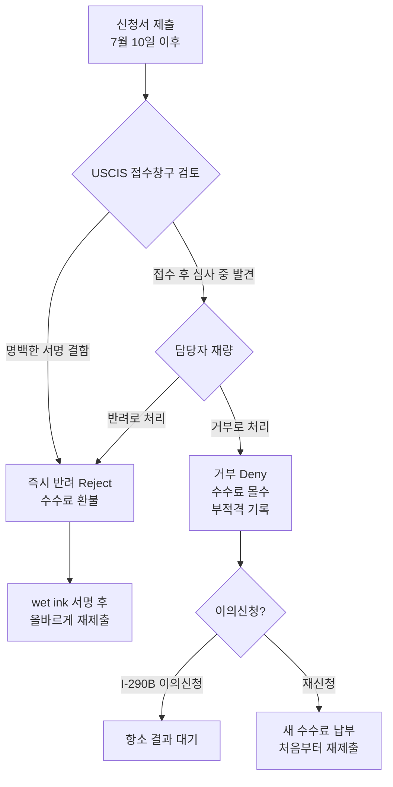

# USCIS 서명 규칙 7월 10일 발효 — DocuSign·타이핑 서명 쓰면 수수료 날리고 거부당합니다

미국 이민 신청서를 준비 중이거나 곧 제출할 예정이라면 **지금 당장** 서명 방식을 확인하세요. 미국 시민권·이민서비스국(USCIS)의 새 서명 규칙이 **2026년 7월 10일**부터 시행됩니다. 이 규칙은 DocuSign·Adobe Sign 등 외부 전자 서명 도구, 타이핑한 이름, 복사·붙여넣기 서명으로 제출된 신청서를 **수수료 환불 없이 거부(deny)**할 수 있도록 USCIS에 권한을 부여합니다.

H-1B, 영주권(I-485), 가족 초청(I-130), 취업허가(EAD) 등을 준비 중인 한인이라면 지금 당장 이 내용을 확인하고 대응 방법을 알아야 합니다.

## 핵심 요약

- **시행일**: 2026년 7월 10일 (제출일 기준)
- **변화**: USCIS가 부적합 서명을 이유로 수수료 환불 없이 **거부(deny)** 가능 — 기존에는 반려(reject) 후 수수료 환불이 일반적
- **무효 서명**: DocuSign·Adobe Sign 등 외부 전자 서명, 타이핑한 이름, 복사·붙여넣기 서명 이미지, 도장 서명
- **유효 서명**: 실제 손으로 직접 쓴 "wet ink" 서명 (스캔·팩스 사본도 원본이 wet ink면 허용)
- **공식 출처**: 연방관보(Federal Register) 2026-09289, 2026년 5월 11일 게재

---

## 반려(reject)와 거부(deny)의 차이 — 수수료 운명이 갈린다

이전까지 서명 문제가 있는 신청서는 대부분 **반려(reject)** 처리됐습니다. 반려는 접수 자체를 거절하는 것으로, **수수료가 환불**되고 다시 제출할 수 있었습니다.

7월 10일부터는 USCIS가 접수 이후 서류 심사 과정에서 부적합 서명을 발견하더라도 **거부(deny)**로 처리할 수 있습니다. 거부는 심사가 완료된 결정으로, **수수료를 돌려받지 못하고** 해당 사건은 부적격 결정으로 기록됩니다. 이후엔 이의신청(Form I-290B)을 내거나, 새 수수료를 다시 내고 처음부터 재신청해야 합니다.

| 구분 | 반려(Reject) | 거부(Deny) |
|---|---|---|
| 수수료 | **환불** | **몰수** |
| 사건 기록 | 남지 않음 | 부적격 결정으로 기록 |
| 다음 단계 | 수정 후 재제출 | I-290B 이의신청 또는 재신청(새 수수료) |
| USCIS 재량 | 낮음 | **높음 — 담당자 판단** |

주의할 점은 거부와 반려 중 어떤 결정을 내릴지가 **USCIS 담당 심사관의 재량**에 달려 있다는 것입니다. 이는 예측이 불가능하므로, 처음부터 올바른 서명을 사용하는 것이 유일한 안전한 대응입니다.

---

## 유효한 서명 vs 무효 서명 — 한눈에 비교

| 서명 방식 | 유효 여부 | 설명 |
|---|---|---|
| 실제 손으로 쓴 서명 (wet ink) | ✅ **유효** | 볼펜이나 펜으로 직접 서명 |
| wet ink 서명 원본을 스캔·복사·팩스 | ✅ **유효** | 원본이 wet ink라면 사본도 허용 |
| USCIS 공식 온라인 시스템(myUSCIS) 내 전자 서명 | ✅ **유효** | USCIS 자체 시스템 한정 |
| DocuSign, Adobe Sign 등 외부 전자 서명 소프트웨어 | ❌ **무효** | 종이 제출·PDF 업로드 모두 해당 |
| 서명란에 타이핑한 이름 | ❌ **무효** | 인쇄체·필기체 구분 없이 무효 |
| 다른 문서에서 복사·붙여넣기한 서명 이미지 | ❌ **무효** | 원본이 있어도 붙여넣기 자체가 무효 |
| 도장(stamp) 서명 | ❌ **무효** | 직인 포함 |
| 서명 권한 없는 직원이 서명 | ❌ **무효** | 회사 청원서에서 특히 주의 |

---

## 어떤 신청서가 영향을 받나

이 규칙은 7월 10일 이후 제출된 **모든 USCIS 이민 혜택 신청서**에 적용됩니다. 한인 이민자들이 많이 사용하는 양식 기준으로 정리하면 다음과 같습니다.

- **I-130** — 가족 초청 청원서 (시민권자·영주권자가 가족 초청)
- **I-485** — 신분 변경(AOS) 신청서 (영주권 취득)
- **I-140** — 취업 기반 이민 청원서 (EB-2, EB-3 등)
- **I-765** — 취업허가(EAD) 신청서
- **I-129** — H-1B 등 비이민 취업 비자 청원서
- **I-539** — 비이민 신분 변경·연장 신청서
- **I-751** — 조건부 영주권 해제 청원서

단, USCIS 공식 온라인 포털에서 제출하는 신청서는 시스템 자체에 전자 서명 기능이 내장되어 있어 별도로 wet ink 서명이 필요하지 않습니다.

---

## 절차 흐름: 부적합 서명 시 어떻게 되나

---

## 왜 지금 이 규칙이 나왔나

USCIS는 연방관보(FR 2026-09289)에서 이 규칙의 도입 근거로 전자 서명 소프트웨어 남용, 타이핑 서명, 스캔 이미지 붙여넣기 증가로 서명 진위 확인이 어려워졌다는 점을 명시했습니다. 규칙은 2026년 5월 11일 연방관보에 게재됐으며, 2026년 7월 10일부터 발효됩니다.

**중간최종규칙(IFR)이란?** 중간최종규칙(IFR)은 사전 의견수렴(notice-and-comment) 없이 즉시 발효되는 규칙입니다. 사후 공공 의견은 받을 수 있으나, 효력 자체는 7월 10일부로 확정됩니다. 의회가 별도 조치를 취하지 않는 한 이 규칙은 번복되지 않습니다.

USCIS는 최근 일련의 규정 강화를 통해 서명, 수수료, 양식 에디션 날짜 등 절차적 요건에서의 엄격성을 크게 높이고 있습니다. 이전에는 관행적으로 허용됐던 방식도 이제는 고비용 거부로 이어질 수 있습니다.

---

## 회사·스폰서가 청원서를 준비하는 한인이 특히 주의할 점

H-1B, L-1, O-1 등 고용주가 청원서를 제출하는 경우, 여러 담당자 사이에서 문서가 이메일로 오가면서 전자 서명이 무의식적으로 사용되는 경우가 많습니다. 예를 들어:

- HR 담당자가 DocuSign으로 I-129에 서명한 뒤 변호사에게 전달
- 이민 변호사가 PDF로 받아 그대로 USCIS에 제출
- 7월 10일 이후 서명 결함 발견 → 수수료 몰수 + 거부

이런 상황을 막으려면 문서 전달 과정에서 반드시 wet ink 서명 용지를 **인쇄 → 서명 → 스캔** 순으로 처리해야 합니다. 회사 법무팀 또는 외부 이민 변호사에게 7월 10일 전에 이 절차 변경 사항을 공유하는 것이 중요합니다.

---

## 온라인 신청(myUSCIS)과 종이 신청: 서명 처리 비교

서명 요건은 신청 방법에 따라 다르게 적용됩니다.

### 종이(우편) 신청

1. **인쇄** — 최신 에디션 양식을 uscis.gov에서 직접 다운로드해 인쇄합니다.
2. **서명** — 볼펜으로 서명란에 직접(wet ink) 서명합니다.
3. **스캔 또는 사진** — 서명된 페이지를 스캔하거나 사진으로 찍어 PDF로 제출해도 원본이 wet ink이면 유효합니다.
4. **우편 발송** — USCIS 지정 주소로 발송하며, 소인(postmark) 날짜가 제출일이 됩니다.

> **중요**: 이메일로 받은 PDF에 전자 서명한 뒤 출력하거나 업로드하는 방식은 무효입니다.

### USCIS 온라인 포털(myUSCIS) 신청

1. **myUSCIS 계정 로그인** — uscis.gov에서 계정을 생성하거나 로그인합니다.
2. **온라인 양식 작성** — 시스템 내에서 직접 정보를 입력합니다.
3. **시스템 내 서명** — USCIS 온라인 시스템 안에서 이루어지는 전자 서명은 공식으로 승인된 방식이므로 유효합니다.
4. **Pay.gov 결제** — 수수료는 온라인으로 Pay.gov를 통해 납부합니다.

현재 온라인 제출이 가능한 양식에는 I-90(영주권 갱신), I-765(EAD), I-539(신분 변경·연장) 일부가 포함됩니다. I-485, I-130, I-129 등 주요 청원서는 아직 온라인 제출이 제한적이거나 불가하므로 종이 제출 규칙이 그대로 적용됩니다.

---

## 팩스, 해외 서명, 대리인 서명 — 자주 묻는 특수 상황

**한국에 있는 가족이 I-130 수혜자 서명을 해야 할 때**
한국에서 서명한 뒤 스캔해 이메일로 보내는 경우, wet ink 서명 → 스캔 → PDF 이메일 순서라면 허용됩니다. DocuSign 링크를 보내 서명하게 해서는 안 됩니다.

**팩스로 받은 서명**
원본이 wet ink 서명이고 팩스로 전송된 사본이라면 허용됩니다. 다만 팩스 품질이 낮아 서명이 판별되기 어렵다면 USCIS가 문제를 제기할 수 있으므로 가급적 스캔 사본을 사용하세요.

**이민 변호사가 대신 서명할 수 있나요?**
법적으로 서명 권한이 있는 당사자만 서명할 수 있습니다. 청원자(petitioner)나 신청인(applicant)을 대신해 변호사가 서명하는 것은 허용되지 않습니다. 다만 G-28(법률 대리인 등록 양식)에는 변호사가 서명합니다.

**회사 임원 대신 HR 담당자가 서명한 경우**
HR 담당자가 서명 권한을 위임받았음을 증빙할 수 있는 내부 수권서(authorization letter)를 보관해 두어야 합니다. USCIS는 청원서 서명자가 해당 법인의 서명 권한자인지 확인할 수 있습니다.

---

7월 10일 이후 제출할 신청서가 있다면 다음을 확인하세요.

- [ ] 신청서 서명란을 **볼펜으로 직접 손으로 서명**했는가?
- [ ] 서명에 DocuSign, Adobe Sign, 또는 기타 전자 서명 소프트웨어를 **사용하지 않았는가?**
- [ ] 서명란에 이름을 **타이핑하지 않았는가?**
- [ ] 서명 이미지를 다른 문서에서 **복사·붙여넣기하지 않았는가?**
- [ ] 회사 청원서라면, 서명자가 **실제 서명 권한을 가진 인물**인가?
- [ ] 온라인 USCIS 시스템이 아닌 이메일·PDF 방식으로 서명이 이루어지지는 않았는가?
- [ ] 이민 변호사 또는 HR이 이 규칙 변경 사항을 **공유받았는가?**

---

## 마무리 — 지금 바로 해야 할 3가지

서명 하나가 수천 달러 수수료와 수개월의 처리 기간을 결정합니다. 그동안 편의상 사용해 온 DocuSign, 타이핑 서명, 스캔 이미지 붙여넣기 방식이 7월 10일부터는 수수료 몰수와 거부 결정으로 이어질 수 있습니다.

7월 10일 이전에 지금 당장 해야 할 일 세 가지입니다.

1. **현재 준비 중인 신청서 서명 방식 재확인** — DocuSign·타이핑 서명이면 wet ink로 다시 서명하세요.
2. **고용주·HR·이민 변호사에게 공유** — H-1B, L-1 등 고용주 청원서는 회사 내부 절차 변경이 필요합니다.
3. **해외 가족에게 알리기** — I-130 수혜자 등 한국에서 서명해 보내는 경우, DocuSign 대신 wet ink → 스캔 방식을 안내하세요.

> **전문가 상담 권장**: 이 글은 USCIS 정책 변경에 대한 일반 정보이며, 개인 이민 법률 자문이 아닙니다. 본인 상황에 맞는 서명 요건과 신청 절차는 이민 전문 변호사와 상담하시기 바랍니다.

## 출처 (Sources)

- [DHS Interim Final Rule: Signatures on Immigration Benefit Requests — Federal Register (2026-09289)](https://www.federalregister.gov/documents/2026/05/11/2026-09289/signatures-on-immigration-benefit-requests)
- [USCIS Policy Manual — Updates](https://www.uscis.gov/policy-manual/updates)
- [New USCIS Signature Rule Takes Effect July 10, 2026 — Reddy Neumann Brown PC](https://www.rnlawgroup.com/new-uscis-signature-rule-takes-effect-july-10-2026-how-to-sign-immigration-forms-correctly-and-avoid-a-costly-denial/)
- [DHS Issues Interim Final Rule on Signature Requirements for USCIS Filings — Mintz](https://www.mintz.com/insights-center/viewpoints/2806/2026-06-10-dhs-issues-interim-final-rule-signature-requirements)
- [USCIS Rule Raises Stakes for Signature Defects — Ogletree Deakins](https://ogletree.com/insights-resources/blog-posts/uscis-rule-raises-stakes-for-signature-defects-in-immigration-benefit-requests/)
- [USCIS Tightens Signature Rules — Inside Business Immigration (Greenberg Traurig)](https://www.gtlaw-insidebusinessimmigration.com/uscis/uscis-tightens-signature-rules-for-immigration-filings-what-employers-applicants-should-know/)
